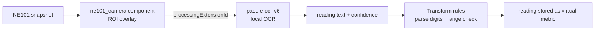

# Technical Details

## 4.1 AI Model

| Item | Specification |
|---|---|
| Model | paddle-ocr-v6 (detection + recognition) |
| Task | Dial digit OCR (host-side) |
| Input | snapshot ROI |
| Output | reading text + confidence |
| Framework | PaddleOCR via NeoMind extension |
| Quantization | bundled tiers (tiny/small/medium) |
| Accelerator | CPU (no GPU/NPU required) |

## 4.2 AI Pipeline

ROI framing resists background clutter and speeds recognition; Transforms parse text→number and validate range/monotonicity.

## 4.3 Performance

| Metric | Result |
|---|---|
| Latency | seconds per read (not a live stream) |
| Accuracy | up to 99% (NE101 official scenario data; calibrate on site) |
| Camera power | see [NE101 battery table](/docs/neoeyes-ne101-series/overview) |

> 📝 **Template placeholder**: Add field-sampled accuracy by meter type/distance/lighting.
