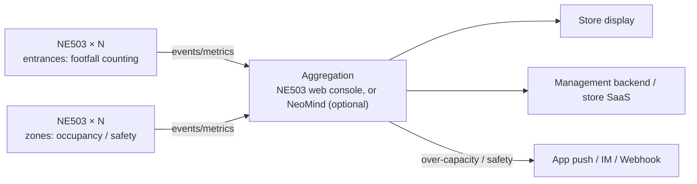

# Solution Overview

Smart gym: real-time occupancy, footfall trends, equipment-zone utilization and safety events on one screen, with instant over-capacity alerts. **The whole solution uses a single device — the NeoEyes NE503 edge AI camera.** Each unit completes the capture → 20 TOPS NPU inference → structured-event loop inside the camera: zero cloud dependency, no extra compute box.

## Scenario & Pain Points

- Peak-hour crowding with no real-time occupancy view
- Equipment purchase and class scheduling by gut feeling, no utilization data
- Falls and conflicts discovered late; disputes hard to settle
- Privacy-sensitive members — cloud face/video is not an option

## Architecture

Every NE503 is autonomous: detection and local alerts survive network cuts and catch up afterwards. Start with 2–8 cameras per store; scaling a chain just adds devices.

## Bill of Materials (BOM)

| # | Item | Spec | Qty | Purpose |
|---|---|---|---|---|
| 1 | **NE503 AI camera** | Hailo-15H · 20 TOPS · 4K · IP67 · PoE | 1/entrance + 1–2/zone | counting / occupancy / safety |
| 2 | Lens | AF 44.5° fixed / Motorized zoom 110° | with camera | narrow for entrances, wide for zones |
| 3 | PoE switch | 802.3AT, ports = cameras + 1 | 1 | power + network in one cable |
| 4 | (optional) platform host | NeoMind on any Linux host | 1 | multi-store aggregation; single store can skip |
| 5 | (optional) mounts | per site | few | ceiling / wall |

> Starter kit (1 entrance + 2 zones): **3× NE503 + 1 PoE switch** — core features online with no server.

## Results

- **Works out of the box**: core apps (Person Detection, Occupancy Monitor) come from [NE503 Verified Apps](/docs/neoeyes-ne503-series/application-guide/verified-apps) — officially validated, **download & deploy, no development**
- Periodic occupancy events + local second-level over-capacity response
- Video never leaves the camera; only numbers and events do — privacy by design

## Next

[Hardware & Deployment](./hardware-deployment) → [AI Model](./ai-model) → [Platform Configuration](./platform-configuration) → [Business Integration](./business-integration).
