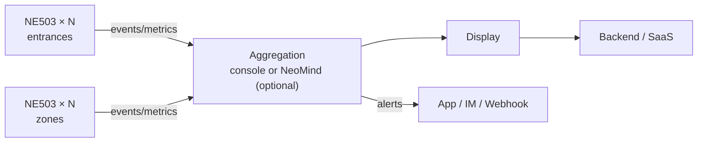

# Solution & Value

## Introduction

Smart Gym: **one device only — the NeoEyes NE503 edge AI camera** (Hailo-15H · 20 TOPS · IP67 · PoE). Each unit runs capture → NPU inference → structured events in-camera: real-time occupancy, footfall trends, zone utilization and safety alerts. Zero cloud dependency, no extra compute box.

- **What**: an in-store operations sensing solution on end-to-end AI cameras
- **Problem**: no occupancy data, no utilization data, late safety discovery
- **Who**: gym chains and single stores, store-SaaS vendors
- **Outcome**: live occupancy display, utilization reports, second-level safety alerts

## Solution Value

**Business**: capacity control backed by data; equipment & class planning from utilization; faster incident response.
**Technical**: single-device end-to-end; zero cloud; 20 TOPS multi-model concurrency.
**Deployment**: IP67 + PoE single-cable; validated official apps (zero dev); starter = 3 cameras + 1 switch, no server.

## Application Scenarios

| Scenario | Description |
|---|---|
| Gym / Studio | occupancy limiting, utilization, safety alerts |
| Chain Stores | unified multi-store dashboards & alerts |
| Sports Venue | zone heat and dwell detection |
| Retail (extended) | entrance counting & zone heat reuse |

## At a Glance

| Item | Description |
|---|---|
| Problem | occupancy/utilization/safety all guesswork |
| AI Capability | person detection + zone occupancy (on-camera NPU) |
| Input / Output | 4K video per point → occupancy / events (structured) |
| Processing | Edge (in camera) |
| Target Users | store ops / chains / SaaS vendors |
| Main Benefit | closed-loop single device, privacy-friendly |

