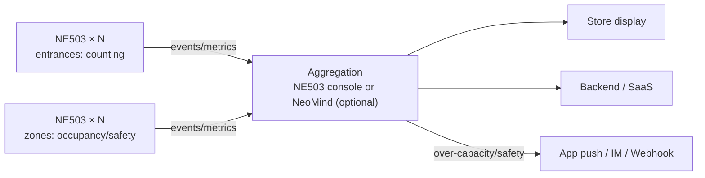

# Solution Components

## 2.1 Hardware

| Component | CamThink Product | Function |
|---|---|---|
| AI Camera (entrance) | **NeoEyes NE503** (AF 44.5°) | footfall counting |
| AI Camera (zones) | **NeoEyes NE503** (Motorized zoom 110°) | occupancy / safety |
| Network | PoE switch (802.3AT) | single-cable power+network |
| Platform Host (optional) | NeoMind on Linux | multi-store aggregation |

> Starter kit (1 entrance + 2 zones): **3× NE503 + 1× PoE switch** — no server.

## 2.2 Software

| Component | Function |
|---|---|
| AI Model | hailo_yolov8n_384_640 (detection) |
| App: Occupancy Monitor | zone head-count + periodic occupancy (Verified App) |
| App: Person Detection | person events + alert linkage (Verified App) |
| AI Platform | NE503 container app management + web console; (optional) NeoMind |
| Event Bus / Webhook / MQTT | event & metric downlink |

## 2.3 Solution Architecture

