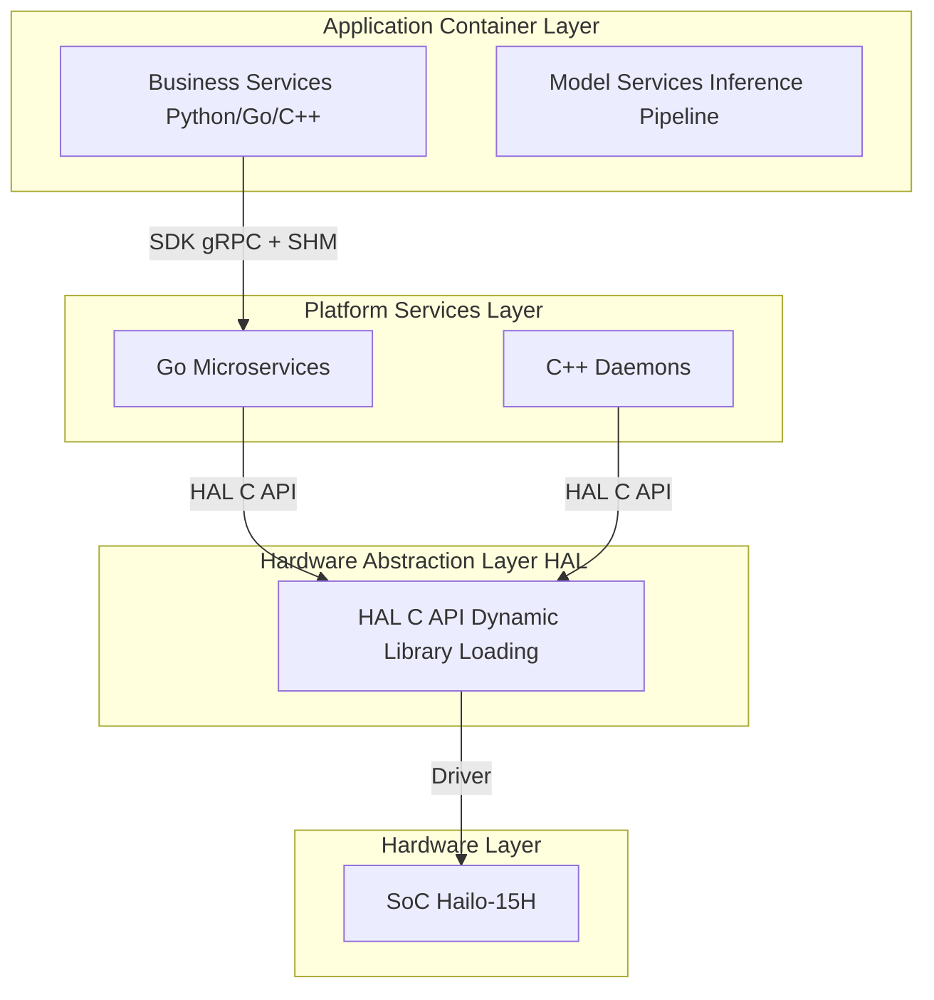
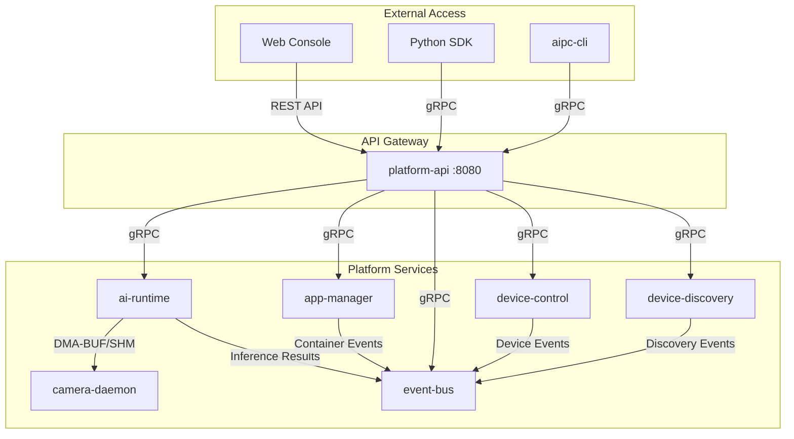
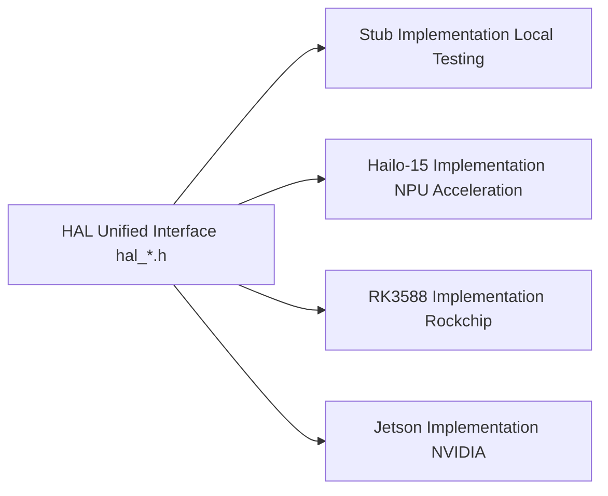
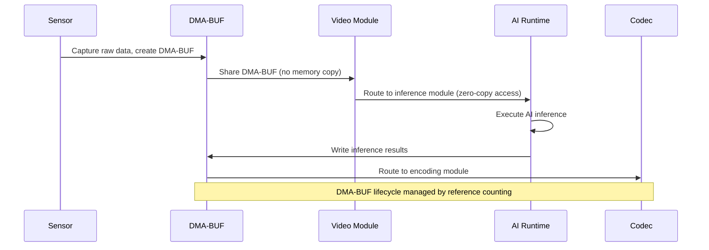

# Platform Architecture

The NE503 AIPC (AI IPC) platform is a complete software stack designed for edge AI computing. It adopts a four-layer architecture and supports multiple SoC platforms (Hailo-15 / RK3588 / Jetson) with seamless migration through a hardware abstraction layer. This document provides a detailed overview of each architectural layer, core services, data flow, and the security model.

## 1. Four-Layer Architecture Overview



| Layer | Responsibility | Technology |
|:---|:---|:---|
| Application Container Layer | Third-party AI applications, model inference pipelines | Python/Go/C++, containerized runtime |
| Platform Services Layer | Camera management, AI inference, container management, event dispatch, device control, API gateway, device discovery | Go microservices + C++ daemons |
| Hardware Abstraction Layer | Unified hardware interface, decoupling platform services from SoC | C/C++ function pointer tables (Ops), DMA-BUF zero-copy |
| Hardware Layer | SoC, NPU, ISP, sensors, MCU | Hailo-15H (current), RK3588 / Jetson (extensible) |

---

## 2. Platform Services Layer

The platform services layer consists of 7 microservices that communicate internally via gRPC over Unix Domain Sockets.

### 2.1 Service Overview

| Service | Language | Listen Address | Responsibility |
|:---|:---|:---|:---|
| **ai-runtime** | Go | `unix:///run/aipc/ai-runtime.sock` | AI model management and inference scheduling, NPU resource allocation, GenAI streaming inference |
| **app-manager** | Go | `unix:///run/aipc/app-manager.sock` | Container application lifecycle management (install/start/stop/uninstall), based on containerd |
| **event-bus** | Go | `unix:///run/aipc/event-bus.sock` + TCP `127.0.0.1:50053` | Publish/subscribe message bus, MQTT-style wildcard matching |
| **device-control** | Go | `unix:///run/aipc/device-control.sock` | Hardware peripheral control (light/PTZ/lens/GPIO), MCU UART communication |
| **device-discovery** | Go | `unix:///run/aipc/device-discovery.sock` | Network device discovery (CT-Disc protocol), device registration and state management |
| **platform-api** | Go | `:8080` | HTTP/RESTful API gateway, proxying all backend gRPC services |
| **camera-daemon** | C++ | `camera.sock` + `camera-control.sock` | Video capture, dual-channel frame dispatch (FD/SHM), encoding, RTSP streaming |

### 2.2 Service Dependencies



### 2.3 gRPC API Definitions

The platform defines all gRPC interfaces through 7 Protocol Buffers files:

| Proto File | Service | Core Operations |
|:---|:---|:---|
| `inference.proto` | AI Inference | RegisterModel / UnregisterModel / ListModels / GetModelInfo / Infer / StreamInfer / CreateSession / DestroySession / GetStats |
| `app.proto` | Container Management | InstallApp / StartApp / StopApp / UninstallApp / ListApps / GetApp / GetAppStats / GetAppLogs |
| `event.proto` | Event Bus | Publish / PublishBatch / Subscribe / Unsubscribe / ListTopics / GetTopicStats (supports `*` wildcards) |
| `device.proto` | Device Control | SetWhiteLight / SetIrLed / SetIrCut / Pan / Tilt / PTZStop / SavePreset / CallPreset / Zoom / Focus / SetAutofocus / GPIOWrite / GPIORead / GetDeviceStatus / SubscribeEvents |
| `camera.proto` | Camera Management | Video capture pipeline, RTSP streaming, OSD overlay |
| `lens_hal.proto` | Lens Control | Zoom / Focus / SetAutofocus (HAL bridge) |

> `lens_hal.proto` is the concrete implementation protocol for the lens control portion of `device.proto`; they are different abstraction levels of the same functionality.

| `discovery.proto` | Device Discovery | CT-Disc protocol device discovery, registration, state management |

---

## 3. Hardware Abstraction Layer (HAL)

The HAL layer uses a **function pointer table (Ops)** pattern for runtime dynamic loading of platform-specific implementations, allowing upper-layer platform services to adapt to different SoCs without modification.

### 3.1 HAL v1 Interfaces

| Header File | Core Struct | Purpose |
|:---|:---|:---|
| `hal_video.h` | `HalVideoOps` | Video capture |
| `hal_ml.h` | `HalMLOps` | AI inference acceleration |
| `hal_codec.h` | `HalCodecOps` | Video encoding (H.264/H.265) + OSD |
| `hal_io.h` | `HalIOOps` | MCU peripheral control |
| `hal_buffer.h` | `HalFrameBuffer` | Unified frame buffer (cross-module sharing) |
| `hal_ml_post.h` | `HalMLPostOps` | Inference post-processing |
| `hal_ml_overlay.h` | `HalMLOverlayOps` | AI result overlay rendering |

### 3.2 HAL v1 vs v2

| Feature | HAL v1 (`hal/`) | HAL v2 (`hal_v2/`) |
|:---|:---|:---|
| Structure | Flat, organized by functional files | Modular, organized by component directories |
| Interface | Direct function calls | Operation tables (Ops structs) |
| Media | Basic video capture/encoding | Full pipeline (privacy mask, digital zoom, stabilization) |
| AI | Basic inference | Inference + post-processing + GenAI (LLM/VLM) |
| DSP | None | Image processing, format conversion, privacy mask |
| Build | CMake single target | Supports single-library / modular build |

HAL v2 core interfaces:

| Interface | Header File | Function |
|:---|:---|:---|
| Media Pipeline | `hal_media.h` | Profile switching, dynamic parameters, privacy mask, runtime stream add/remove |
| AI Inference | `hal_model.h` | Model inference and post-processing |
| GenAI | `hal_genai.h` | LLM/VLM streaming generation, custom stop words and context management |
| DSP | `hal_dsp.h` | Crop, scale, format conversion, privacy mask, stabilization |
| Peripherals | `hal_mcu.h` | Generic MCU communication interface |

### 3.3 Core Data Structure: HalFrameBuffer

```c
typedef struct {
    uint64_t sequence, timestamp_ns;
    uint32_t width, height;
    HalPixelFormat format;          // NV12, RGB24, etc.
    HalFrameMemoryType memory_type; // DMA_BUF or CPU_MEMORY
    int      dma_fds[3];            // DMA-BUF fd (zero-copy)
    uint8_t *planes[3];             // CPU pointers
    uint32_t strides[3], sizes[3];
    void    *priv;                  // Reference counting + platform private data
} HalFrameBuffer;
```

`HalFrameBuffer` supports reference counting (`hal_frame_buffer_ref` / `hal_frame_buffer_release`). The video, AI, and encoding modules can share the same DMA-BUF without memory copying.

### 3.4 Multi-Platform Support



Current implementations: Hailo-15 (complete) + Stub (testing). RK3588 and Jetson can be supported through the HAL porting guide.

---

## 4. SDK Layer

### 4.1 Python SDK Modules

The Python SDK (`hailo_ipc_sdk`) provides 8 core modules:

| Module | Class | Function |
|:---|:---|:---|
| `inference` | `InferenceClient` | AI inference (single / streaming / session management) |
| `media` | `FdMediaClient` | Zero-copy video stream acquisition |
| `events` | `EventClient` | Event bus publish/subscribe |
| `device` | `DeviceClient` | Device control (light/PTZ/lens/GPIO) |
| `app` | `AppClient` | Application lifecycle management |
| `plugin` | `PluginDiscovery` / `PluginServer` | Plugin discovery and services |
| `overlay` | `OverlayClient` | AI result overlay |
| `config` | `Config` | Configuration management |

### 4.2 Communication Protocols

| SDK Module | Communication Method | Description |
|:---|:---|:---|
| InferenceClient | gRPC over Unix Socket | Proxied via platform-api |
| FdMediaClient | Shared Memory (SHM) + gRPC | Zero-copy frame transfer |
| EventClient | gRPC over Unix Socket | Supports wildcard subscriptions |
| DeviceClient | gRPC over Unix Socket | Proxied via platform-api |

### 4.3 Quick Example

```python
from hailo_ipc_sdk import InferenceClient, EventClient

# AI inference
with InferenceClient() as inf:
    result = inf.infer(image, model_id="person_v1")

# Event publishing
events = EventClient()
events.publish("app/alert", {"type": "person_detected"})
```

---

## 5. Web Console

The web console is built on React 19 + TypeScript + Vite, providing device management, video monitoring, AI model management, application management, and system monitoring.

| Technology Stack | Component |
|:---|:---|
| Framework | React 19 + TypeScript |
| Build | Vite |
| State Management | Zustand |
| Data Fetching | TanStack Query |
| UI Components | shadcn/ui + Radix |
| Testing | Vitest |

The web console communicates with platform-api via REST API and WebSocket, receiving real-time AI inference results and device events. Access URL: `http://<device-ip>:8080`.

---

## 6. Container Isolation and Security

NE503 adopts a multi-layered defense-in-depth architecture. Core principles: least privilege, access path convergence, and explicit authorization.

### 6.1 Security Layer Model

```
┌──────────────────────────────────────────────┐
│          Application Container Layer          │
│   Namespaces / Seccomp / Capabilities        │
│   Cgroup / ReadOnly Rootfs                   │
└────────────────┬─────────────────────────────┘
                  │ gRPC over Unix Socket (group permission control)
┌────────────────┴─────────────────────────────┐
│          Platform Services Layer              │
│   Authentication / Permission Convergence    │
│   Audit Logging                              │
└────────────────┬─────────────────────────────┘
                  │ HAL C API
┌────────────────┴─────────────────────────────┐
│          Hardware Layer                       │
│   TrustZone / Secure Boot                    │
└──────────────────────────────────────────────┘
```

### 6.2 Container Isolation Mechanisms

**Linux Namespaces** (5 enabled by default):

| Namespace | Isolation Scope | Effect |
|:---|:---|:---|
| PID | Process IDs | Container processes cannot see host processes |
| NET | Network stack | No network by default (`none` mode) |
| IPC | System V IPC / POSIX message queues | Inter-process communication isolation |
| UTS | Hostname | Container has independent hostname |
| MOUNT | Filesystem mounts | Independent filesystem view |

**Capabilities**: All dangerous Linux capabilities are removed by default:

| Capability | Description |
|:---|:---|
| `CAP_SYS_ADMIN` | System administration |
| `CAP_NET_ADMIN` | Network administration |
| `CAP_SYS_MODULE` | Kernel module loading |
| `CAP_SYS_TIME` | System time modification |
| `CAP_SYS_BOOT` | System reboot |
| `CAP_SYS_RAWIO` | Raw I/O port access |
| `CAP_SYS_PTRACE` | Process tracing |
| `CAP_SYS_CHROOT` | chroot switching |
| `CAP_MKNOD` | Device node creation |

**Seccomp BPF**: Restricts available system calls through an allowlist. The default configuration permits approximately 200+ safe system calls. Blocked dangerous calls include:

| Category | Blocked System Calls |
|:---|:---|
| Filesystem | `mount` / `umount` / `swapon` / `swapoff` |
| System | `reboot` / `kexec_load` |
| Kernel | `init_module` / `delete_module` |
| Hardware | `iopl` / `ioperm` |
| Process | `ptrace` (partially restricted) |
| Keys | `keyctl` / `add_key` / `request_key` |

> **Implementation Status**: The Seccomp profile has been defined and validated. Actual loading and enforcement in the current codebase is still in progress (`implementation pending`).

**Cgroups Resource Limits**:

| Resource | Default Value |
|:---|:---|
| CPU | 50% single core |
| Memory | 256MB |
| Processes | 128 |

**Filesystem**: Read-only root filesystem + No New Privileges (privilege escalation prevention) + only declared directories are mounted.

### 6.3 Access Path Convergence

All resource access must go through platform services. Containers cannot access hardware directly:

| Resource | Access Path |
|:---|:---|
| Video stream | -> camera-daemon SHM |
| AI inference | -> ai-runtime gRPC |
| Peripheral control | -> device-control gRPC |
| Event messages | -> event-bus gRPC |

Unix Socket permissions are controlled through Linux groups (AIPC group GID). The group is automatically injected only into the Main container at startup. Sub containers cannot access any sockets.

### 6.4 Declarative Permission Model

Applications declare required permissions through the `permissions` field in `app.yaml`. Undeclared permissions are inaccessible by default:

```yaml
permissions:
  video: [cam0_main.raw]           # Video stream access
  inference:
    models: [person_v1]             # Available models
    max_qps: 30
  events:
    publish: [app/myapp/*]          # Publishable topics
    subscribe: [model/*/detections] # Subscribable topics
  device:
    light: true
    ptz: false
  network:
    outbound: [https://api.example.com]
```

### 6.5 Network Security

| Mode | Description |
|:---|:---|
| **Isolated (internal) (default)** | No network access (maps to container network "none" at runtime), communicates with platform services only through SDK |
| **Bridge (multi-container mode only)** | Connected via `aipc-br0` bridge, DNS defaults to `8.8.8.8` (configurable), outbound allowlist control |

> Single-container applications support `isolated` and `host` modes; multi-container applications support `internal`, `bridge`, and `host` modes. Both `isolated` and `internal` are isolated networks, but are named differently due to historical reasons across configuration levels.

Platform API supports optional Bearer Token (JWT) authentication. Public endpoints are limited to `/api/login` and `/api/v1/system/health`. WebSocket passes the token via query parameter.

### 6.6 Multi-Container Security Boundary

| Role | Permissions |
|:---|:---|
| **Main Container** | Granted platform Socket access (AIPC group GID), can call AI inference, event bus, etc. |
| **Sub Container** | Fully isolated, cannot access any platform services, communicates with Main container only through shared network namespace |

### 6.7 Security Configuration Files

| Configuration File | Security Purpose |
|:---|:---|
| `security/seccomp-default.json` | Default Seccomp system call allowlist |
| `platform/app-manager.yaml` | Container security policies (capabilities, resource limits) |
| `platform-api.yaml` | API authentication keys, JWT configuration |
| `platform/event-bus.yaml` | Topic ACL access control |

### 6.8 Audit and Monitoring

- All API calls are logged (operation logs)
- Container resource usage monitored in real time (CPU / memory / process count)
- Event log categories: operation, security, alert, system
- Automatic circuit breaking: health check failures trigger automatic restart (backoff strategy)

---

## 7. Key Technical Features

### 7.1 Zero-Copy Optimization



Core mechanisms:
- `HalFrameBuffer` passes DMA-BUF file descriptors via `dma_fds[]`, enabling zero-copy throughout the video -> AI -> encoding pipeline
- Reference counting manages frame lifecycle (`hal_frame_buffer_ref` / `hal_frame_buffer_release`)
- FD passing between AI Runtime and Camera Daemon via `SCM_RIGHTS` (no memory copy required)

### 7.2 gRPC over Unix Socket

All inter-service communication uses gRPC over Unix Domain Sockets:

| Feature | Description |
|:---|:---|
| Transport | Unix Domain Socket (local inter-process communication) |
| Protocol | gRPC (HTTP/2 framing) |
| Security | Linux filesystem permissions + group permission control |
| Performance | Low latency (bypasses TCP/IP stack), high throughput |

### 7.3 Event-Driven Architecture

The Event Bus uses a publish/subscribe pattern with MQTT-style wildcard matching:

| Pattern | Description | Example |
|:---|:---|:---|
| Exact match | Exact topic name match | `app/myapp/status` |
| `*` Single-level wildcard | Matches one level | `app/*/status` |
| `**` Multi-level wildcard | Matches multiple levels | `model/**/detections` |

All inference results, container events, and device events generated by services are dispatched through the Event Bus. Third-party applications subscribe to topics of interest using the SDK's `EventClient`.

### 7.4 Containerized Application Platform

- Based on containerd runtime, OCI standard image deployment
- Multi-container support (Main + Sub), plugin-based dependency resolution
- Health check system (Command / HTTP / TCP, exponential backoff strategy)
- Automatic restart (backoff strategy on failure)

---

## 8. Configuration System

The platform uses YAML configuration files to manage all service parameters. Configuration files are located in the `configs/` directory:

| Configuration File | Service | Core Configuration |
|:---|:---|:---|
| `platform-api.yaml` | platform-api | Server port, authentication keys, log level |
| `platform/app-manager.yaml` | app-manager | containerd connection, security policies, resource limits |
| `platform/event-bus.yaml` | event-bus | Socket path, TCP listener, topic ACL |
| `platform/device-control.yaml` | device-control | MCU UART device, lens parameters, automation rules |
| `platform/camera-daemon.yaml` | camera-daemon | Video capture, encoding parameters, RTSP configuration |
| `platform/discovery.yaml` | device-discovery | CT-Disc protocol parameters |
| `ai/ai-runtime.yaml` | ai-runtime | HAL library paths, model repository, scheduler, auto-inference pipeline |
| `security/seccomp-default.json` | Security | Default Seccomp system call allowlist |

Installation path: `/opt/aipc/` (binaries in `bin/`, configuration in `etc/`).

---

## 9. Related Documentation

- [Application Development Guide](./1-app-development.md) — How to write and deploy container applications
- [Python SDK Reference](./2-sdk-reference.md) — SDK API signatures and usage examples
- [RESTful API Reference](./5-restful-api.md) — Complete HTTP API endpoint reference
- [AI Inference Service](../4-service-reference/0-ai-runtime.md) — AI Runtime deep dive
- [Container Application Management](../4-service-reference/1-app-manager.md) — App Manager deep dive
- [Configuration File Reference](../6-advanced-reference/1-config-reference.md) — Detailed parameters for all configuration files
