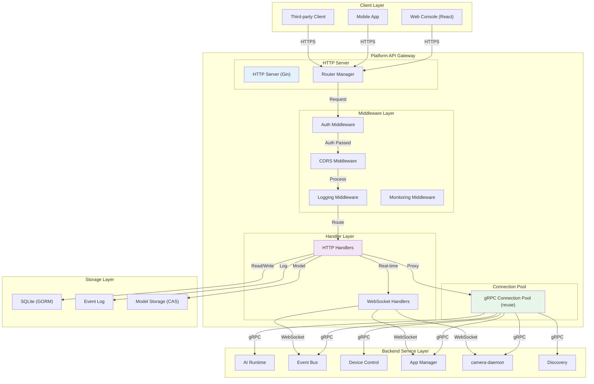

# RESTful API Reference

The Platform API is the HTTP gateway for NE503, built on Go + Gin framework, proxying all backend gRPC services and supporting WebSocket real-time communication (event streaming, video streaming, terminal, container logs). Tech stack: Go + Gin + gRPC Client + SQLite (GORM).



Request processing flow: Client sends HTTP request -> CORS handling -> Logging -> Authentication check -> Route matching -> Parameter validation -> Permission check -> Business logic (calling backend services via gRPC connection pool) -> Response wrapping. Gateway processing latency is approximately 1-5ms, backend service processing is approximately 10-50ms.

---

## 1. Overview

| Item | Description |
|:---|:---|
| Endpoint Prefix | `/api/v1` |
| Base Address | `http://<device-ip>:8080` |
| Swagger UI | `/swagger/` |
| Protocol | HTTP/HTTPS + WebSocket |
| Response Format | JSON |

---

> The paths in the sections below omit the `/api/v1` prefix. Prepend it when making requests, e.g., `/api/v1/system/info`.

## 2. Authentication

Platform API supports Bearer Token authentication (disabled by default, can be enabled in configuration).

**Transmission Methods:**

| Method | Format | Use Case |
|:---|:---|:---|
| HTTP Header | `Authorization: Bearer <token>` | REST API requests |
| HTTP Header | `X-API-Key: <token>` | REST API requests |
| Query Parameter | `?token=<token>` | WebSocket connections |

**Public Endpoints (no authentication required):**

- `/api/login` -- Login (independent of /api/v1 prefix)
- `/api/v1/system/health` -- Health check

**Authentication Flow:** The middleware extracts the Token from Header or Query parameter -> queries the user database to validate -> checks expiration -> allows the request or returns `401 Unauthorized`. If the request does not carry a Token and the target is not a public endpoint, `401` is also returned.

---

## 3. System Management

### System

| Method | Path | Description |
|:---|:---|:---|
| GET | `/system/info` | Get platform version and service status |
| GET | `/system/stats` | Get system statistics |
| GET | `/system/health` | Health check (public endpoint, no authentication required) |
| POST | `/system/password` | Change password |
| POST | `/system/restart` | Restart system |
| GET/POST | `/system/ota/*` | OTA firmware upgrade |

### Time Management

| Method | Path | Description |
|:---|:---|:---|
| POST | `/system/time/sync-from-client` | Sync time from client |
| GET/POST | `/system/time/*` | Time/timezone/NTP configuration |

---

## 4. AI Model Management

| Method | Path | Description |
|:---|:---|:---|
| GET | `/ai/models` | List loaded models |
| POST | `/ai/models` | Register model |
| POST | `/ai/models/upload` | Upload model file |
| POST | `/ai/models/scan` | Scan available models |
| GET/DELETE | `/ai/models/{id}` | Get/delete model |
| POST | `/ai/models/{id}/load` | Load model to NPU |
| POST | `/ai/models/{id}/unload` | Unload model from NPU |
| GET | `/ai/stats` | AI inference statistics |
| GET | `/ai/capabilities` | AI capability list |

---

## 5. Event Bus

| Method | Path | Description |
|:---|:---|:---|
| GET | `/events/topics` | List all event topics |
| POST | `/events/publish` | Publish event |
| GET (WS) | `/events/stream` | Event stream (WebSocket real-time push) |

---

## 6. Device Control

| Method | Path | Description |
|:---|:---|:---|
| GET | `/device/status` | Get device status |
| POST | `/device/light` | White light control |
| POST | `/device/ir-led` | IR LED control |
| POST | `/device/ir-cut` | IR-Cut filter control |
| POST | `/device/ptz` | PTZ (Pan-Tilt-Zoom) control |
| POST | `/device/zoom` | Zoom control |
| POST | `/device/focus` | Focus control |
| POST | `/device/autofocus` | Auto focus |
| GET/PUT/POST | `/device/lens/*` | Lens operations |
| POST/GET | `/device/gpio/*` | GPIO control |

---

## 7. App Management

| Method | Path | Description |
|:---|:---|:---|
| GET | `/apps` | List all apps |
| POST | `/apps` | Install app |
| POST | `/apps/wizard` | Wizard-style installation |
| POST | `/apps/upload-image` | Upload app image |
| GET | `/apps/{id}` | Get app details |
| POST | `/apps/{id}/start` | Start app |
| POST | `/apps/{id}/stop` | Stop app |
| DELETE | `/apps/{id}` | Uninstall app |
| GET | `/apps/{id}/stats` | Get app statistics |
| GET | `/apps/{id}/logs` | Get app logs |

---

## 8. Container Management

| Method | Path | Description |
|:---|:---|:---|
| GET | `/containers` | List all containers |
| GET | `/containers/{id}` | Get container details |
| GET | `/containers/{id}/stats` | Get container resource statistics |
| GET (WS) | `/containers/{id}/logs/ws` | Container log stream (WebSocket) |
| GET (WS) | `/containers/{id}/exec/ws` | Container terminal (WebSocket) |
| POST | `/containers/{id}/start` | Start container |
| POST | `/containers/{id}/stop` | Stop container |
| DELETE | `/containers/{id}` | Delete container |

---

## 9. Media Configuration

| Method | Path | Description |
|:---|:---|:---|
| GET | `/media/status` | Get streaming status |
| GET/POST | `/media/config` | Get/set media configuration |
| PUT | `/media/encoder` | Hot-update encoding parameters (no restart required) |
| PUT | `/media/rtsp` | Enable/disable RTSP stream |
| PUT | `/media/ai-overlay` | AI detection box overlay |
| PUT | `/media/osd` | OSD time/text watermark configuration |
| GET/POST | `/media/profiles` | Encoding profile management |
| POST | `/media/streams/{name}/enable` | Enable specified stream |
| DELETE | `/media/streams/{name}/disable` | Disable specified stream |

---

## 10. H.264 Video Streaming

| Method | Path | Description |
|:---|:---|:---|
| GET (WS) | `/h264/{stream_id}` | H.264 video stream (WebSocket) |

---

## 11. System Monitoring

| Method | Path | Description |
|:---|:---|:---|
| GET | `/monitor/summary` | System resource overview |
| GET | `/monitor/cpu` | CPU usage |
| GET | `/monitor/memory` | Memory usage |
| GET | `/monitor/disk` | Disk usage |
| GET | `/monitor/network` | Network traffic statistics |

---

## 12. Storage Management

| Method | Path | Description |
|:---|:---|:---|
| GET | `/storage/disks` | List all disks |
| POST | `/storage/mount` | Mount disk |
| POST | `/storage/unmount` | Unmount disk |
| POST | `/storage/format` | Format disk |

---

## 13. File Management

| Method | Path | Description |
|:---|:---|:---|
| GET | `/files` | List files |
| GET/POST | `/files/content` | Read/write file content |
| POST | `/files/upload` | Upload file |
| GET | `/files/download` | Download file |
| DELETE | `/files` | Delete file |

---

## 14. Web Terminal

| Method | Path | Description |
|:---|:---|:---|
| GET (WS) | `/terminal/ws` | Web terminal (WebSocket, SSH interactive) |

---

## 15. Network Configuration

| Method | Path | Description |
|:---|:---|:---|
| GET | `/network/config` | Get network configuration |
| POST | `/network/config` | Update network configuration |
| GET | `/network/interfaces` | List network interfaces |

---

## 16. Logging System

| Method | Path | Description |
|:---|:---|:---|
| GET | `/logs/services` | Get service list |
| GET | `/logs/content` | Get log content |
| GET (WS) | `/logs/stream/ws` | Service log stream (WebSocket) |

---

## 17. WebSocket Interfaces

All WebSocket endpoints pass the authentication Token via `?token=<token>`.

| Path | Purpose | Data Direction |
|:---|:---|:---|
| `/api/v1/events/stream?token=` | Event stream real-time push | Server -> Client |
| `/api/v1/h264/{stream_id}` | H.264 video stream push | Server -> Client |
| `/api/v1/containers/{id}/logs/ws` | Container log real-time stream | Server -> Client |
| `/api/v1/containers/{id}/exec/ws` | Container terminal interaction | Bidirectional |
| `/api/v1/terminal/ws` | Web terminal (SSH) | Bidirectional |
| `/api/v1/logs/stream/ws` | Service log real-time stream | Server -> Client |

---

## 18. Response Format

All API responses use a unified JSON format:

```json
{
  "code": 0,
  "message": "Success",
  "data": { ... }
}
```

| Field | Type | Description |
|:---|:---|:---|
| `code` | int | Status code, `0` indicates success, non-zero indicates error |
| `message` | string | Status description |
| `data` | object | Response data, may be empty on error |

---

## 19. Service Configuration

| Configuration | Default | Description |
|:---|:---|:---|
| `service.http_addr` | `:8080` | HTTP listen address |
| `service.log_level` | `info` | Log level |
| `auth.enabled` | `false` | Enable authentication |
| `auth.token_key` | -- | Token signing secret |
| `web.enable_cors` | `true` | Enable CORS |
| `stream.encoded_pub_dir` | `/run/aipc/encoded` | H.264 encoded frame publish directory |
| `storage.root_path` | `/opt/aipc` | Platform root directory |
| `storage.model_blob_path` | `/opt/aipc/models/blobs` | Model file storage path |

Backend gRPC services connect via Unix Domain Socket. Socket files are located in the `/run/aipc/` directory. The connection pool supports automatic reconnection and resource recycling.

---

## 20. Related Documentation

- [Platform Architecture](./0-platform-architecture.md) -- NE503 four-layer architecture and service dependencies
- [App Development](./1-app-development.md) -- Application development guide based on Platform API
- [SDK Reference](./2-sdk-reference.md) -- Python SDK complete API reference
- [CLI Guide](./4-cli-guide.md) -- aipc-cli command-line tool usage guide
