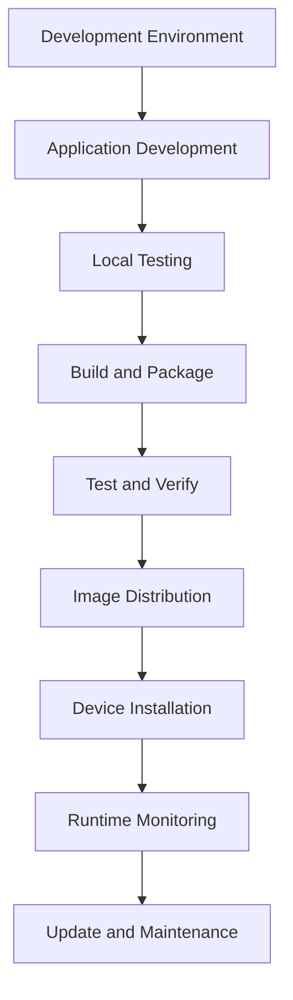

# Application Development

This guide covers how to develop, build, deploy, and manage container applications on the NE503 AIPC platform. From project creation to device installation, it covers the complete application lifecycle.

## 1. Quick Start

The following workflow demonstrates the complete steps to create an AI detection application from scratch and deploy it to a device:

```bash
# 1. Create project
mkdir my-app && cd my-app

# 2. Create application code
cat > app.py << 'EOF'
from hailo_ipc_sdk import InferenceClient, EventClient

inference = InferenceClient()
events = EventClient()

for frame, result in inference.subscribe(stream="cam0_main", model="yolov8n", fps=10):
    if result.objects:
        print(f"Detected {len(result.objects)} objects")
        events.publish("app/my_app/detection", {"count": len(result.objects)})
EOF

# 3. Create application manifest
cat > app.yaml << 'EOF'
apiVersion: v1
kind: Application
metadata:
  id: my_app
  name: My Application
  version: 1.0.0
spec:
  image: aipc/my_app:1.0.0
  resources:
    memory: "256Mi"
  permissions:
    inference:
      models: [yolov8n]
    events:
      publish: [app/my_app/*]
EOF

# 4. Create Dockerfile
cat > Dockerfile << 'EOF'
FROM aipc/python-base:1.0
COPY . /app/
CMD ["python", "app.py"]
EOF

# 5. Build and deploy
docker build -t aipc/my_app:1.0.0 .
docker save aipc/my_app:1.0.0 | gzip > my_app.tar.gz
scp app.yaml my_app.tar.gz root@<device-ip>:/tmp/
ssh root@<device-ip> "cd /tmp && gunzip my_app.tar.gz && \
  aipc-cli app install app.yaml my_app.tar && aipc-cli app start my_app"
```

---

## 2. Project Structure

```
my-app/
├── app.yaml          # Required: application manifest
├── Dockerfile        # Required: build definition
├── app.py            # Entry point
├── requirements.txt  # Optional: Python dependencies
├── config/           # Optional: configuration directory
└── tests/            # Optional: test code
```

---

## 3. SDK Installation

The AIPC SDK is not published to the public PyPI and must be installed using one of the following methods:

| Method | Dockerfile Usage | Use Case |
|:---|:---|:---|
| Base image (recommended) | `FROM aipc/python-base:1.0` | SDK pre-installed, zero configuration |
| Wheel file | `COPY hailo_ipc_sdk-*.whl /tmp/`<br />`RUN pip install /tmp/hailo_ipc_sdk-*.whl` | Offline environment |
| Private PyPI | `RUN pip install -i https://pypi.internal/ aipc-sdk` | Enterprise internal use |

---

## 4. app.yaml Configuration Specification

The application manifest is the core configuration file of the AIPC platform, defining basic information, resource requirements, permission settings, and more.

### 4.1 Minimal Configuration

```yaml
apiVersion: v1
kind: Application
metadata:
  id: my_app
  name: My Application
  version: 1.0.0
spec:
  image: aipc/my_app:1.0.0
```

### 4.2 Complete Single-Container Configuration

```yaml
apiVersion: v1
kind: Application

metadata:
  id: my_app                          # Required: unique identifier (lowercase letters, digits, underscores)
  name: My Application                # Required: display name
  version: 1.0.0                      # Required: semantic version
  description: Application description # Required: application description
  author: Your Name                   # Optional: author
  email: your@email.com               # Optional: contact email

spec:
  image: aipc/my_app:1.0.0            # Image name and tag

  resources:
    cpu: "50%"                        # CPU limit (percentage or core count)
    memory: "256Mi"                   # Memory limit (Mi/Gi)

  permissions:
    video:
      - cam0_main.raw                 # Raw video stream (DMA-BUF shared memory)
      - cam0_main                     # Encoded video stream (Unix Socket)
    inference:
      models: [yolov8n, person_v1]    # Available model list
      max_qps: 30                     # Maximum QPS
      max_concurrent: 2               # Maximum concurrent inferences
      allow_register_model: false     # Whether to allow registering new models
    events:
      publish: [app/my_app/*]         # Publishable topics (supports wildcards)
      subscribe: [model/*/detections, system/*]
    device:
      light: true                     # Fill light
      ir_cut: true                    # IR-CUT filter
      ptz: false                      # PTZ control
      lens: false                     # Lens zoom/focus
      gpio:
        read: [12, 13]                # Readable GPIO pins
        write: [21, 22]               # Writable GPIO pins
    network:
      mode: isolated                  # isolated maps to container network "none" at runtime (no network namespace), bridge=NAT with port mapping (multi-container mode only), host=share host network
      outbound:                       # Outbound whitelist (isolated mode)
        - "https://api.example.com"
      inbound:                        # Inbound ports (host mode)
        - 8554

  env:
    - name: LOG_LEVEL
      value: INFO

  volumes:
    - host: /opt/aipc/data/my_app
      container: /app/data
      readonly: false

  security:
    no_new_privileges: true           # Disable privilege escalation (default: true)
    readonly_rootfs: true             # Read-only root filesystem (default: true)

  autostart: true                     # Auto-start on boot
  restart_policy: on-failure          # always | on-failure | no (container-level restart policy)
  restart_max_retries: 3

  healthcheck:
    enabled: true
    interval: 30s
    timeout: 5s
    retries: 3

  auto_restart:
    enabled: true
    max_retries: 3
    retry_delay_seconds: 10
    backoff_multiplier: 2.0
```

### 4.3 metadata Field Reference

| Field | Required | Description |
|:---|:---|:---|
| `id` | Yes | Unique identifier, lowercase letters/digits/underscores, immutable after creation |
| `name` | Yes | Display name |
| `version` | Yes | Semantic version (major.minor.patch) |
| `description` | Yes | Application description |
| `author` | No | Author name |
| `email` | No | Contact email |

---

## 5. Multi-Container Mode

Suitable for complex applications requiring process isolation. The Main container has platform service access permissions, while Sub containers run in an isolated environment.

```yaml
spec:
  containers:
    main:
      image: smart-detection-main:1.0
      role: main                      # Must be declared
      permissions:
        video: [cam0_main.raw]
        inference:
          models: [yolov8n]
      resources:
        cpu: "100%"
        memory: "512Mi"
      ports:
        - containerPort: 8080
          protocol: TCP
      env:
        - name: SUB_DETECTOR_ADDR
          value: "detector:50051"

    detector:
      image: smart-detection-detector:1.0
      role: sub                       # Sub container, cannot declare permissions
      resources:
        cpu: "50%"
        memory: "256Mi"
      ports:
        - containerPort: 50051
          protocol: TCP

  networking:
    mode: internal                    # internal | bridge | host
    ingress:
      - port: 8080
        target: main:8080
        protocol: HTTP

  lifecycle:
    startup_order: [detector, main]   # Start detector first
    shutdown_order: [main, detector]  # Stop main first

  volumes:
    - host: /opt/aipc/data/smart_detection
      container: /app/data
```

| Role | Permissions | Description |
|:---|:---|:---|
| **main** | Gets platform Socket access, can declare permissions | Responsible for interacting with platform services |
| **sub** | Fully isolated, cannot declare permissions | Communicates with main via shared network namespace |

---

## 6. Plugin System

Applications can declare capabilities they provide (`plugin.capabilities`) and other plugins they depend on (`plugin_dependencies`):

```yaml
spec:
  plugin:
    capabilities:
      - id: rtsp-server               # Capability unique identifier
        version: "1.0"
        transport: both               # grpc | event | both
        description: RTSP streaming service
        proto: "rtsp.RtspService"     # gRPC service definition
        topics:
          publish:
            - "plugin/rtsp/stream-status"
          subscribe:
            - "system/video-config-changed"

  plugin_dependencies:
    - capability: rtsp-server
      min_version: "1.0"
      required: true
    - capability: object-storage
      min_version: "2.1"
      required: false
```

---

## 7. Dockerfile Best Practices

### Python (Base Image)

```dockerfile
FROM aipc/python-base:1.0
WORKDIR /app
COPY . /app/
RUN if [ -f requirements.txt ]; then pip install --no-cache-dir -r requirements.txt; fi
RUN useradd -m -u 1000 appuser && chown -R appuser:appuser /app
USER appuser
CMD ["python", "app.py"]
```

### Python (Wheel File, Offline Environment)

```dockerfile
FROM python:3.9-slim
WORKDIR /app
COPY hailo_ipc_sdk-*.whl /tmp/
RUN pip install --no-cache-dir /tmp/hailo_ipc_sdk-*.whl && rm /tmp/*.whl
COPY . /app/
RUN useradd -m -u 1000 appuser && chown -R appuser:appuser /app
USER appuser
CMD ["python", "app.py"]
```

### Go (Multi-Stage Build)

```dockerfile
FROM golang:1.25-alpine AS builder
WORKDIR /build
COPY go.mod go.sum ./
RUN go mod download
COPY . .
RUN CGO_ENABLED=0 GOOS=linux go build -o /app/main ./cmd/main

FROM alpine:3.18
RUN apk --no-cache add ca-certificates tzdata
COPY --from=builder /app/main /app/main
RUN addgroup -g 1000 appgroup && adduser -u 1000 -G appgroup -s /bin/sh -D appuser
USER appuser
HEALTHCHECK --interval=30s --timeout=5s --start-period=5s --retries=3 \
    CMD /app/main --health-check
ENTRYPOINT ["/app/main"]
```

---

## 8. Build and Deployment

### 8.1 Application Lifecycle



### 8.2 Build Image

```bash
# Basic build
docker build -t my-app:1.0.0 .

# Cross-architecture build (x86 dev machine → ARM device)
docker buildx build --platform linux/arm64 -t my-app:1.0.0 --load .

# Build with proxy
docker build --build-arg HTTP_PROXY=http://proxy:port \
             --build-arg HTTPS_PROXY=http://proxy:port \
             -t my-app:1.0.0 .
```

### 8.3 Export Image

```bash
# Export as tar
docker save my-app:1.0.0 -o my-app.tar

# Export and compress (recommended, gzip reduces size by ~70%)
docker save my-app:1.0.0 | gzip > my-app.tar.gz

# Verify exported file
docker load -i my-app.tar && docker images | grep my-app
```

### 8.4 Transfer to Device

```bash
# SCP (recommended)
scp app.yaml my-app.tar.gz root@<device-ip>:/tmp/

# rsync (suitable for large files, supports resume)
rsync -avz --progress app.yaml my-app.tar.gz root@<device-ip>:/tmp/
```

### 8.5 Install Application

**CLI Method:**

```bash
ssh root@<device-ip>
cd /tmp && gunzip my-app.tar.gz
aipc-cli app install app.yaml my-app.tar
aipc-cli app start my_app
```

**Web Console Method:**

1. Open browser and navigate to `http://<device-ip>:8080`
2. Go to the **App Management** page
3. Click **Import** to start the installation wizard
4. Select the image source and fill in the configuration
5. Confirm installation

---

## 9. Permission Configuration

The AIPC platform uses fine-grained permission control. Applications must explicitly declare required permissions, following the principle of least privilege.

### Video Stream Access

```yaml
permissions:
  video:
    - cam0_main.raw      # Raw video stream (DMA-BUF shared memory, zero-copy)
    - cam0_main          # Encoded video stream (Unix Domain Socket)
    - cam0_sub           # Sub-stream
```

### AI Inference

```yaml
permissions:
  inference:
    models: [yolov8n, person_v1]    # Available models
    max_qps: 30                      # Maximum QPS
    max_concurrent: 2                # Maximum concurrent inferences
    allow_register_model: false      # Whether to allow registering new models
```

### Event Bus

```yaml
permissions:
  events:
    publish: [app/my_app/alerts, alerts/*]
    subscribe: [model/*/detections, device/camera/*, system/health]
```

### Device Control

```yaml
permissions:
  device:
    light: true           # Fill light
    ir_cut: true          # IR-CUT filter
    ptz: true             # PTZ
    lens: true            # Lens
    gpio:
      read: [12, 13]
      write: [21, 22]
```

### Network Access

```yaml
permissions:
  network:
    mode: isolated                    # isolated (default) or host
    outbound:                         # Only in isolated mode
      - "https://api.example.com"
      - "mqtt://broker.example.com:8883"
    inbound:                          # Only in host mode
      - 8554
```

### Least Privilege Practices

```yaml
# Wrong: over-privileged
permissions:
  inference:
    models: ["*"]
  device:
    gpio:
      read: [0-100]

# Correct: declare only necessary permissions
permissions:
  inference:
    models: [person_detection_v1]
    max_qps: 30
  device:
    gpio:
      read: [12]
```

---

## 10. Version Management

### Version Numbering Rules

Uses semantic versioning: `MAJOR.MINOR.PATCH`

- **MAJOR**: Incompatible API changes
- **MINOR**: Backward-compatible feature additions
- **PATCH**: Backward-compatible bug fixes

Pre-release tags: `-dev.N`, `-alpha.N`, `-beta.N`, `-rc.N`

### Update Workflow

```bash
# 1. Update version number
sed -i 's/version: 1.0.0/version: 1.1.0/' app.yaml

# 2. Build new image
docker build -t my-app:1.1.0 .

# 3. Export and transfer
docker save my-app:1.1.0 | gzip > my-app-v1.1.0.tar.gz
scp app.yaml my-app-v1.1.0.tar.gz root@<device-ip>:/tmp/

# 4. Stop old version, install new version
ssh root@<device-ip>
cd /tmp && gunzip my-app-v1.1.0.tar.gz
aipc-cli app stop my_app
aipc-cli app remove my_app
aipc-cli app install /tmp/app.yaml /tmp/my-app-v1.1.0.tar
aipc-cli app start my_app
```

### Rollback

```bash
aipc-cli app stop my_app
aipc-cli app remove my_app
gunzip my-app.tar.gz.backup
aipc-cli app install app.yaml.backup my-app.tar.backup
aipc-cli app start my_app
```

---

## 11. Testing

### Unit Testing

```python
# tests/test_app.py
import unittest
from unittest.mock import Mock, patch

class TestApp(unittest.TestCase):
    def setUp(self):
        self.app = MyApp()

    @patch('app.InferenceClient')
    def test_inference_client(self, mock_client):
        mock_client.return_value.subscribe.return_value = iter([])
        result = self.app.inference_client()
        self.assertIsNotNone(result)

    def test_cleanup(self):
        with patch.object(self.app, 'inference') as mock_inf:
            with patch.object(self.app, 'events') as mock_ev:
                self.app.cleanup()
                mock_inf.close.assert_called_once()
                mock_ev.close.assert_called_once()
```

```bash
pip install pytest pytest-cov pytest-mock
pytest tests/ -v --cov=app --cov-report=html
```

### Integration Testing

```bash
# Start test container
docker run --rm --network host -e APP_ID=my_app -e TEST_MODE=1 my-app:1.0.0

# Verify SDK can be imported
docker run --rm my-app:1.0.0 python -c "import hailo_ipc_sdk; print('OK')"
```

### Performance Testing

Verify that inference latency and memory growth are within acceptable ranges:

```python
# tests/test_performance.py
def test_inference_latency():
    times = []
    for _ in range(100):
        start = time.time()
        # Simulate inference
        time.sleep(0.001)
        times.append(time.time() - start)
    assert sum(times) / len(times) < 0.1, "Average latency too high"
    assert max(times) < 0.5, "Maximum latency too high"

def test_memory_usage():
    import psutil
    process = psutil.Process()
    initial = process.memory_info().rss / 1024 / 1024
    for i in range(1000):
        app.process_frame(f"frame_{i}")
    growth = process.memory_info().rss / 1024 / 1024 - initial
    assert growth < 100, f"Excessive memory growth: {growth}MB"
```

### Security Testing

```python
def test_no_hardcoded_secrets():
    import inspect
    source = inspect.getsource(MyApp)
    for pattern in ['API_KEY', 'PASSWORD', 'SECRET', 'TOKEN', 'PRIVATE_KEY']:
        assert pattern not in source, f"Found hardcoded secret pattern: {pattern}"
```

---

## 12. Release Checklist

### Pre-Release

- [ ] Code formatting check passed (`make fmt && make lint`)
- [ ] `app.yaml` format validated (`aipc-cli validate app.yaml`)
- [ ] Image built successfully with reasonable size
- [ ] Unit test coverage >= 80%
- [ ] Integration tests passed
- [ ] No hardcoded secrets (`grep -r "API_KEY\|PASSWORD\|SECRET" . --exclude-dir=.git`)
- [ ] Dockerfile security check (`hadolint`)
- [ ] Documentation and changelog updated

### During Release

- [ ] File integrity verified (`file my-app.tar.gz`, `yamllint app.yaml`)
- [ ] Installation workflow tested
- [ ] Rollback plan ready (backup old version files)

### Post-Release

- [ ] Application status is Running (`aipc-cli app list`)
- [ ] No anomalies in logs (`aipc-cli app logs my_app --tail 20`)
- [ ] Resource usage is normal (`aipc-cli app stats my_app`)
- [ ] Health check passed (`aipc-cli app stats my_app`)

### Handling Release Failures

```bash
# Quick rollback
aipc-cli app stop my_app
aipc-cli app remove my_app
aipc-cli app install app.yaml.backup my-app.tar.gz.backup
aipc-cli app start my_app

# Diagnose issues
free -h && df -h
systemctl status containerd app-manager
aipc-cli app logs my_app --all > app.log
```

---

## 13. Troubleshooting

| Problem | Diagnostic Command | Common Causes |
|:---|:---|:---|
| Application fails to start | `aipc-cli app logs <id>`<br />`systemctl status app-manager`<br />`systemctl status containerd` | Image import failed, permission configuration error, insufficient resources, health check failed |
| Image build failed | `docker build --build-arg HTTP_PROXY=...` | Network issues (use proxy), image too large (use multi-stage build) |
| Empty inference results | `aipc-cli model list` | permissions.inference.models does not include target model |
| Cannot access video stream | `aipc-cli stream list` | permissions.video stream name is incorrect (`.raw` for raw stream, no suffix for encoded stream) |
| Cannot connect to external services | `aipc-cli app exec <id> -- curl <url>` | Network mode is isolated and outbound is not configured |
| Image import failed | `systemctl status containerd`<br />`ctr -n aipc images import <tar>`<br />`file <tar>` | containerd error, corrupted file format |
| Multi-container startup failed | — | Sub container cannot declare permissions; confirm only one `role: main`; check startup_order |

### Debug Commands

```bash
aipc-cli app exec my_app -- bash        # Enter container
aipc-cli app info my_app --verbose      # Detailed information
aipc-cli app info my_app --network      # View network configuration
aipc-cli app info my_app --volumes      # View mount points
aipc-cli app logs my_app -f             # Follow logs in real time
```

---

## 14. Related Documentation

- [Platform Architecture](../3-platform-development/0-platform-architecture.md) — Understand system design and data flow
- [Python SDK Reference](./2-sdk-reference.md) — SDK API signatures and data types
- [SDK Examples](./3-sdk-examples.md) — Complete application examples and development guide
- [CLI Tool](../5-system-integration/3-cli-guide.md) — aipc-cli complete command reference
- [Container Application Management](../6-reference/service-reference/1-app-manager.md) — App Manager in-depth analysis
