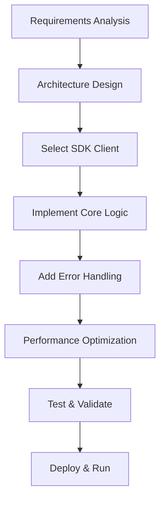

# SDK Examples

This document provides complete application examples based on `hailo_ipc_sdk`, ranging from basic connectivity tests to complex multi-scenario integrations, helping developers quickly master the application development patterns of the NE503 platform. For detailed SDK API references, see [Python SDK Reference](./2-sdk-reference.md).

## 1. Quick Start

The `hello-world` example is the simplest way to verify that SDK connectivity and basic API calls are working correctly:

```python
# apps/hello-world/main.py
from hailo_ipc_sdk import InferenceClient, DeviceClient, EventClient, Event

def main():
    # Connect service clients
    inference = InferenceClient()
    device = DeviceClient()
    events = EventClient()

    # Get device status
    status = device.get_device_status()
    print(f"Device status: {status}")

    # List available models
    models = inference.list_models()
    print(f"Available models: {len(models)}")

    # Publish a test event
    events.publish("hello/world", {"message": "Hello from AIPC!"})

if __name__ == "__main__":
    main()
```

If the device status and model count are printed correctly after running, the SDK environment is configured properly.

## 2. SDK Example Architecture

The SDK examples use a three-layer architecture design:

| Layer | Responsibility | Typical Clients |
|-------|---------------|-----------------|
| **Base Layer** | Client connection and basic API calls | `InferenceClient`, `DeviceClient`, `EventClient` |
| **Business Layer** | Specific business logic implementation | Event subscription, boundary detection, people counting |
| **Integration Layer** | Multi-service collaboration and complex workflows | Inference + device control integration, multi-stream video processing |

The data flow follows a unified **Input -> Processing -> Output** pattern, supporting both synchronous and asynchronous processing. Each example is modular and can run independently or be combined with others.

## 3. Event Subscription and Integration

`EventSubscriberApp` demonstrates how to subscribe to multiple event topics and execute linked controls:

```python
class EventSubscriberApp:
    def __init__(self):
        self.events = EventClient()
        self.device = DeviceClient()
        self.subscriptions = []
        self.app_id = "event_subscriber"

    def run(self):
        # Subscribe to multiple topics, each bound to an independent callback
        topics = [
            ("model/*/detections", self._on_detection),
            ("app/*/alert", self._on_alert),
            ("system/device/**", self._on_system_event),
        ]
        for topic, callback in topics:
            thread = self.events.on_event(topic, callback)
            self.subscriptions.append(thread)

    def _on_detection(self, event: Event):
        """Turn on the light automatically when a person is detected"""
        if "person" in str(event.payload).lower():
            self.device.set_white_light(80)

    def _on_alert(self, event: Event):
        """Publish an acknowledgment message after receiving an alert"""
        self.events.publish(f"app/{self.app_id}/alert_ack", {
            "original_topic": event.topic,
            "acknowledged": True
        }, persistent=True)
```

**Key points**: Topics support MQTT-style wildcards (`*` for single level, `**` for multi-level), and `persistent=True` ensures event persistence.

Usage:

```bash
python examples/event_subscriber.py
# Debug mode
python examples/event_subscriber.py --debug
```

Expected output:

```
[security-monitor] Subscribed to: model/*/detections
[security-monitor] Subscribed to: app/*/alert
[detection] Detection event: model/cam0_main/detections
  Payload: {"objects": [{"label": "person", "score": 0.9}]}
[security-monitor] Person detected! Light turned ON
```

## 4. Perimeter Protection System

`PerimeterGuardApp` implements boundary-crossing detection and linked alerts. The core logic consists of three components: **boundary detection + linked control + debouncing**:

```python
class PerimeterGuardApp:
    def __init__(self):
        self.inference = InferenceClient()
        self.events = EventClient()
        self.device = DeviceClient()
        self.app_id = "perimeter_guard"

        # Protection parameters
        self.alert_cooldown = 5.0          # Alert cooldown time (seconds)
        self.last_alert_time = 0
        self.detection_line = (0.3, 0.7)   # Protection line coordinates (normalized)
        self.light_on = False
        self.light_timeout = 10.0          # Light timeout (seconds)

    def run(self):
        for frame_seq, result in self.inference.subscribe(
            stream="cam0_main", model="person_v1", fps=15
        ):
            self._process_frame(frame_seq, result)
            self._update_device_state()

    def _process_frame(self, frame_seq: int, result: InferenceResult):
        persons = result.get_objects_by_label("person")
        # Filter persons who crossed the boundary
        crossed = [p for p in persons if self._is_crossing_line(p)]

        if crossed and time.time() - self.last_alert_time >= self.alert_cooldown:
            self._trigger_alert(frame_seq, crossed)
            self.last_alert_time = time.time()

    def _is_crossing_line(self, person: DetectedObject) -> bool:
        """Check if the target center point has crossed the protection line"""
        cx = person.bbox.x + person.bbox.width / 2
        cy = person.bbox.y + person.bbox.height / 2
        return cx > self.detection_line[0] and cy > self.detection_line[1]

    def _trigger_alert(self, frame_seq: int, persons: list):
        """Publish a persistent alert event"""
        self.events.publish(f"app/{self.app_id}/perimeter_alert", {
            "type": "boundary_crossing",
            "frame_sequence": frame_seq,
            "person_count": len(persons),
            "confidence": [p.score for p in persons]
        }, persistent=True)
```

Usage:

```bash
python examples/perimeter_guard.py
# Custom protection line coordinates
python examples/perimeter_guard.py --detection-line 0.4,0.8
# Custom light timeout
python examples/perimeter_guard.py --light-timeout 15
# Debug mode
python examples/perimeter_guard.py --debug --verbose
```

Expected output:

```
[perimeter-guard] Perimeter Guard App initialized
[inference] Frame 100: 1 objects detected
[perimeter-guard] 1 person(s) crossing the boundary
[ALERT] 1 person(s) crossed the boundary!
[perimeter-guard] Light turned ON

After 10 seconds...
[perimeter-guard] Light turned OFF

[inference] Frame 250: 2 objects detected
[perimeter-guard] 2 person(s) crossing the boundary
[ALERT] 2 person(s) crossed the boundary!
```

## 5. Person Detection and Counting

`PersonDetectionApp` implements real-time detection, people counting, and anomaly alerts:

```python
class PersonDetectionApp:
    def __init__(self):
        self.inference = InferenceClient()
        self.events = EventClient()
        self.alert_threshold = 5              # People count alert threshold
        self.current_persons = 0
        self.person_history = []              # Sliding window statistics
        self.app_id = "person_detection"

    def run(self):
        for frame_seq, result in self.inference.subscribe(
            stream="cam0_main", model="person_detection", fps=30
        ):
            self._process_detection(frame_seq, result)
            self._update_statistics()
            self._check_anomalies()

    def _process_detection(self, frame_seq: int, result: InferenceResult):
        """Process detection results, publish high-confidence person events"""
        persons = result.get_objects_by_label("person")
        self.current_persons = len(persons)

        for person in persons:
            if person.score > 0.8:
                self.events.publish(f"app/{self.app_id}/person_detected", {
                    "frame": frame_seq,
                    "id": person.track_id if hasattr(person, 'track_id') else None,
                    "confidence": person.score,
                    "bbox": person.bbox.to_xywh(),
                    "timestamp": time.time()
                })

    def _check_anomalies(self):
        """Detect anomalous behavior such as crowd gathering"""
        if self.current_persons > self.alert_threshold:
            self.events.publish(f"app/{self.app_id}/population_alert", {
                "count": self.current_persons,
                "threshold": self.alert_threshold
            })

    def _update_statistics(self):
        """Sliding window statistics: keep last 1 minute of data"""
        self.person_history.append({
            "timestamp": time.time(),
            "count": self.current_persons
        })
        cutoff_time = time.time() - 60
        self.person_history = [
            h for h in self.person_history
            if h["timestamp"] > cutoff_time
        ]
```

**Key logic**:
- Only publish detection results with confidence > 0.8
- Control anomaly alert sensitivity via `alert_threshold`
- `person_history` maintains a sliding window for trend analysis

Usage:

```bash
python examples/person_detection.py
# Custom alert threshold
python examples/person_detection.py --alert-threshold 10
# Disable visualization overlay
python examples/person_detection.py --no-overlay
# Save detection data
python examples/person_detection.py --output logs/detection.json
```

Expected output:

```
[person-detection] Person Detection App initialized
[person-detection] Starting detection...

[person-detection] Frame 150: 2 persons detected
[person-detection] -> Person #1: confidence=0.92, bbox=[100,200,50,80]
[person-detection] -> Person #2: confidence=0.87, bbox=[300,250,60,90]

[person-detection] Frame 200: 5 persons detected
[person-detection] Population alert! Current: 5, Threshold: 5

[person-detection] Statistics:
  - Current persons: 5
  - Average per minute: 12.5
```

## 6. Video Stream Processing

`VideoProcessorApp` demonstrates a multi-threaded video processing pipeline that supports motion detection, object detection, and scene analysis:

```python
class VideoProcessorApp:
    def __init__(self):
        self.inference = InferenceClient()
        self.processing_queue = queue.Queue(maxsize=10)

        # Processing switches
        self.enable_motion = True
        self.enable_object_detection = True

    # Note: subscribe returns InferenceResult, not raw frames
    def run(self):
        # Start processing thread
        threading.Thread(target=self._process_frames, daemon=True).start()

        # Main thread receives video stream and enqueues for processing
        for frame_seq, frame_data in self.inference.subscribe(
            stream="cam0_main", model="yolov8n"
        ):
            try:
                self.processing_queue.put_nowait((frame_seq, frame_data))
            except queue.Full:
                pass  # Drop current frame when queue is full

    def _process_frames(self):
        """Frame processing thread: motion detection + object detection"""
        while True:
            frame_seq, frame_data = self.processing_queue.get()
            start = time.time()

            # Motion detection
            if self.enable_motion:
                motion_score = self._detect_motion(frame_data)
                if motion_score > 0.5:
                    # Mark motion regions
                    pass

            # Object detection
            if self.enable_object_detection:
                result = self.inference.infer(
                    model_id="object_detection", image=frame_data
                )

            # Output performance stats every 100 frames
            if frame_seq % 100 == 0:
                elapsed = time.time() - start
                print(f"Frame {frame_seq}: {elapsed:.3f}s")

    def _detect_motion(self, frame_data) -> float:
        """Frame-differencing motion detection, returns motion score 0~1"""
        gray = cv2.cvtColor(frame_data, cv2.COLOR_BGR2GRAY)
        if hasattr(self, "prev_frame"):
            diff = cv2.absdiff(self.prev_frame, gray)
            score = np.mean(diff) / 255.0
        else:
            score = 0
        self.prev_frame = gray
        return score
```

**Key design decisions**:
- **Producer-consumer pattern**: The main thread receives frames and enqueues them, while worker threads process asynchronously
- **Backpressure control**: `Queue(maxsize=10)` limits memory usage, dropping frames when full rather than blocking
- **Frame differencing**: Lightweight motion detection without requiring an additional AI model

Usage:

```bash
python examples/video_processor.py
# Custom output stream (this is an example path, replace with your actual stream address)
python examples/video_processor.py --output-stream rtsp://localhost:8554/output
# Enable specific processing
python examples/video_processor.py --motion-detection --object-detection
# Save processing results
python examples/video_processor.py --save processed_videos/
```

Expected output:

```
[video-processor] Video Processor App initialized
[video-processor] Starting processing...

[video-processor] Frame 1000 processed
  - Motion score: 0.23
  - Objects detected: 2
  - Processing time: 0.045s

[video-processor] Frame 1100 processed
  - Motion score: 0.78
  - Objects detected: 3
  - Motion detected! Adding overlay

[video-processor] Performance stats:
  - Total frames: 1500
  - Average FPS: 29.8
  - Avg processing time: 0.042s
```

## 7. Complete Application Examples

### object-detection

A real-time object detection application based on YOLOv8:

```python
# apps/object-detection/main.py
from hailo_ipc_sdk import InferenceClient

class ObjectDetectionApp:
    def __init__(self):
        self.inference = InferenceClient()
        self.model_name = "yolov8s"

    def run(self):
        for frame_seq, result in self.inference.subscribe(
            stream="cam0_main", model=self.model_name, fps=15
        ):
            objects = result.objects
            # Note: subscribe returns (frame_seq, result), which does not include image data.
            # If you need to draw detection boxes on the image, you must obtain the corresponding frame
            # via FdMediaClient, or use OverlayClient to directly overlay detection results.
            # The `frame` variable below is for demonstration purposes only.
            for obj in objects:
                if obj.score > 0.5:
                    # Draw bounding box and label
                    bbox = obj.bbox
                    cv2.rectangle(frame, (bbox.x, bbox.y),
                        (bbox.x + bbox.width, bbox.y + bbox.height),
                        (0, 255, 0), 2)
                    cv2.putText(frame, f"{obj.label} {obj.score:.2f}",
                        (bbox.x, bbox.y - 10),
                        cv2.FONT_HERSHEY_SIMPLEX, 0.5, (0, 255, 0), 2)
```

### people-counting

Bidirectional people counting based on virtual counting lines:

```python
# apps/people-counting/main.py
from hailo_ipc_sdk import InferenceClient
from collections import deque

class PeopleCounter:
    def __init__(self):
        self.inference = InferenceClient()
        self.counting_lines = [(100, 0, 100, 720)]  # Counting line coordinates
        self.person_history = deque(maxlen=100)
        self.total_count = 0

    def run(self):
        for frame_seq, result in self.inference.subscribe(
            stream="cam0_main", model="person_detection"
        ):
            self._count_people(frame_seq, result)

    def _count_people(self, frame_seq, result):
        persons = result.get_objects_by_label("person")
        for line in self.counting_lines:
            crossed = sum(
                1 for p in persons if self._crossed_line(p, line)
            )
            if crossed > 0:
                self.total_count += crossed
                print(f"Frame {frame_seq}: +{crossed}, Total: {self.total_count}")
```

## 8. Custom Development Guide

### Development Workflow



**Select SDK Client**: Choose the appropriate client based on your functional requirements — use `InferenceClient` for AI inference, `EventClient` for event handling, and `DeviceClient` for device control. For detailed API references, see [Python SDK Reference](./2-sdk-reference.md).

### Best Practices

#### Error Handling

```python
class RobustApp:
    def __init__(self):
        self.retry_count = 0
        self.max_retries = 3

    def _safe_execute(self, func, *args, **kwargs):
        """Safe execution wrapper that catches exceptions and retries"""
        try:
            return func(*args, **kwargs)
        except Exception as e:
            self.retry_count += 1
            logger.error(f"Execution failed: {e}, retry {self.retry_count}/{self.max_retries}")
            if self.retry_count >= self.max_retries:
                self._emergency_shutdown()
            return None
```

Core principles:
- All exceptions must be explicitly caught and handled
- Use retry mechanisms for transient failures
- Log detailed error context
- Implement graceful degradation strategies

#### Performance Optimization

- Use **connection pooling** to manage clients, avoiding frequent creation and destruction
- **Batch requests** to reduce communication overhead
- **Cache** frequently accessed data (e.g., permission info, model results)
- Use **async I/O** to improve concurrency

#### Configuration Management

- Manage all parameters through configuration files, never hardcode values
- Support environment variable overrides (`os.getenv("KEY", default)`)
- Provide configuration validation and sensible defaults

#### Monitoring and Logging

- Use structured logging (the `logging` module, not `print`)
- Collect key metrics: frame rate, inference latency, memory usage
- Proactively alert on anomalies rather than failing silently

#### Security

- Validate all external input data
- Inject sensitive information (keys, tokens) through environment variables
- Maintain security audit logs

### Debugging Tips

Configure detailed log output to quickly locate issues:

```python
import logging
import traceback

logging.basicConfig(
    level=logging.DEBUG,
    format="%(asctime)s - %(name)s - %(levelname)s - %(message)s",
    handlers=[
        logging.FileHandler("app.log"),
        logging.StreamHandler()
    ]
)
logger = logging.getLogger(__name__)

def debug_function(func):
    """Debugging decorator: logs function arguments, return values, and exceptions"""
    def wrapper(*args, **kwargs):
        logger.debug(f"Calling {func.__name__}({args}, {kwargs})")
        try:
            result = func(*args, **kwargs)
            logger.debug(f"{func.__name__} returned: {result}")
            return result
        except Exception as e:
            logger.error(f"{func.__name__} exception: {e}")
            logger.error(traceback.format_exc())
            raise
    return wrapper
```

## 9. Related Documentation

- [Platform Architecture](../3-platform-development/0-platform-architecture.md) -- NE503 software platform overall architecture and service topology
- [Application Development Guide](./1-app-reference.md) -- Complete development workflow from project creation to deployment
- [Python SDK Reference](./2-sdk-reference.md) -- Detailed API reference for all SDK modules
