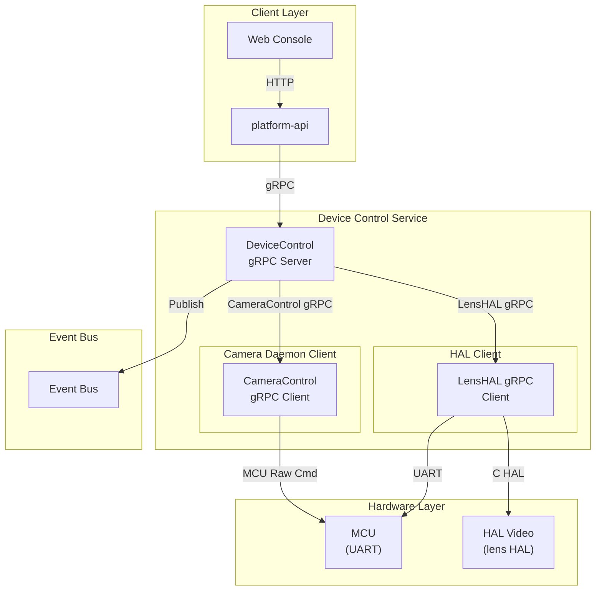
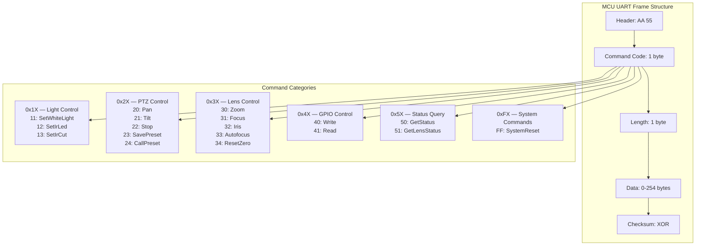
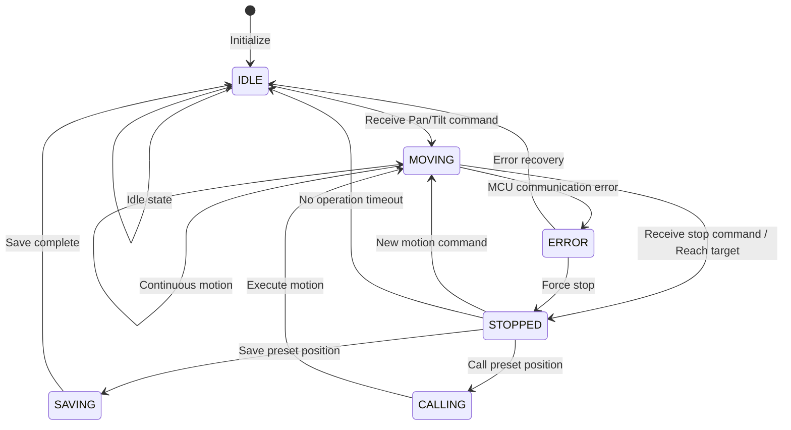
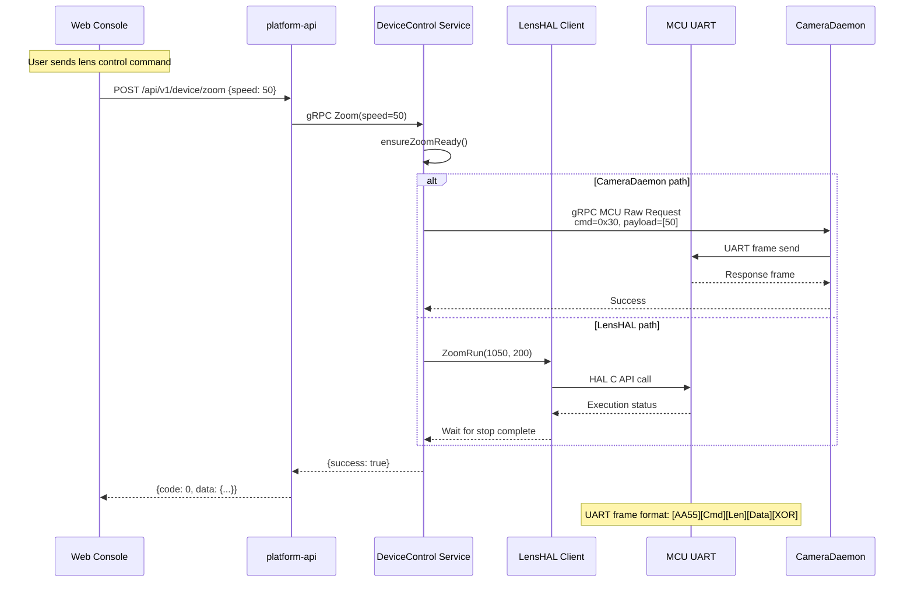
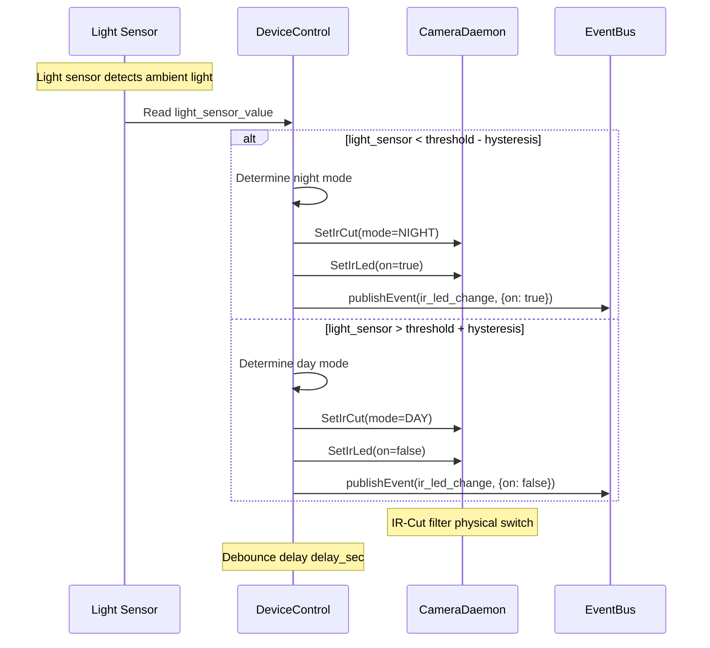

# Device Control Service

Device Control is the hardware peripheral control service on the NE503 platform. It manages peripherals such as lights, PTZ, lens, and GPIO through MCU (UART) and HAL. It supports advanced control of the AF0832 lens (autofocus, AF window, iris) and real-time event subscription.

Tech stack: Go + gRPC + HAL.

## 1. Architecture



The Device Control service listens on `unix:///run/aipc/device-control.sock` and interacts with hardware through two paths: **CameraDaemon path** (MCU Raw Command controls lights, PTZ, GPIO via UART) and **LensHAL path** (C HAL API controls lens Zoom, Focus, Iris, autofocus).

## 2. MCU UART Protocol

### Frame Format



| Command Range | Category | Typical Commands |
|:---|:---|:---|
| `0x1X` | Light Control | SetWhiteLight (0x11), SetIrLed (0x12), SetIrCut (0x13) |
| `0x2X` | PTZ Control | Pan (0x20), Tilt (0x21), Stop (0x22), SavePreset (0x23), CallPreset (0x24) |
| `0x3X` | Lens Control | Zoom (0x30), Focus (0x31), Iris (0x32), Autofocus (0x33), ResetZero (0x34) |
| `0x4X` | GPIO Control | Write (0x40), Read (0x41) |
| `0x5X` | Status Query | GetStatus (0x50), GetLensStatus (0x51) |
| `0xFX` | System Commands | SystemReset (0xFF) |

---

## 3. gRPC API

Service name: `DeviceControl`, listening on `unix:///run/aipc/device-control.sock`.

### 3.1 Light Control

| RPC | Request | Response | Description |
|:---|:---|:---|:---|
| `SetWhiteLight` | `LightLevelRequest` | `Status` | White light brightness (0-100) |
| `SetIrLed` | `LightSwitchRequest` | `Status` | IR LED switch |
| `SetIrCut` | `IrCutRequest` | `Status` | IR-Cut filter mode |

```protobuf
message LightLevelRequest { uint32 level = 1; }          // 0-100
message LightSwitchRequest { bool on = 1; }
enum IrCutMode { IRCUT_AUTO = 0; IRCUT_DAY = 1; IRCUT_NIGHT = 2; }
```

### 3.2 PTZ Control

| RPC | Request | Response | Description |
|:---|:---|:---|:---|
| `Pan` | `PanRequest` | `Status` | Horizontal rotation |
| `Tilt` | `TiltRequest` | `Status` | Vertical rotation |
| `PTZStop` | `PTZStopRequest` | `Status` | Stop motion |
| `SavePreset` | `PresetRequest` | `Status` | Save preset position |
| `CallPreset` | `PresetRequest` | `Status` | Call preset position |

```protobuf
enum PanDirection { PAN_STOP = 0; PAN_LEFT = 1; PAN_RIGHT = 2; }
enum TiltDirection { TILT_STOP = 0; TILT_UP = 1; TILT_DOWN = 2; }
message PanRequest { PanDirection direction = 1; uint32 speed = 2; }
message TiltRequest { TiltDirection direction = 1; uint32 speed = 2; }
message PresetRequest { uint32 preset_id = 1; }          // 1-255
```

### 3.3 Lens Control

| RPC | Request | Response | Description |
|:---|:---|:---|:---|
| `Zoom` | `ZoomRequest` | `Status` | Zoom speed control |
| `Focus` | `FocusRequest` | `Status` | Focus speed control |
| `SetAutofocus` | `AutofocusRequest` | `Status` | Enable/disable autofocus |
| `SetZoomLevel` | `ZoomLevelRequest` | `Status` | Absolute zoom position |
| `SetFocusLevel` | `FocusLevelRequest` | `Status` | Absolute focus position |
| `LensResetZero` | `LensResetRequest` | `Status` | Reset to zero |
| `GetLensStatus` | `Empty` | `LensStatusResponse` | Get lens status |
| `ControlIris` | `IrisRequest` | `Status` | Iris speed control |
| `SetIrisTarget` | `IrisTargetRequest` | `Status` | Absolute iris position |
| `SetLensLimits` | `LensLimitsRequest` | `Status` | Set limits |

```protobuf
message ZoomRequest { int32 speed = 1; }                 // -100 ~ 100
message FocusRequest { int32 speed = 1; }                // -100 ~ 100
message ZoomLevelRequest { float level = 1; }            // 0.0 ~ 1.0
message FocusLevelRequest { float level = 1; }           // 0.0 ~ 1.0
```

### 3.4 AF0832 Advanced API

The AF0832 lens provides finer control capabilities, including positioning by zoom ratio and focus distance, AF window configuration, and AF measurement retrieval.

| RPC | Request | Response | Description |
|:---|:---|:---|:---|
| `LensInit` | `LensInitRequest` | `Status` | Initialize AF0832 lens |
| `LensGotoRatioDistance` | `GotoRatioDistanceRequest` | `Status` | Position by zoom ratio and focus distance |
| `SetAfWindows` | `SetAfWindowsRequest` | `Status` | Configure AF windows |
| `GetAfMeasurement` | `Empty` | `AfMeasurementResponse` | Get AF measurement values |

```protobuf
message GotoRatioDistanceRequest {
  float zoom_ratio = 1;        // 1.0 ~ 2.88 optical zoom ratio
  float focus_distance_m = 2;  // Focus distance (meters)
}

message AfWindow { int32 x = 1; int32 y = 2; int32 w = 3; int32 h = 4; }
message SetAfWindowsRequest {
  bool enabled = 1;
  repeated AfWindow windows = 2;  // 1-3 windows
}
```

### 3.5 GPIO

| RPC | Request | Response | Description |
|:---|:---|:---|:---|
| `GPIOWrite` | `GPIOWriteRequest` | `Status` | Write GPIO |
| `GPIORead` | `GPIOReadRequest` | `GPIOReadResponse` | Read GPIO |

GPIO control flow: receive write request → validate pin availability → build MCU command frame → send UART command via CameraDaemon → update GPIO state → publish event to EventBus.

### 3.6 Status and Events

| RPC | Request | Response | Description |
|:---|:---|:---|:---|
| `GetDeviceStatus` | `Empty` | `DeviceStatus` | Get complete device status |
| `SubscribeEvents` | `Empty` | `stream DeviceEvent` | Event stream subscription |

```protobuf
message DeviceStatus {
  float soc_temp_c = 1;
  float mcu_temp_c = 2;
  uint32 light_sensor = 3;
  int32 ptz_pan_pos = 10;
  int32 ptz_tilt_pos = 11;
  uint32 zoom_pos = 20;
  uint32 focus_pos = 21;
  bool autofocus_enabled = 22;
  IrCutMode ircut_mode = 30;
  uint32 white_light_level = 40;
  bool ir_led_on = 41;
  string mcu_version = 50;
}

message DeviceEvent {
  enum EventType {
    GPIO_CHANGE = 0;
    LIGHT_SENSOR_CHANGE = 1;
    TEMPERATURE_ALERT = 2;
    PTZ_MOVE_COMPLETE = 3;
    FOCUS_COMPLETE = 4;
  }
  EventType type = 1;
  uint64 timestamp_ns = 2;
}
```

## 4. PTZ State Machine



## 5. Lens Control Flow



Lens control is implemented through two paths: the CameraDaemon path (MCU Raw Command via UART) and the LensHAL path (C HAL API controls the lens). The lens state progresses through four phases: NO_CFG -> STOPPED -> RESET_ZERO -> MOTOR_RUNNING. Readiness is checked via `ensureZoomReady()`, and `recoverLensLink()` is used for recovery on exceptions.

## 6. Automation Control

### Day/Night Switching



### Automation Features

| Feature | Description |
|:---|:---|
| Auto day/night switching | Automatically switch IR-Cut and IR LED based on light sensor, with hysteresis band and debounce delay |
| Over-temperature protection | Warning event above alert temperature (default 75°C), auto throttle above critical temperature (default 85°C), auto recovery when temperature returns to safe range |
| Event publishing | Push GPIO changes, temperature alerts, PTZ motion completion, focus completion, and other events to EventBus |

> **Note**: Warning thresholds can be adjusted based on actual deployment conditions.

## 7. Configuration

Configuration file: `configs/platform/device-control.yaml`

| Configuration Item | Description | Default Value |
|:---|:---|:---|
| `service.listen` | Listen address | `unix:///run/aipc/device-control.sock` |
| `camera_daemon.lens_endpoint` | CameraDaemon lens HAL address | `/run/aipc/camera-control.sock` |
| `mcu.device` / `mcu.baudrate` | Serial device / baud rate | `/dev/ttyS0` / `921600` |
| `mcu.timeout_ms` / `mcu.max_retries` | Timeout / max retries | `1000` / `3` |
| `mcu.heartbeat_interval_sec` | Heartbeat interval | `30` |
| `capabilities.ptz.pan_range` / `tilt_range` | Horizontal / vertical range | `[-180,180]` / `[-45,45]` |
| `capabilities.ptz.presets` | Number of presets | `16` |

> **Note**: Preset IDs are numbered starting from 1. The valid range is 1 to the configured presets count (default 1-16).
| `capabilities.lens.zoom_range` / `focus_range` | Zoom / focus range | `[1.0,2.88]` / `[0.1,10.0]` |
| `capabilities.gpio.available_pins` | Available GPIO pins | `[12, 13, 21, 22]` |
| `automation.day_night_auto.light_sensor_threshold` | Day/night switching light threshold | `300` |
| `automation.day_night_auto.hysteresis` / `delay_sec` | Hysteresis band / debounce delay | `50` / `10` |
| `automation.temperature_protection.warning_temp_c` | Warning temperature (°C) | `75` |
| `automation.temperature_protection.critical_temp_c` | Critical temperature (°C) | `85` |
| `event_bus.endpoint` | Event bus address | `unix:///run/aipc/event-bus.sock` |

## 8. Related Documentation

- [Platform Architecture](../3-software-platform/0-platform-architecture.md) — Four-layer architecture overview and inter-service communication
- [RESTful API](../3-software-platform/5-restful-api.md) — HTTP API gateway forwarding rules
- [Event Bus](2-event-bus.md) — Event bus service reference
- [CLI Guide](../3-software-platform/4-cli-guide.md) — Command-line device control tools
