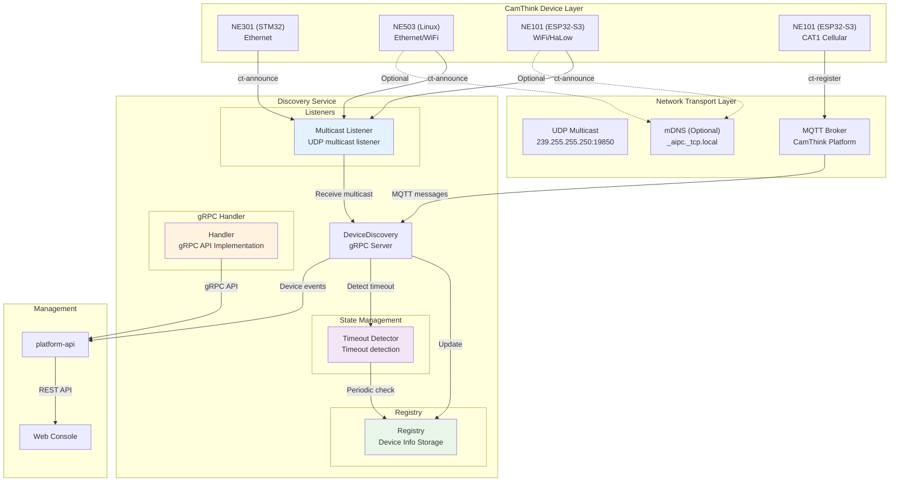
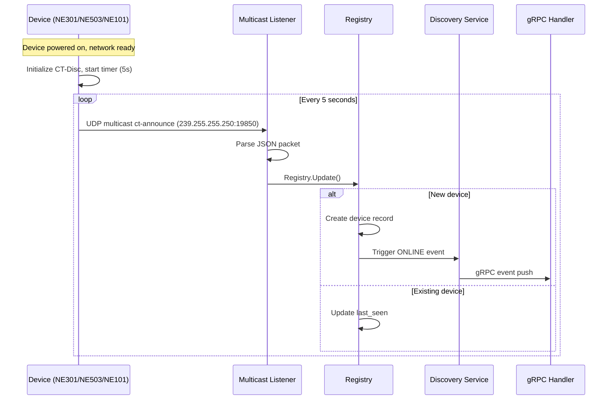
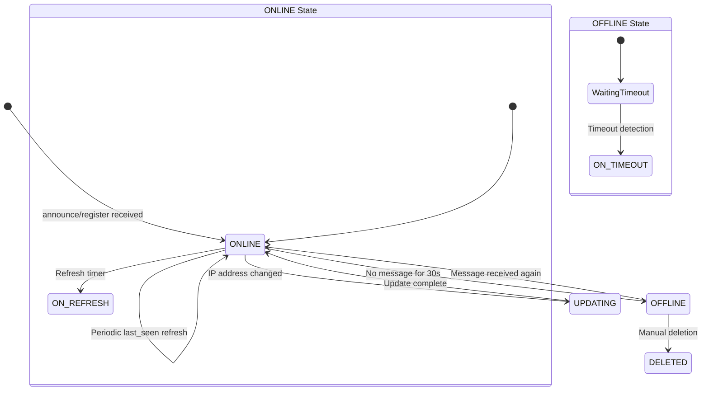
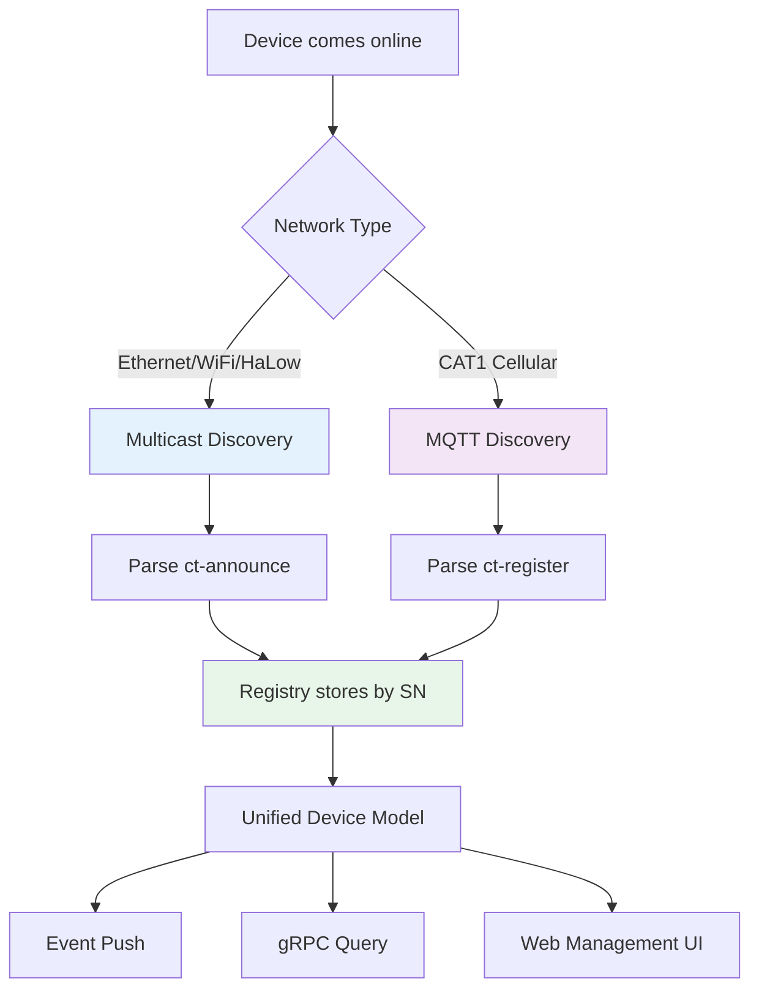
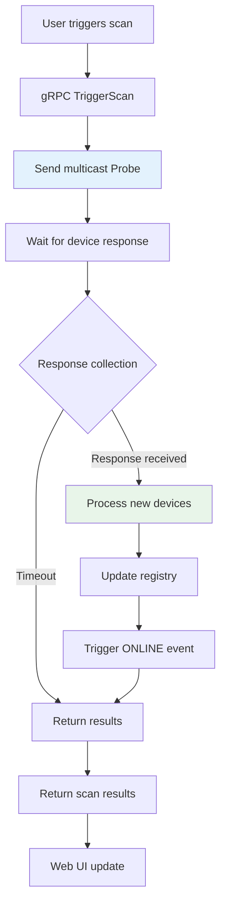
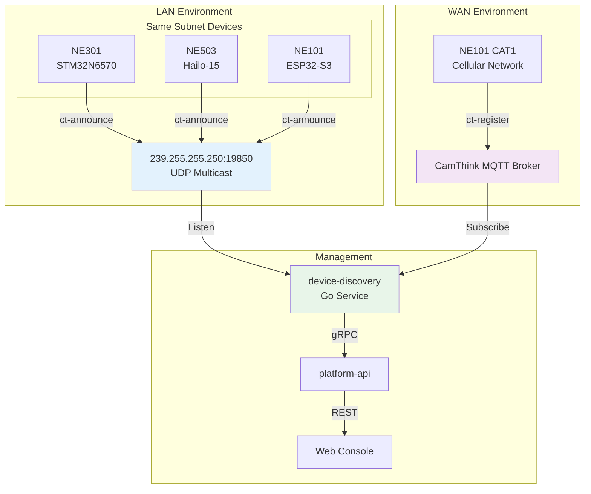

# Device Discovery Service

Device Discovery is a Go + gRPC based device discovery service that implements the **CT-Disc** (CamThink Device Discovery & Management) protocol for automatic discovery and unified management of CamThink devices in LAN and WAN environments.

Core capabilities: **dual transport mode** (UDP multicast + MQTT auto-selected by network type), **unified device model** (normalized storage by SN), **real-time state management** (automatic online/offline detection), **management command channel** (remote command dispatch).

## System Architecture



## CT-Disc Protocol

CT-Disc defines the complete interaction flow for devices to automatically announce, register with the management platform, and accept management commands.

### Multicast Discovery

After powering on, devices automatically send `ct-announce` via UDP multicast. The Discovery service listens and registers them.



### Device State Management

Each device maintains four states in the registry, with automatic transitions through timeout detection.



| State | Description | Trigger Condition |
|-------|-------------|-------------------|
| **ONLINE** | Device is online | announce/register message received |
| **OFFLINE** | Device is offline | No heartbeat received for over 30s |
| **DELETED** | Deleted | Manually removed by management |
| **UPDATING** | Information updating | Key field change such as IP address |

### Multi-Protocol Unified Management

Regardless of whether devices connect via UDP multicast or MQTT, they are all normalized and stored in the registry by SN.



## gRPC API

Service name `aipc.discovery.DiscoveryService`, listening on `unix:///run/aipc/device-discovery.sock`.

### ListDevices {#listdevices}

Query the list of discovered devices, with support for filtering by product model and status.

```protobuf
rpc ListDevices(ListDevicesRequest) returns (ListDevicesResponse)
```

| Field | Type | Description |
|-------|------|-------------|
| `product` | string | **Request**: Filter by product model, empty string for no filter |
| `status` | DeviceStatus | **Request**: Filter by device status |
| `devices` | DiscoveredDevice[] | **Response**: Device list |

### GetDevice {#getdevice}

Query a single device's details by serial number. Returns a `DiscoveredDevice` object containing the device's full information (SN, product model, IP, MAC, firmware version, capabilities, network type, and current status).

| Field | Type | Description |
|-------|------|-------------|
| `serial_number` | string | Device serial number |

### TriggerScan {#triggerscan}

Actively trigger a multicast probe to discover newly connected devices on the network.

```protobuf
rpc TriggerScan(TriggerScanRequest) returns (TriggerScanResponse)
```

| Field | Type | Description |
|-------|------|-------------|
| `timeout_seconds` | int32 | Request: scan timeout duration |
| `found_count` | int32 | Response: number of devices found |
| `new_devices` | DiscoveredDevice[] | Response: list of newly discovered devices |



### WatchDevices {#watchdevices}

Subscribe to device event stream (server streaming) for real-time online/offline and state change events. No request parameters are required — calling this RPC opens a persistent stream that pushes events for all discovered devices.

| Field | Type | Description |
|-------|------|-------------|
| `type` | EventType | `ONLINE` / `OFFLINE` / `UPDATED` |
| `device` | DiscoveredDevice | Device information |

### SendCommand {#sendcommand}

Send a management command to a specified device via the MQTT channel and wait for a response.

| Field | Type | Description |
|-------|------|-------------|
| `serial_number` | string | Target device serial number |
| `action` | string | Command action |
| `params` | string | Command parameters (JSON) |
| `timeout_seconds` | int32 | Response wait timeout duration |

## Transport Parameters

| Transport | Multicast Address/Topic | Port | Interval | QoS | Max Packet |
|-----------|------------------------|------|----------|-----|------------|
| **UDP Multicast** | `239.255.255.250` | `19850` | `5000ms` | - | `512 bytes` |
| **MQTT Register** | `ct/disc/register` | - | `30000ms` | `0` | - |
| **MQTT Command** | `ct/cmd/{sn}` | - | - | `1` | - |
| **MQTT Response** | `ct/resp/{sn}` | - | - | `1` | - |

### JSON Payload Format

Both transport modes use a similar JSON structure. Field descriptions are as follows:

| Field | Type | Description |
|-------|------|-------------|
| `type` | string | `ct-announce` (multicast) or `ct-register` (MQTT) |
| `product` | string | Product model, e.g. `NE503`, `NE101` |
| `sn` | string | Device serial number |
| `mac` / `ip` / `fw` / `port` | - | MAC address, IP, firmware version, HTTP port |
| `hw` | string | Hardware platform, e.g. `Hailo-15`, `ESP32-S3` |
| `caps` | string[] | Capability list: `camera`, `mqtt`, `http`, `cellular` |
| `net` | string | MQTT only: network type, e.g. `cat1` |

**ct-announce example** (multicast announcement)

```json
{ "type": "ct-announce", "product": "NE503", "sn": "CT503-2026-00001",
  "mac": "AA:BB:CC:DD:EE:FF", "ip": "192.168.1.50", "fw": "v1.0.0",
  "port": 80, "hw": "Hailo-15", "caps": ["camera", "mqtt", "http"] }
```

**ct-register example** (MQTT registration)

```json
{ "type": "ct-register", "product": "NE101", "sn": "CT101-2026-00001",
  "mac": "AA:BB:CC:DD:EE:FF", "ip": "10.0.1.50", "fw": "v1.0.0",
  "port": 80, "hw": "ESP32-S3", "caps": ["camera", "mqtt", "http", "cellular"], "net": "cat1" }
```

## Management Commands

Standard management commands dispatched via the `SendCommand` API or MQTT command topics.

| action | Description | params Example | Applicable Devices |
|--------|-------------|----------------|-------------------|
| `reboot` | Reboot device | `{}` | All |
| `get_info` | Get device detailed information | `{}` | All |
| `set_config` | Push configuration | `{"key": "value"}` | All |
| `ota_upgrade` | OTA firmware upgrade | `{"url": "..."}` | NE101, NE503 |
| `capture` | Trigger photo capture | `{}` | NE101 |
| `set_network` | Modify network configuration | `{"mode": "static"}` | NE503 |

**Command message** (`ct/cmd/{sn}`): `{"id": "cmd-001", "action": "reboot", "params": {}, "timestamp": 1716163200}`

**Command response** (`ct/resp/{sn}`): `{"id": "cmd-001", "result": "ok", "data": {}, "timestamp": 1716163201}`

## Network Topology



## Configuration

Configuration file: `configs/platform/discovery.yaml`

```yaml
service:
  name: device-discovery
  listen: unix:///run/aipc/device-discovery.sock
  log_level: info

discovery:
  multicast_addr: 239.255.255.250
  multicast_port: 19850
  announce_interval: 5
  timeout: 30
  interface: ""  # Bind to network interface, empty for auto-select
```

## Related Documentation

- [AI Runtime](./0-ai-runtime.md) — AI inference runtime service
- [Event Bus](./2-event-bus.md) — Event bus service
- [Quick Start](../1-quick-start.md) — NE503 quick start guide
