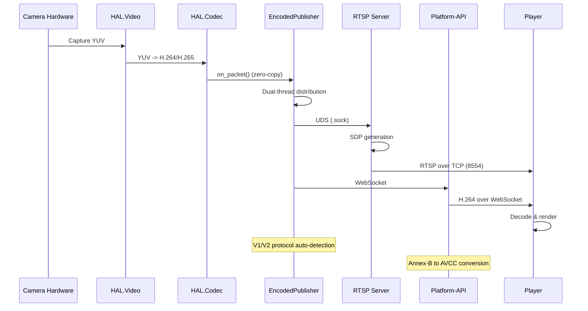
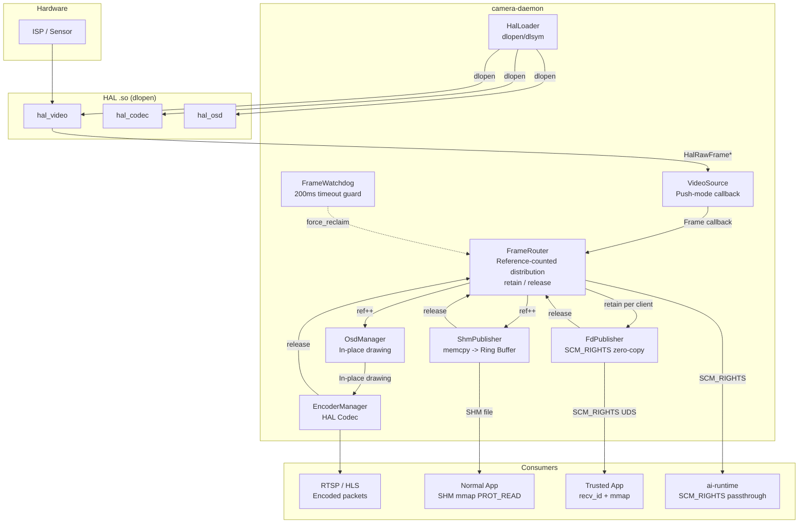
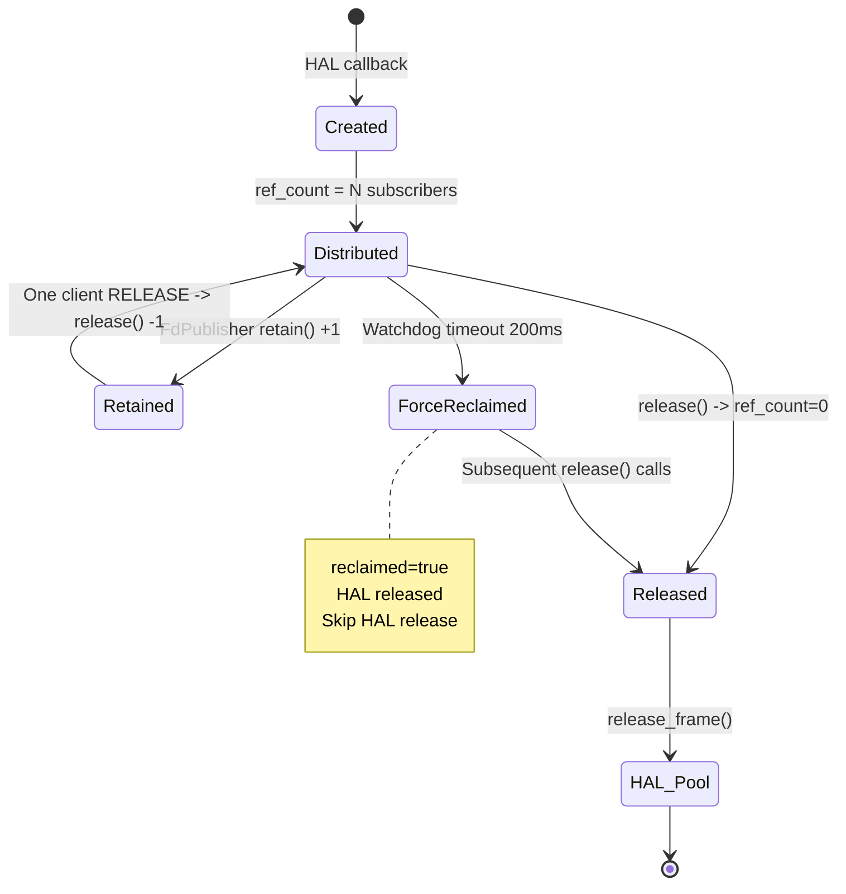
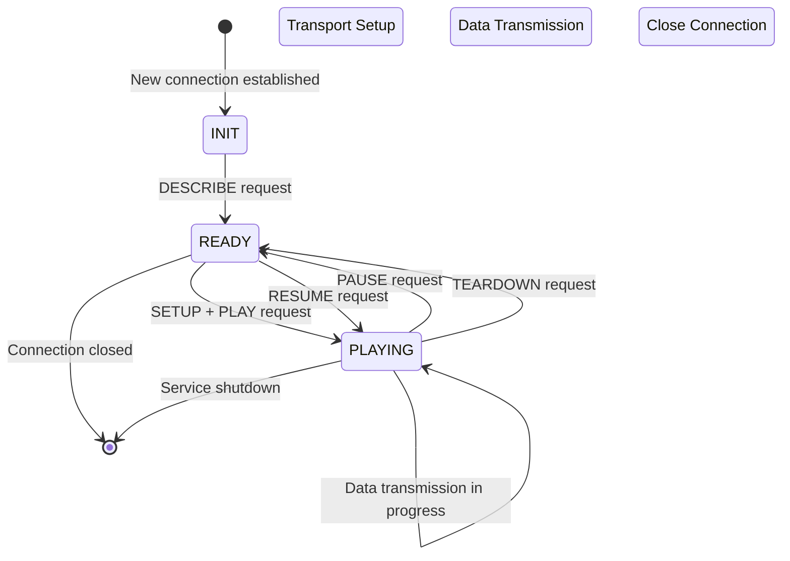
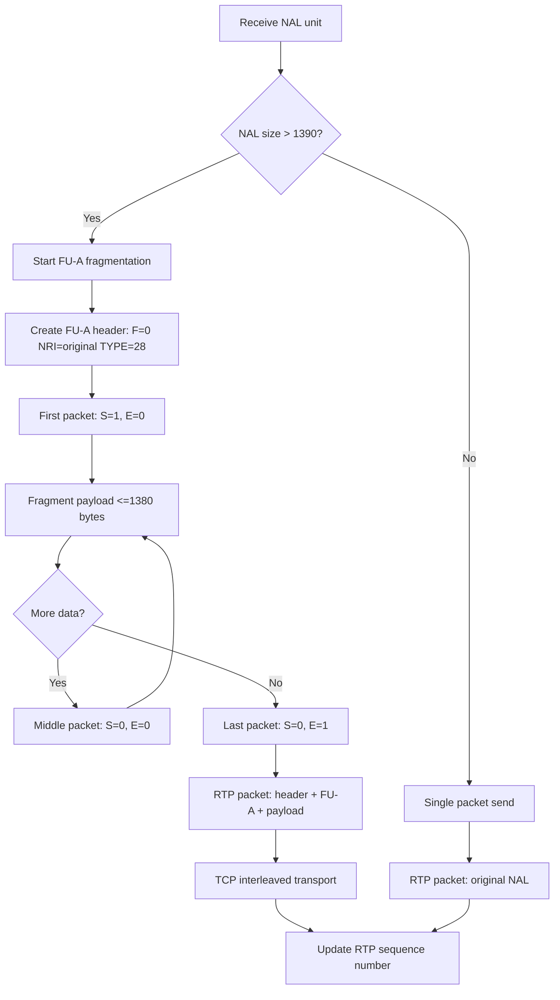
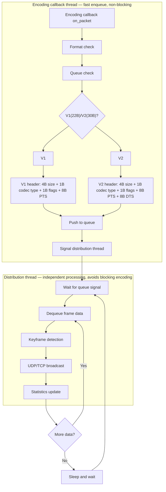
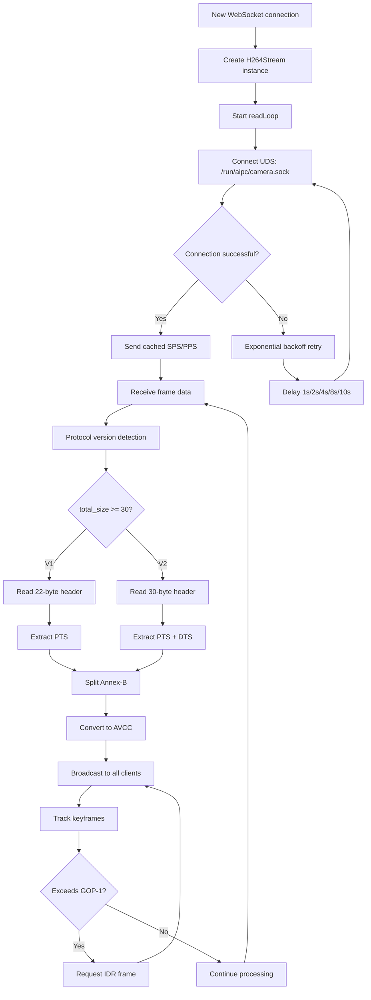
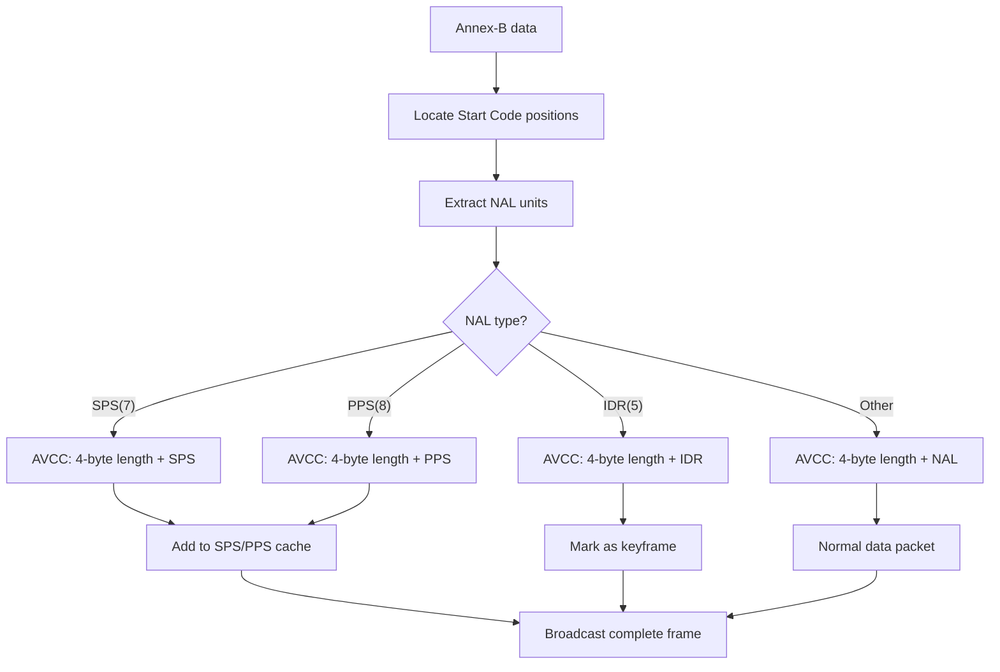
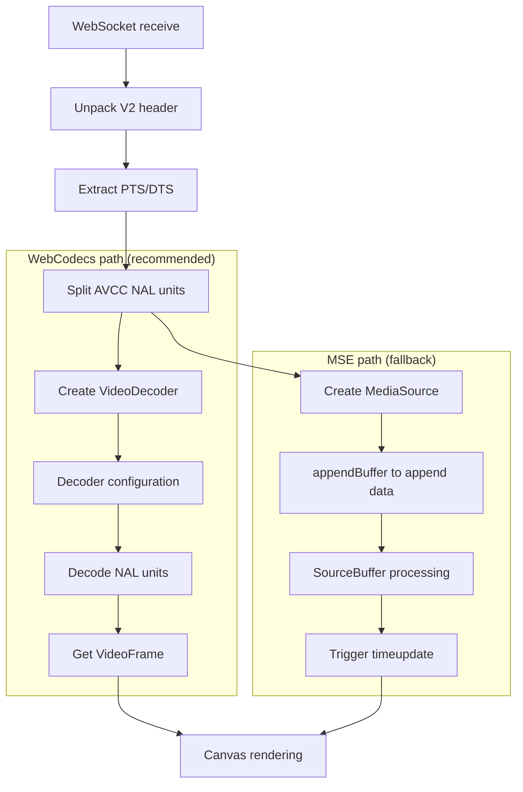

# Media Streaming Service

NE503 implements a complete low-latency video pipeline from camera hardware capture to web frontend playback, supporting RTSP protocol output, and provides real-time video streaming via WebSocket endpoints of the Platform API. The system employs DMA-BUF zero-copy, reference-counted frame distribution, Unix Domain Socket communication, and other technologies to achieve end-to-end latency of less than 100ms.

- **Protocol** — RTSP 1.0 + RTP/AVP/TCP interleaved transport; H.264/H.265 FU-A fragmentation
- **Zero-copy** — DMA-BUF FD passthrough + reference counting, no memory copies on the AI inference path
- **Dual-channel** — FD Passthrough (zero-copy) and SHM Ring Buffer (single memcpy) coexist, automatically selected based on App permissions
- **Multi-client** — A single stream can simultaneously serve multiple consumers including RTSP, WebSocket, and AI inference
- **Hot update** — Dynamically adjust encoding parameters (bitrate, frame rate, GOP) without restarting the encoder

## Data Flow Architecture



## Camera Daemon

Camera Daemon is the core C++ service on the NE503 platform, responsible for video capture, frame distribution, encoding, and multi-channel frame publishing. It directly operates the HAL hardware abstraction layer.

### Overall Architecture



### Dual-Channel Frame Distribution

App containers acquire video frames through two methods. The Daemon automatically selects the appropriate method based on App permissions.

#### FD Passthrough (Zero-Copy) — FdPublisher

For trusted Apps (with `dma_buf: true` declared in manifest). DMA-BUF fd is passed directly via `SCM_RIGHTS`. The App uses `mmap` to access pixel data — zero-copy throughout. Each client can hold a maximum of 3 frames simultaneously (backpressure protection). The Watchdog enforces a 200ms timeout for forced reclamation to prevent HAL buffer leaks.

**Communication Protocol (`fd_protocol.h`):**

| Direction | Message | Description |
|-----------|---------|-------------|
| Client -> Server | `SUBSCRIBE(stream_name)` | Subscribe to video stream |
| Server -> Client | `FRAME` + SCM_RIGHTS | Frame metadata + DMA-BUF fd |
| Client -> Server | `RELEASE(frame_id)` | Return frame |
| Client -> Server | `UNSUBSCRIBE` | Unsubscribe |

#### SHM Ring Buffer (Single memcpy) — ShmPublisher

For all Apps (no special container permissions required). Frame data is memcpy'd to a shared memory Ring Buffer. Apps access it read-only via `mmap PROT_READ`. Internally caches DMA-BUF mmap results to avoid per-frame mmap/munmap system calls. Performance: 640x640 NV12 approximately 0.1ms, 4K approximately 2ms.

#### Comparison of Both Methods

| | FD Passthrough | SHM |
|---|---|---|
| Copy count | 0 | 1 memcpy |
| 640x640 latency | Approx. 0.03ms | Approx. 0.1ms |
| 4K latency | Approx. 0.03ms | Approx. 2ms |
| Container permissions | seccomp: ioctl, SCM_RIGHTS | No special permissions |
| App crash risk | HAL buffer leak (Watchdog protection) | No impact |
| Python interface | recv_fd + mmap + np.frombuffer | mmap + np.frombuffer |
| Recommended use case | AI inference, high-frame-rate processing | General analysis, image saving |

### Frame Lifecycle

#### Reference Counting Flow



#### Watchdog Forced Reclamation

The scanning thread checks unreturned frames every 50ms. Frames exceeding 200ms trigger `force_reclaim`: marks `reclaimed=true` and immediately returns to HAL, but retains the ManagedFrame object. Subsequent `release()` calls check the flag and skip HAL release; the object is deleted when ref_count drops to 0.

### Module Reference

| Module | Source File | Responsibility |
|--------|-------------|----------------|
| **HalLoader** | `hal_loader.h/cpp` | Dynamically loads HAL shared libraries via `dlopen`/`dlsym` (Video required, Codec/OSD optional) |
| **VideoSource** | `video_source.h/cpp` | Wraps HAL Video interface, Push-mode frame callback, supports multi-stream (ISP hardware scaling) |
| **FrameRouter** | `frame_router.h/cpp` | Reference-counted frame distribution core, manages `ManagedFrame` lifecycle (ref_count / reclaimed) |
| **FrameWatchdog** | `frame_watchdog.h/cpp` | Timeout forced reclamation guard, 100ms scan cycle, 500ms timeout threshold, 300ms warning threshold |
| **FdPublisher** | `fd_publisher.h/cpp` | Zero-copy DMA-BUF FD publishing, SCM_RIGHTS transport, 1 accept + N recv thread model |
| **ShmPublisher** | `shm_publisher.h/cpp` | SHM Ring Buffer frame publishing, DMA-BUF mmap cache optimization |
| **OsdManager** | `osd_manager.h/cpp` | Per-stream OSD instance management, in-place pixel modification (encoding path only, does not affect AI inference stream) |
| **EncoderManager** | `encoder_manager.h/cpp` | Manages HAL Codec hardware encoder instances, supports runtime parameter adjustment |

`VideoSource` key point: 4K main stream + 640x640 AI stream + sub-stream are all ISP hardware-scaled outputs with no software scaling overhead.

> **Note**: The AI stream uses DMA-BUF file descriptors for zero-copy delivery to ai-runtime via SCM_RIGHTS over Unix Domain Socket. This avoids any memory copy between the camera pipeline and the NPU inference pipeline.

## RTSP Server

The RTSP server implements RTSP 1.0 + RTP/AVP/TCP interleaved transport, supporting H.264/H.265 with up to 8 concurrent clients on port 8554.

### State Machine



### RTP FU-A Fragmentation

FU-A fragmentation is performed when the NAL unit exceeds 1390 bytes:



## Encoded Stream Publishing

EncodedPublisher uses a dual-thread architecture to decouple encoding callbacks from network distribution:



The encoder outputs V1 (22-byte) or V2 (30-byte) protocol headers. The system auto-detects the version via `total_size >= 30`. The V2 header contains: 4B total size + 1B codec type (0=H264, 1=H265) + 1B flags (bit0=keyframe) + 8B PTS + 8B DTS + 8B reserved.

> **V1 header structure** (22 bytes): `4B total_size + 1B codec_type + 1B flags + 8B PTS + 8B reserved` (no DTS field). The V2 header extends V1 by replacing the 8B reserved field with `8B DTS + 8B reserved`.

## H.264 WebSocket API

Platform-API forwards the H.264 stream via the WebSocket endpoint `/api/v1/h264/:stream`, connecting to EncodedPublisher internally through UDS.

### Connection Handling Flow



### Annex-B to AVCC Conversion

The encoder outputs in Annex-B format. WebSocket transmission requires conversion to AVCC format (4-byte length prefix):



The SPS/PPS cache ensures that new clients immediately receive parameter sets upon connection, and automatically refreshes on resolution changes.

## Frontend Playback



- **WebCodecs (recommended)** — `VideoDecoder` directly decodes NAL units, `VideoFrame` renders via Canvas, lowest latency.
- **MSE (fallback)** — `MediaSource` + `SourceBuffer` delegates to the browser's built-in decoder, better compatibility.
- Built-in exponential backoff reconnection (1s -> 10s), automatic recovery on disconnection.

## Performance Parameters

| Component | Parameter | Value | Description |
|-----------|-----------|-------|-------------|
| RTSP | epoll timeout | 500ms | Balances responsiveness and resource usage |
| RTSP | Send buffer | 4MB | Prevents TCP blocking |
| RTSP | RTP_MTU | 1390 bytes | IP + TCP + RTP + FU-A overhead |
| RTSP | Max clients | 8 | Concurrent connection limit |
| RTSP | End-to-end latency | Encoding approx. 20ms + Network approx. 30ms + Rendering approx. 30ms | Target < 100ms |
| Publisher | Protocol version | V1 (22B) / V2 (30B) | Auto-detected |
| Publisher | Queue size | Unlimited | Avoids frame drops |
| WebSocket | Auto-reconnect | Exponential backoff 1s -> 10s | Up to 5 increments |
| WebSocket | Heartbeat interval | 30s | Keepalive probe |
| WebSocket | Idle timeout | 5 minutes | Auto-disconnect on no data |

## Configuration

```yaml
hal:
  video_library: /opt/aipc/lib/hal/hal-hailo15.so
  codec_library: ""
  osd_library: ""

video:
  device_path: /dev/video0
  streams:
    - { name: main, width: 3840, height: 2160, fps: 30, pool: 8 }
    - { name: ai,   width: 640,  height: 640,  fps: 15, pool: 6 }
    - { name: sub,  width: 640,  height: 480,  fps: 10, pool: 4 }

shm:
  directory: /run/aipc/shm
  buffer_count: 4

fd_publisher:
  sock_path: /run/aipc/camera.sock
  max_clients: 16
  max_outstanding_per_client: 3

watchdog:
  scan_interval_ms: 100
  frame_timeout_ms: 500
  warn_threshold_ms: 300

encoder:
  main:
    codec: h264
    width: 1920
    height: 1080
    bitrate: 4000000
    fps: 30
    gop: 30
    profile: high
    level: 4.1
  sub:
    codec: h264
    width: 1280
    height: 720
    bitrate: 2000000
    fps: 30
    gop: 60

> **Note**: The sub-stream resolution (`1280x720`) and the AI stream resolution (`640x640`) are independent configurations. The sub-stream is intended for secondary viewing/recording, while the AI stream is specifically sized for NPU model input.

rtsp:
  enabled: true
  port: 8554
  max_clients: 8
  buffer_size: 4194304
  timeout: 500

websocket:
  path: /api/v1/h264
  max_reconnect_delay: 10
  initial_reconnect_delay: 1
  idle_timeout: 300
  ping_interval: 30
```

| Operation | Hot Update | Full Reconfiguration |
|-----------|------------|---------------------|
| Impact | Seamless, < 50ms | Restarts encoder, approx. 100ms |
| Parameters | Bitrate, frame rate, GOP | Resolution, codec format |
| Experience | No interruption | Brief black screen |

## Related Documentation

- [NE503 Overview](../0-overview.md) — Product core capabilities and specifications
- [Software Platform](../3-software-platform/0-platform-architecture.md) — Platform architecture and containerized applications
- [Platform Development](../5-platform-development/0-development-guide.md) — SDK and development toolchain
