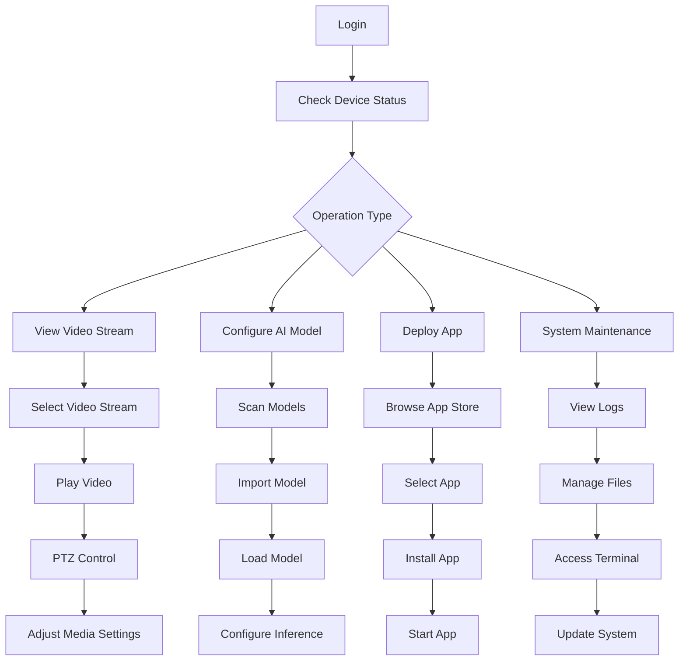
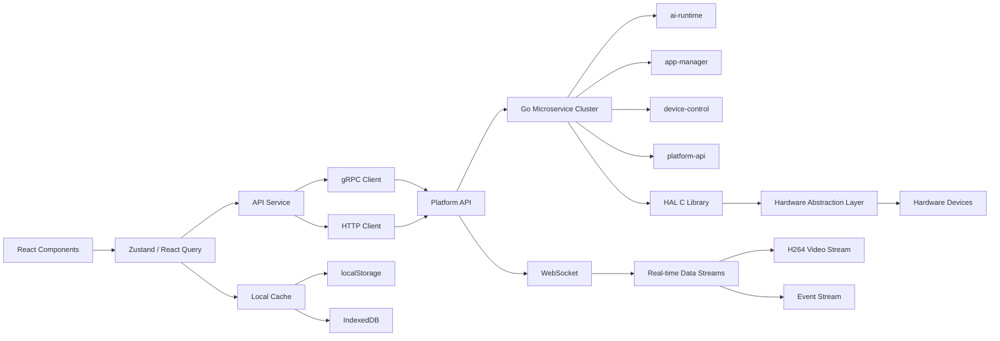
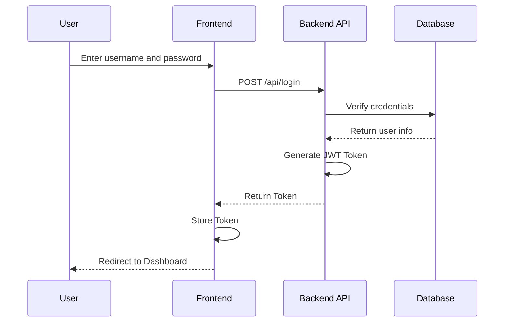
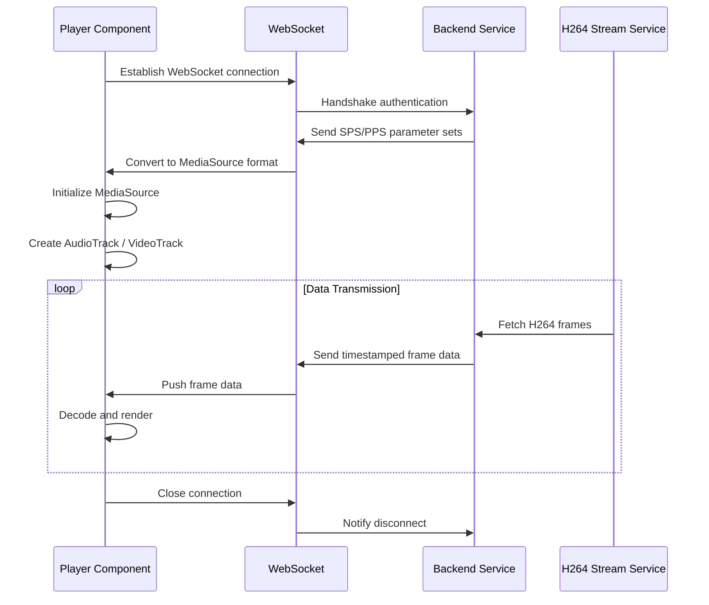
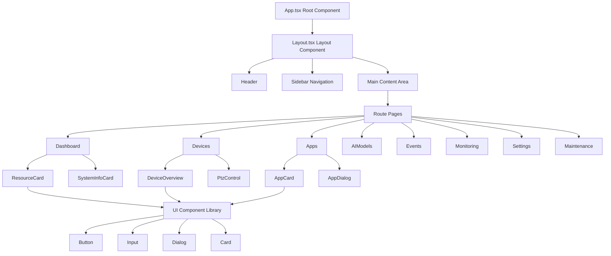

---

# Web Console Service

## 1 Overview

Web Console is the web management interface for the NE503 AI IPC, providing device monitoring and control, AI model management, containerized app management, system monitoring, event viewing, and remote maintenance capabilities.

Tech stack: **React + TypeScript + Vite**, UI components based on shadcn/ui + Tailwind CSS, state management via Zustand + React Query, video streaming implemented through WebSocket + Media Source Extensions for H.264 real-time playback.

Core features:

- **Device Monitoring & Control** — Video streaming, PTZ control, GPIO, light/lens adjustment
- **AI Model Management** — Model loading/unloading, inference configuration, performance monitoring
- **Containerized App Management** — App installation/start/stop, log viewing, terminal access
- **System Monitoring** — Real-time CPU/NPU/memory/storage monitoring
- **Event System** — Topic subscription, event publishing, real-time event streaming
- **Remote Maintenance** — System logs, file management, web terminal

## 2 Page Navigation Structure

```mermaid
graph TD
    A[Web Console] --> B[Login Page]
    A --> C[Dashboard]
    A --> D[Media/Video]
    A --> E[Device Management]
    A --> F[App Management]
    A --> G[AI Models]
    A --> H[Event Viewer]
    A --> I[System Monitoring]
    A --> J[System Settings]
    A --> K[Storage Management]
    A --> L[System Maintenance]

    C --> C1[System Overview]
    C --> C2[Resource Cards]
    C --> C3[Device Status]
    C --> C4[App Statistics]
    C --> C5[Model Statistics]

    D --> D1[Main Stream]
    D --> D2[Sub Stream]
    D --> D3[Third-party Stream]
    D --> D4[PTZ Control]
    D --> D5[Media Settings]

    E --> E1[Device Overview]
    E --> E2[Light Control]
    E --> E3[Lens Control]
    E --> E4[PTZ Control]
    E --> E5[GPIO Control]

    F --> F1[App Store]
    F --> F2[Installed Apps]
    F --> F3[Running Apps]
    F --> F4[App Details]
    F --> F5[Container Logs]
    F --> F6[Terminal Access]

    G --> G1[Model List]
    G --> G2[Model Details]
    G --> G3[Model Import]
    G --> G4[Inference Config]

    H --> H1[Topic Subscription]
    H --> H2[Publish Event]
    H --> H3[Real-time Stream]

    I --> I1[CPU Usage]
    I --> I2[NPU Usage]
    I --> I3[Memory Usage]
    I --> I4[Storage Usage]

    J --> J1[Device Info]
    J --> J2[Network Settings]
    J --> J3[Time Settings]
    J --> J4[Video Settings]
    J --> J5[Image Settings]
    J --> J6[Audio Settings]
    J --> J7[Theme Settings]

    K --> K1[Storage Overview]
    K --> K2[Space Analysis]
    K --> K3[Storage Cleanup]

    L --> L1[System Logs]
    L --> L2[File Management]
    L --> L3[Process Management]
    L --> L4[Terminal Access]
```



## 3 Core Functional Modules

### 3.1 Dashboard

The system overview page provides a global view of device operational status:

| Card | Content |
|------|---------|
| **System Overview** | Device name, model, firmware version, MAC address, IP address, uptime |
| **Resource Monitoring** | CPU usage and core count, NPU usage, memory usage, storage usage (eMMC) |
| **Device Status** | Online/offline camera count, device health status indicators |
| **App Statistics** | Total containers, running count, stopped count, app details list |
| **Model Statistics** | Number of loaded models, model loading time ranking |

### 3.2 Media (Video Streaming Management)

Multi-stream video management and playback features:

- **Multi-stream Support** — Main stream (primary video), sub stream (auxiliary stream), third-party stream
- **Video Player** — H.264 real-time streaming, double-click fullscreen, control panel toggle, stream statistics display, auto-reconnect
- **PTZ Control** — Directional controls, speed adjustment, preset management, focus/aperture control
- **Media Settings** — Resolution, frame rate, encoding parameter configuration

### 3.3 Device Management

Device hardware control and management:

| Feature | Description |
|---------|-------------|
| **Device Overview** | Basic device info, hardware status monitoring, connection status indicators |
| **Light Control** | LED on/off, brightness adjustment, color temperature adjustment |
| **Lens Control** | Focus, zoom, aperture adjustment |
| **PTZ Control** | Directional control (up/down/left/right), speed presets, absolute position control |
| **GPIO Control** | Input/output status monitoring, level control, status toggling |

### 3.4 App Management

Full lifecycle management of containerized apps:

- **App Store** — Browse app templates, search and filter, import new apps
- **App List** — Card/list view toggle, status filtering (all/running/stopped/failed), search
- **App Operations** — Install, start, stop, restart, uninstall
- **Advanced Features** — Container log viewing, terminal access, process management

### 3.5 AI Model Management

AI model lifecycle management:

- **Model List** — Card/list view, search, status filtering (loaded/unloaded)
- **Model Operations** — Load model to NPU, unload model, scan for new models
- **Model Details** — Model information viewing, performance metrics, resource usage
- **Inference Configuration** — Inference parameter settings, performance optimization options, batch processing configuration

### 3.6 Event Viewer

Real-time event monitoring and handling:

- **Topic Subscription** — Wildcard pattern support, subscription status management, topic browsing
- **Event Publishing** — Manual event publishing, event format configuration, test publishing
- **Real-time Stream** — Real-time event display, scroll and pause, timestamp display, filtering

### 3.7 System Monitoring

Real-time system resource monitoring:

| Monitoring Item | Content |
|-----------------|---------|
| **CPU** | Usage history chart, core load distribution, temperature monitoring |
| **NPU** | AI accelerator usage, inference task statistics, performance counters |
| **Memory** | Memory usage, available memory, cache usage |
| **Storage** | Disk usage, I/O performance statistics, file system status |

### 3.8 System Settings

System configuration and management:

- **Device Info** — Hardware details, system information, network configuration
- **Network Settings** — Wired/wireless configuration, static IP, DNS, network diagnostics
- **Time Settings** — Timezone selection, NTP configuration, manual time setting
- **Media Settings** — Video encoding parameters, image quality, audio configuration
- **Theme Settings** — Light/dark theme toggle, custom themes

### 3.9 Storage Management

Storage space management and optimization:

- **Storage Overview** — Capacity usage, file system type, partition information
- **Space Analysis** — Categorization by type, large file search, usage trends
- **Storage Cleanup** — Temporary file cleanup, log file management, cache cleanup

### 3.10 System Maintenance

Advanced system maintenance features:

- **System Logs** — Real-time log viewing, log level filtering, log export
- **File Management** — File browsing, upload/download, permission management
- **Terminal Access** — Web terminal, command execution, output viewing
- **Process Management** — Process list, process control, resource usage monitoring

## 4 Typical Operation Flows



## 5 Data Flow Architecture



The frontend manages global state (authentication, theme, system statistics) via Zustand, and handles data fetching and caching through React Query. The API Service layer encapsulates both gRPC and HTTP communication, interfacing with different backend microservices. Real-time data (video streams, event streams) is transmitted through WebSocket channels.

## 6 API Interface

In development mode, requests are forwarded through the Vite proxy; in production, the backend API is accessed directly.

**Main API Endpoints**:

| Endpoint Prefix | Function |
|-----------------|----------|
| `/api/v1/auth/*` | Authentication (login, JWT token management) |
| `/api/v1/h264/*` | H.264 video streaming |
| `/api/v1/devices/*` | Device management |
| `/api/v1/apps/*` | App management |
| `/api/v1/models/*` | Model management |
| `/api/v1/events/*` | Event handling |
| `/api/v1/system/*` | System monitoring |

### 6.1 Login Authentication Flow



Authentication uses the JWT Token mechanism. After a successful login, the frontend stores the Token locally. All subsequent API requests carry the Token via the Authorization Header for identity verification.

### 6.2 WebSocket Video Streaming



Video streaming flow:

1. **Connection Establishment** — The player connects to the backend via WebSocket and completes handshake authentication
2. **Initialization** — The backend sends SPS/PPS parameter sets, the frontend initializes MediaSource and Tracks
3. **Data Transmission** — The H264 stream service fetches frame data, pushes it via WebSocket with timestamps, and the frontend decodes and renders
4. **Disconnect & Cleanup** — Close the WebSocket connection and notify the backend to release resources

:::tip Video Streaming Notes
Safari does not support WebCodecs and automatically falls back to Media Source Extensions, which may result in slightly reduced performance. Chrome 88+ or Edge 88+ is recommended for the best experience.
:::

## 7 Frontend Architecture

### 7.1 Technology Stack

| Category | Technology |
|----------|-----------|
| Routing | React Router v6 |
| State Management | Zustand (lightweight global state) + React Query (data fetching) |
| UI Components | shadcn/ui + Tailwind CSS |
| Internationalization | react-i18next |
| Build Tool | Vite |
| Testing Framework | Vitest |
| Code Standards | ESLint + Prettier |

### 7.2 Component Hierarchy



### 7.3 State Management

Global state is managed via Zustand, organized into three stores by responsibility:

| Store | Managed Content |
|-------|----------------|
| **Auth Store** | Login state, user info, token management |
| **Theme Store** | Theme settings, language configuration |
| **System Stats** | CPU/NPU/memory/storage usage |

Page-level state (dashboard data, device control, app list, model list, etc.) is managed by individual page components, with remote data fetched and cached through React Query.

### 7.4 Project Directory Structure

```
src/
├── components/          # Shared components
│   ├── ui/            # Base UI components
│   └── player/        # Player components
├── pages/             # Page components
│   ├── dashboard/     # Dashboard
│   ├── devices/       # Device management
│   ├── apps/          # App management
│   ├── ai-models/     # AI models
│   ├── events/        # Event viewer
│   ├── monitoring/    # System monitoring
│   ├── settings/      # System settings
│   └── maintenance/   # System maintenance
├── services/          # API service encapsulation
├── store/             # Zustand state management
├── lib/               # Utility libraries
│   └── videoStream/  # Video stream processing
├── hooks/             # Custom Hooks
├── styles/            # Style files
└── utils/             # Utility functions
```

## 8 Development Build

### 8.1 Environment Requirements

- Node.js: 18+ / 20+
- Package Manager: pnpm
- Operating System: Windows / macOS / Linux

### 8.2 Common Commands

```bash
# Install dependencies
pnpm install

# Start dev server (http://localhost:5174)
pnpm dev

# Production build
pnpm build

# Type checking
pnpm exec tsc --noEmit

# Testing
pnpm test           # Interactive testing
pnpm test:run       # Single run
pnpm test:coverage  # Coverage report

# Linting and formatting
pnpm lint           # ESLint check
pnpm lint:fix       # Auto-fix
pnpm format         # Prettier formatting
pnpm format:check   # Format check
```

## 9 Browser Compatibility

| Feature | Chrome 88+ | Firefox 78+ | Safari 14+ | Edge 88+ |
|---------|-----------|-------------|------------|----------|
| WebCodecs | Supported | Supported | **Not Supported** | Supported |
| Media Source Extensions | Supported | Supported | Supported | Supported |
| WebSocket | Supported | Supported | Supported | Supported |
| Service Worker | Supported | Supported | Supported | Supported |
| WebAssembly | Supported | Supported | Supported | Supported |

Known limitations:

- **Safari** does not support WebCodecs and automatically falls back to MSE with slightly lower performance
- **Mobile browsers** may have limited functionality; desktop browsers are recommended
- **Older browsers** may require polyfills for ES6+ features

## 10 Related Documentation

- [AI Runtime Service](./0-ai-runtime.md) — NPU inference scheduling and model lifecycle management
- [Event Bus Service](./2-event-bus.md) — Event bus and message pub/sub
- [Device Control Service](./3-device-control.md) — Device hardware control service
- [Device Discovery Service](./4-device-discovery.md) — Device discovery and registration service
- [Media Streaming Service](./5-media-streaming.md) — Media stream transmission service
