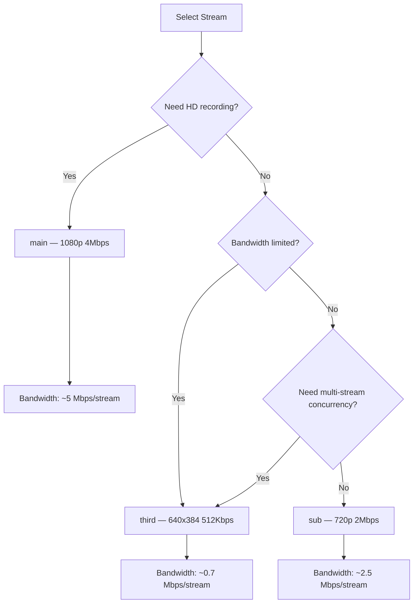

# Video Integration

NE503 outputs H.264 video streams via the RTSP protocol, supporting TCP interleaved transport with end-to-end latency < 100ms. This guide is intended for third-party developers who need to integrate NE503 video streams into their own systems, providing a complete solution from stream pulling and recording to frontend playback.

## 1 Stream Overview

### 1.1 Three-Stream Parameters

NE503 provides three independently encoded H.264 streams with the following parameters:

| Parameter | Main Stream (main) | Sub Stream (sub) | Third Stream (third) |
|------|-------------|-------------|---------------|
| Resolution | 1920x1080 | 1280x720 | 640x384 |
| Frame Rate | 30 fps | 30 fps | 15 fps |
| Bitrate | 4 Mbps | 2 Mbps | 512 Kbps |
| GOP | 30 (1s) | 60 (2s) | 30 (2s) |
| Profile | High 4.1 | High | High |
| Codec | H.264 | H.264 | H.264 |

> The above are factory default parameters. You can adjust bitrate, frame rate, and GOP at runtime via the Platform API endpoint `/api/v1/media/streams/:name` without restarting the device.

### 1.2 RTSP URL Format

```
rtsp://<DEVICE_IP>:8554/{main,sub,third}
```

| Stream | URL | Typical Use Case |
|------|-----|---------|
| Main Stream | `rtsp://192.168.1.100:8554/main` | HD recording, large screen display |
| Sub Stream | `rtsp://192.168.1.100:8554/sub` | Multi-channel preview, medium-quality recording |
| Third Stream | `rtsp://192.168.1.100:8554/third` | Mobile devices, AI analysis, low-bandwidth scenarios |

> NE503 enforces **RTSP over TCP** (RTP/AVP/TCP interleaved transport) and does not support UDP transport mode. All stream pulling commands must specify TCP transport.

## 2 FFmpeg Integration

### 2.1 Basic Stream Verification

```bash
# Verify that the stream is available (play for 10 seconds without actual output)
ffmpeg -rtsp_transport tcp -i "rtsp://192.168.1.100:8554/main" \
  -t 10 -f null -
```

### 2.2 Stream Recording

```bash
# Record main stream directly (no transcoding, preserve original H.264)
ffmpeg -rtsp_transport tcp -i "rtsp://192.168.1.100:8554/main" \
  -c copy -f mp4 recording_main.mp4

# Record sub stream as MKV (supports stream interruption recovery, MKV container is more fault-tolerant)
ffmpeg -rtsp_transport tcp -i "rtsp://192.168.1.100:8554/sub" \
  -c copy -f matroska recording_sub.mkv
```

### 2.3 Transcoded Output

```bash
# Transcode to 720p H.264 for Web distribution
ffmpeg -rtsp_transport tcp -i "rtsp://192.168.1.100:8554/main" \
  -vf scale=1280:720 -c:v libx264 -preset fast -crf 23 \
  -f mp4 output_720p.mp4

# Transcode to H.265 to save storage space
ffmpeg -rtsp_transport tcp -i "rtsp://192.168.1.100:8554/main" \
  -c:v libx265 -preset medium -crf 28 \
  -f mp4 output_h265.mp4
```

### 2.4 Timed Frame Capture

```bash
# Capture one frame every 5 seconds and save as JPEG
ffmpeg -rtsp_transport tcp -i "rtsp://192.168.1.100:8554/sub" \
  -vf fps=1/5 -q:v 2 snapshot_%04d.jpg

# Single frame screenshot
ffmpeg -rtsp_transport tcp -i "rtsp://192.168.1.100:8554/main" \
  -frames:v 1 capture.jpg
```

### 2.5 Simultaneous Multi-Stream Pulling

```bash
# Pull all three streams simultaneously and save separately
ffmpeg -rtsp_transport tcp -i "rtsp://192.168.1.100:8554/main" \
       -rtsp_transport tcp -i "rtsp://192.168.1.100:8554/sub" \
       -rtsp_transport tcp -i "rtsp://192.168.1.100:8554/third" \
  -map 0:v -c:v:0 copy recording_main.mp4 \
  -map 1:v -c:v:1 copy recording_sub.mp4 \
  -map 2:v -c:v:2 copy recording_third.mp4
```

### 2.6 Transcode to HLS for Web Playback

```bash
# Convert RTSP to HLS segments, suitable for Web frontend playback
ffmpeg -rtsp_transport tcp -i "rtsp://192.168.1.100:8554/sub" \
  -c:v libx264 -preset veryfast -tune zerolatency \
  -hls_time 2 -hls_list_size 3 -hls_flags delete_segments \
  -f hls stream.m3u8
```

## 3 GStreamer Pipeline

### 3.1 Basic Stream Pipeline

```bash
# Pull main stream and display
gst-launch-1.0 rtspsrc location=rtsp://192.168.1.100:8554/main \
  protocols=tcp latency=0 ! \
  rtph264depay ! h264parse ! avdec_h264 ! autovideosink

# Pull sub stream and save as MP4
gst-launch-1.0 rtspsrc location=rtsp://192.168.1.100:8554/sub \
  protocols=tcp latency=0 ! \
  rtph264depay ! h264parse ! mp4mux ! filesink location=output.mp4
```

### 3.2 Hardware-Accelerated Transcoding (x86 Server)

On servers equipped with NVIDIA GPUs, you can leverage NVDEC hardware decoding:

```bash
# NVIDIA hardware decoding + transcoded output
gst-launch-1.0 rtspsrc location=rtsp://192.168.1.100:8554/main \
  protocols=tcp latency=0 ! \
  rtph264depay ! nvh264dec ! \
  videoconvert ! x264enc tune=zerolatency ! \
  mp4mux ! filesink location=output_hw.mp4
```

> For ARM platforms, use the corresponding hardware decoding plugins (e.g., `v4l2h264dec`), depending on the target platform's multimedia framework.

### 3.3 Frame Extraction for AI Inference

```python
import gi
gi.require_version('Gst', '1.0')
from gi.repository import Gst, GLib

Gst.init(None)

PIPELINE = (
    "rtspsrc location=rtsp://192.168.1.100:8554/third protocols=tcp latency=0 ! "
    "rtph264depay ! decodebin ! videoconvert ! video/x-raw,format=RGB ! "
    "appsink name=sink emit-signals=True max-buffers=2 drop=True"
)

def on_new_sample(sink):
    sample = sink.emit("pull-sample")
    buffer = sample.get_buffer()
    caps = sample.get_caps()
    w = caps.get_structure(0).get_int("width")[1]
    h = caps.get_structure(0).get_int("height")[1]
    success, info = buffer.map(Gst.MapFlags.READ)
    if success:
        import numpy as np
        frame = np.frombuffer(info.data, dtype=np.uint8).reshape(h, w, 3)
        # Perform AI inference here
        buffer.unmap(info)
    return Gst.FlowReturn.OK

pipeline = Gst.parse_launch(PIPELINE)
sink = pipeline.get_by_name("sink")
sink.connect("new-sample", on_new_sample)
pipeline.set_state(Gst.State.PLAYING)

loop = GLib.MainLoop()
try:
    loop.run()
except KeyboardInterrupt:
    pipeline.set_state(Gst.State.NULL)
```

## 4 VMS Integration

### 4.1 NX Witness

NE503 includes a built-in NX Witness VMS (port 7001), ready to use out of the box. For scenarios where you need to connect NE503 to an external NX Witness server:

1. On the NX Witness server, add a new device and select the **Generic RTSP** driver
2. Fill in the connection parameters:
   - **RTSP Address**: `rtsp://192.168.1.100:8554/main`
   - **Transport Protocol**: TCP
   - **Encoding Format**: H.264
3. If multiple streams are needed, add `main`, `sub`, and `third` separately

> For more NX Witness configuration details, see [Quick Start](../1-quick-start.md).

### 4.2 Generic NVR / ONVIF Integration

The current version of NE503 primarily supports RTSP integration and does not provide ONVIF device discovery service. Steps for generic NVR integration:

1. In the NVR, select "Manually Add Device" or "Custom RTSP"
2. Fill in the RTSP address: `rtsp://<DEVICE_IP>:8554/main`
3. Select **TCP** as the transport protocol
4. Choose the stream as needed: use `main` for NVR recording, use `sub` for multi-view preview

## 5 Web Frontend Playback

Browsers cannot play RTSP streams directly and require a middleware layer for transcoding or protocol conversion. The following three solutions are ranked by recommendation level.

### 5.1 WebSocket + MSE (Recommended)

NE503 natively provides a WebSocket H.264 stream endpoint `ws://<DEVICE_IP>:8080/api/v1/h264/main`, which the frontend can render directly through MSE:

```javascript
const ws = new WebSocket('ws://192.168.1.100:8080/api/v1/h264/main');
ws.binaryType = 'arraybuffer';

const mediaSource = new MediaSource();
const video = document.getElementById('player');
video.src = URL.createObjectURL(mediaSource);

mediaSource.addEventListener('sourceopen', () => {
  const sb = mediaSource.addSourceBuffer('video/mp4; codecs="avc1.640029"');
  let isAppending = false;
  let queue = [];

  ws.onmessage = (event) => {
    const data = new Uint8Array(event.data);
    queue.push(data);
    if (!isAppending) drainQueue();

    function drainQueue() {
      if (!queue.length || sb.updating) return;
      isAppending = true;
      sb.appendBuffer(queue.shift());
    }

    sb.addEventListener('updateend', () => {
      isAppending = false;
      drainQueue();
    });
  };
});

// Auto-reconnect on disconnect
ws.onclose = () => setTimeout(() => location.reload(), 3000);
```

### 5.2 WebCodecs (Low Latency)

Chrome 94+ supports the WebCodecs API, enabling lower-latency decoding and rendering:

```javascript
const ws = new WebSocket('ws://192.168.1.100:8080/api/v1/h264/sub');
ws.binaryType = 'arraybuffer';

const canvas = document.getElementById('canvas');
const ctx = canvas.getContext('2d');

const decoder = new VideoDecoder({
  output: (frame) => {
    canvas.width = frame.displayWidth;
    canvas.height = frame.displayHeight;
    ctx.drawImage(frame, 0, 0);
    frame.close();
  },
  error: (e) => console.error('Decode error:', e),
});

decoder.configure({
  codec: 'avc1.640029',
  optimizeForLatency: true,
});

ws.onmessage = (event) => {
  const data = new Uint8Array(event.data);
  const chunk = new EncodedVideoChunk({
    type: KeyFrameDetector.isKeyFrame(data) ? 'key' : 'delta',
    timestamp: performance.now() * 1000,
    data: data,
  });
  decoder.decode(chunk);
};

// Simple keyframe detection (check NAL type)
const KeyFrameDetector = {
  isKeyFrame(nal) {
    // IDR frame NAL type is 5
    for (let i = 0; i < nal.length - 4; i++) {
      if (nal[i] === 0 && nal[i+1] === 0 && nal[i+2] === 0 && nal[i+3] === 1) {
        const type = nal[i+4] & 0x1f;
        if (type === 5 || type === 7) return true;
      }
    }
    return false;
  },
};
```

### 5.3 HLS Transcoding Solution

Convert RTSP to HLS via FFmpeg or MediaMTX, compatible with all modern browsers:

```bash
# Option A: FFmpeg direct HLS conversion
ffmpeg -rtsp_transport tcp -i "rtsp://192.168.1.100:8554/sub" \
  -c:v libx264 -preset veryfast -tune zerolatency \
  -hls_time 1 -hls_list_size 3 -hls_flags delete_segments \
  -f hls /var/www/html/stream.m3u8

# Option B: MediaMTX (supports automatic RTSP to HLS/WebRTC conversion)
# Install: go install github.com/bluenviron/mediamtx@latest
mediamtx --rtsp-address :8555
# Then push: ffmpeg -rtsp_transport tcp -i rtsp://192.168.1.100:8554/main -c copy -f rtsp rtsp://localhost:8555/mystream
```

Frontend playback using hls.js:

```html
<script src="https://cdn.jsdelivr.net/npm/hls.js@latest"></script>
<video id="video" controls></video>
<script>
  const video = document.getElementById('video');
  if (Hls.isSupported()) {
    const hls = new Hls({ liveSyncDurationCount: 1, liveMaxLatencyDurationCount: 3 });
    hls.loadSource('http://YOUR_SERVER/stream.m3u8');
    hls.attachMedia(video);
    hls.on(Hls.Events.MANIFEST_PARSED, () => video.play());
  }
</script>
```

> The HLS solution has higher latency (3-5 seconds) and is suitable for playback scenarios where real-time performance is not critical. For low-latency scenarios, prefer WebSocket + MSE or WebCodecs.

## 6 Multi-Client Concurrency and Bandwidth Planning

### 6.1 Concurrency Limits

The NE503 RTSP service supports up to **8 concurrent clients** (shared across all streams). Each stream can be independently pulled by multiple clients simultaneously.

| Scenario | Recommended Stream | Concurrent Connections | Notes |
|------|---------|--------|------|
| NVR recording + live preview | main + sub | 2 | Use main stream for recording, sub stream for preview |
| Multi-view monitoring wall | sub or third | By number of views | Use sub for 4 views or fewer, use third for more |
| AI analysis + recording | third + main | 2 | Use third stream for analysis to save bandwidth |
| Mobile remote viewing | third | 1 | Low bitrate suitable for cellular networks |

### 6.2 Bandwidth Estimation

| Stream | Bitrate | Single-Stream Bandwidth | 4 Simultaneous Streams |
|------|------|---------|------------|
| main | 4 Mbps | ~5 Mbps (including overhead) | ~20 Mbps |
| sub | 2 Mbps | ~2.5 Mbps | ~10 Mbps |
| third | 512 Kbps | ~700 Kbps | ~2.8 Mbps |

> RTSP over TCP interleaved transport overhead is approximately 10-25%, so actual bandwidth requirements are higher than the encoded bitrate.

### 6.3 Stream Selection Guide



## 7 Related Documentation

- [Quick Start](../1-quick-start.md) — RTSP stream verification and VLC playback
- [RESTful API](./1-restful-api.md) — Media stream API endpoints (stream start/stop, parameter adjustment)
- [CLI Guide](./3-cli-guide.md) — Command-line stream management tools
- [Media Streaming Service Reference](../6-reference/service-reference/5-media-streaming.md) — Camera Daemon and RTSP service internal architecture
- [Configuration Reference](../6-reference/3-config-reference.md) — Encoder and RTSP configuration parameter details
- [Troubleshooting](../6-reference/2-troubleshooting.md) — Common RTSP stream pulling issues and solutions
