# Troubleshooting Guide

## 1 Overview

This guide provides systematic troubleshooting procedures and solutions for the NE503 AIPC platform. The platform uses a microservice architecture where services communicate via Unix Sockets and follow a specific startup sequence. When encountering issues, follow this general workflow:

1. Confirm the issue symptom
2. Check related logs
3. Refer to the corresponding section
4. Execute the recommended solution

## 2 General Troubleshooting Workflow

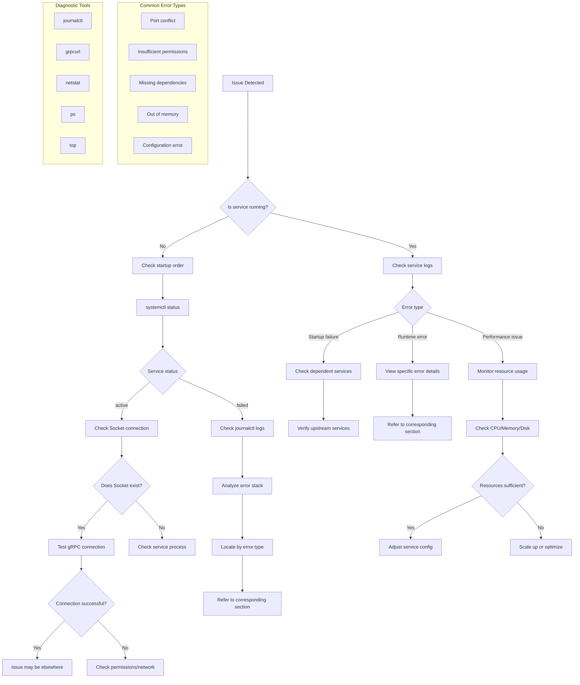
```mermaid
flowchart TD
    A["Issue Detected"] --> B{"Is service running?"}
    B -->|Yes| C["Check service logs"]
    B -->|No| D["Check startup order"]

    D --> E["systemctl status"]
    E --> F{"Service status"}
    F -->|failed| G["Check journalctl logs"]
    F -->|active| H["Check Socket connection"]

    C --> I{"Error type"}
    I -->|"Startup failure"| J["Check dependent services"]
    I -->|"Runtime error"| K["View specific error details"]
    I -->|"Performance issue"| L["Monitor resource usage"]

    J --> M["Verify upstream services"]
    K --> N["Refer to corresponding section"]
    L --> O["Check CPU/Memory/Disk"]

    H --> P{"Does Socket exist?"}
    P -->|Yes| Q["Test gRPC connection"]
    P -->|No| R["Check service process"]

    Q --> S{"Connection successful?"}
    S -->|Yes| T["Issue may be elsewhere"]
    S -->|No| U["Check permissions/network"]

    G --> V["Analyze error stack"]
    V --> W["Locate by error type"]
    W --> X["Refer to corresponding section"]

    O --> Y{"Resources sufficient?"}
    Y -->|Yes| Z["Adjust service config"]
    Y -->|No| AA["Scale up or optimize"]

    subgraph "Common Error Types"
        AB["Port conflict"]
        AC["Insufficient permissions"]
        AD["Missing dependencies"]
        AE["Out of memory"]
        AF["Configuration error"]
    end

    subgraph "Diagnostic Tools"
        AG[journalctl]
        AH[grpcurl]
        AI[netstat]
        AJ[ps]
        AK[top]
    end
```

## 3 Service Startup Failure Troubleshooting

### 3.1 Check systemd Status

```bash
# View all AIPC service statuses
systemctl status ai-runtime camera-daemon app-manager event-bus device-control platform-api

# View a specific service status
systemctl status ai-runtime.service

# View failed services
systemctl --failed

# View service dependencies
systemctl list-dependencies platform-api.service
```

### 3.2 Check if Unix Socket Exists

```bash
# List /run/aipc directory
ls -la /run/aipc/

# Check if a specific Socket exists
ls -la /run/aipc/ai-runtime.sock
ls -la /run/aipc/app-manager.sock
ls -la /run/aipc/device-control.sock

# Test Socket connection
nc -U /run/aipc/ai-runtime.sock
```

### 3.3 View Logs with journalctl

```bash
# View service logs in real time
journalctl -u ai-runtime -f

# View logs from the last 1 hour
journalctl -u camera-daemon --since "1 hour ago"

# View logs containing error keywords
journalctl -u app-manager | grep -i "error\|failed\|fatal"

# View detailed startup failure errors
journalctl -u app-manager -b --no-pager

# Filter by error level
journalctl -u event-bus -p err
journalctl -u device-control -p warning
```

### 3.4 Common Startup Issues

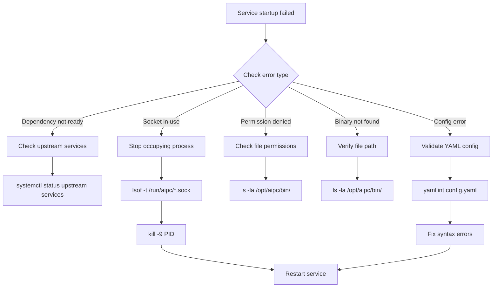
```mermaid
flowchart TD
    A["Service startup failed"] --> B{"Check error type"}
    B -->|"Dependency not ready"| C["Check upstream services"]
    B -->|"Socket in use"| D["Stop occupying process"]
    B -->|"Permission denied"| E["Check file permissions"]
    B -->|"Binary not found"| F["Verify file path"]
    B -->|"Config error"| G["Validate YAML config"]

    C --> H["systemctl status upstream services"]
    D --> I["lsof -t /run/aipc/*.sock"]
    E --> J["ls -la /opt/aipc/bin/"]
    F --> K["ls -la /opt/aipc/bin/"]
    G --> L["yamllint config.yaml"]

    I --> M["kill -9 PID"]
    L --> N["Fix syntax errors"]
    M --> O["Restart service"]
    N --> O
```

### 3.5 Socket Connection Test

```bash
# Test gRPC service using grpcurl
grpcurl -plaintext unix:///run/aipc/ai-runtime.sock list

# Test if service responds
grpcurl -plaintext -d '{}' unix:///run/aipc/ai-runtime.sock aipc.platform.inference.v1.InferenceService/ListModels

# Check Socket permissions
ls -ld /run/aipc/
ls -la /run/aipc/*.sock
```

## 4 AI Inference Troubleshooting

### 4.1 Model Loading Failure

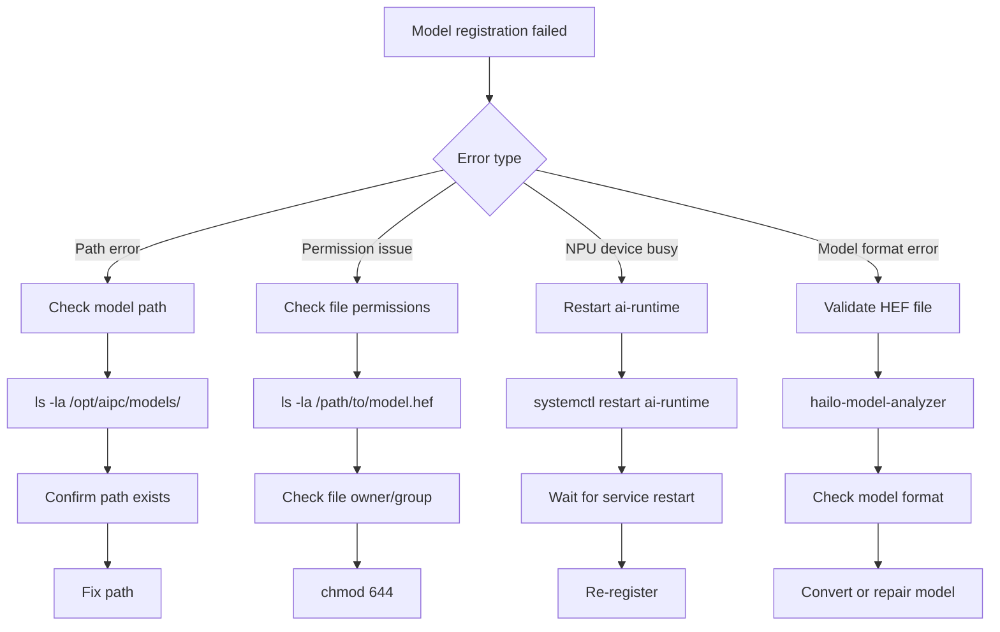
```mermaid
flowchart TD
    A["Model registration failed"] --> B{"Error type"}
    B -->|"Path error"| C["Check model path"]
    B -->|"Permission issue"| D["Check file permissions"]
    B -->|"NPU device busy"| E["Restart ai-runtime"]
    B -->|"Model format error"| F["Validate HEF file"]

    C --> G["ls -la /opt/aipc/models/"]
    D --> H["ls -la /path/to/model.hef"]
    E --> I["systemctl restart ai-runtime"]
    F --> J["hailo-model-analyzer"]

    G --> K["Confirm path exists"]
    H --> L["Check file owner/group"]
    I --> M["Wait for service restart"]
    J --> N["Check model format"]

    K --> O["Fix path"]
    L --> P["chmod 644"]
    M --> Q["Re-register"]
    N --> R["Convert or repair model"]
```

**Diagnostic commands:**

```bash
# View model registration logs
journalctl -u ai-runtime | grep -i "model"

# Check NPU device status
hailortcli scan

# Validate model files
ls -la /opt/aipc/models/
file /opt/aipc/models/yolov8n.hef
```

### 4.2 Inference Timeout

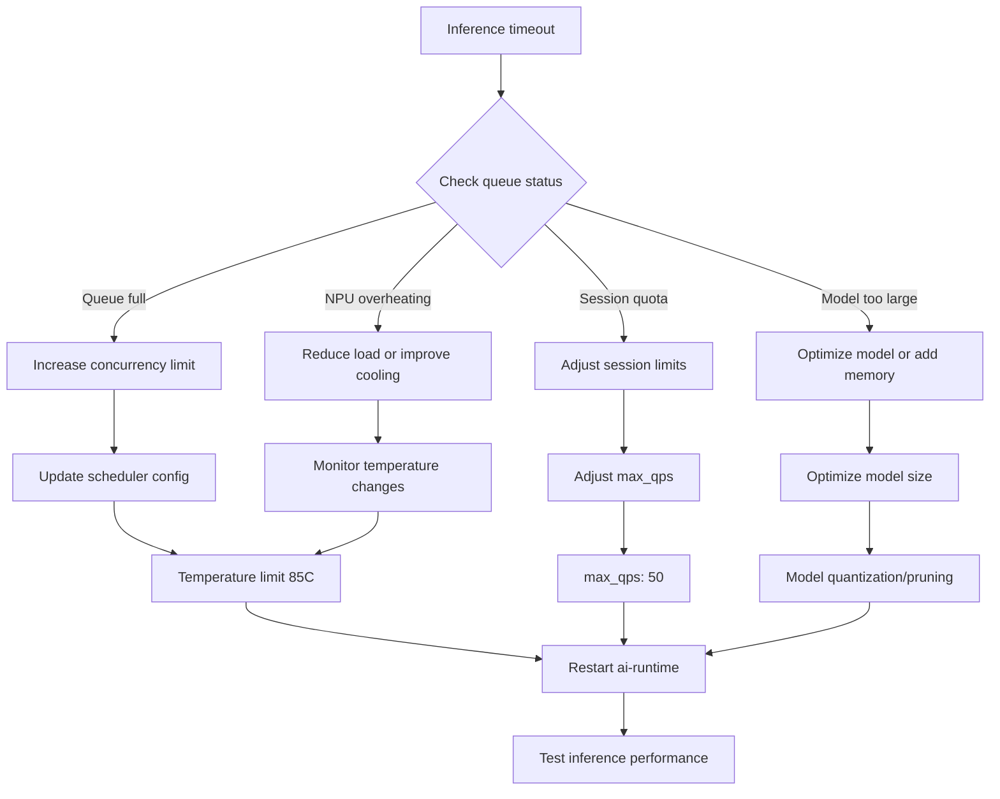
```mermaid
flowchart TD
    A["Inference timeout"] --> B{"Check queue status"}
    B -->|"Queue full"| C["Increase concurrency limit"]
    B -->|"Session quota"| D["Adjust session limits"]
    B -->|"Model too large"| E["Optimize model or add memory"]
    B -->|"NPU overheating"| F["Reduce load or improve cooling"]

    C --> G["Update scheduler config"]
    D --> H["Adjust max_qps"]
    E --> I["Optimize model size"]
    F --> J["Monitor temperature changes"]

    G --> K["global_qps_limit: 200"]
    H --> L["max_qps: 50"]
    I --> M["Model quantization/pruning"]
    J --> K["Temperature limit 85C"]

    K --> N["Restart ai-runtime"]
    L --> N
    M --> N
    N --> O["Test inference performance"]
```

**Diagnostic commands:**

```bash
# View inference statistics
grpcurl -plaintext -d '{}' unix:///run/aipc/ai-runtime.sock aipc.platform.inference.v1.InferenceService/GetStats

# List registered models
grpcurl -plaintext -d '{}' unix:///run/aipc/ai-runtime.sock aipc.platform.inference.v1.InferenceService/ListModels

# Monitor system resources
top -p $(pidof ai-runtime)
```

### 4.3 NPU Overheating

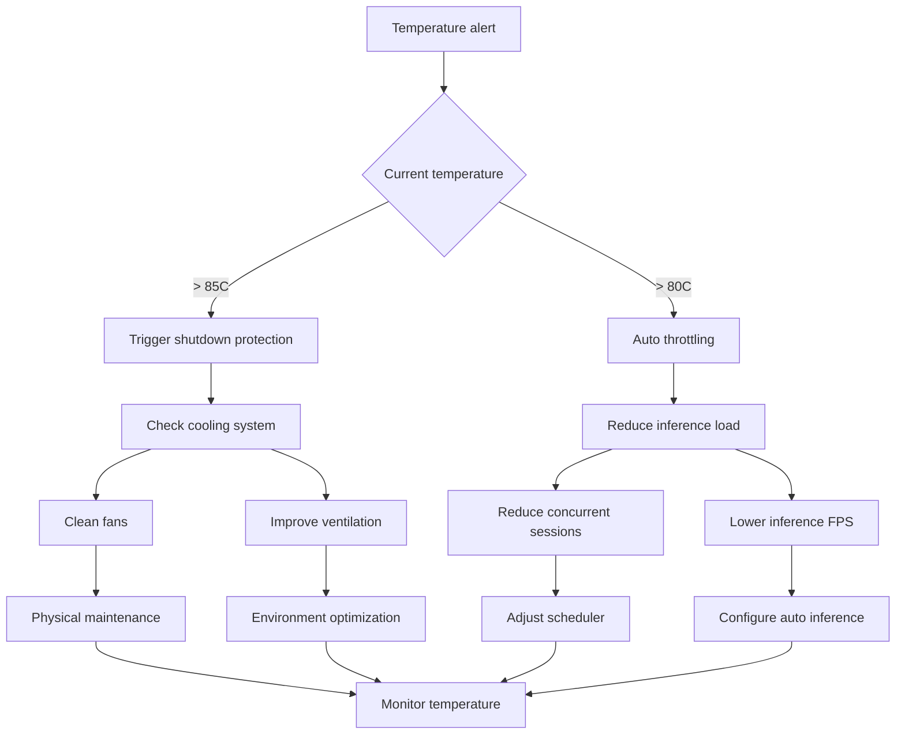
```mermaid
flowchart TD
    A["Temperature alert"] --> B{"Current temperature"}
    B -->|"> 85C"| C["Trigger shutdown protection"]
    B -->|"> 80C"| D["Auto throttling"]

    C --> E["Check cooling system"]
    D --> F["Reduce inference load"]

    E --> G["Clean fans"]
    E --> H["Improve ventilation"]
    F --> I["Reduce concurrent sessions"]
    F --> J["Lower inference FPS"]

    G --> K["Physical maintenance"]
    H --> L["Environment optimization"]
    I --> M["Adjust scheduler"]
    J --> N["Configure auto inference"]

    K --> O["Monitor temperature"]
    L --> O
    M --> O
    N --> O
```

**Monitoring commands:**

```bash
# Check NPU temperature
hailortcli scan | grep Temperature

# View ai-runtime temperature logs
journalctl -u ai-runtime | grep -i "temperature"

# View performance statistics
grpcurl -plaintext -d '{}' unix:///run/aipc/ai-runtime.sock aipc.platform.inference.v1.InferenceService/GetStats
```

### 4.4 Session Quota Exceeded

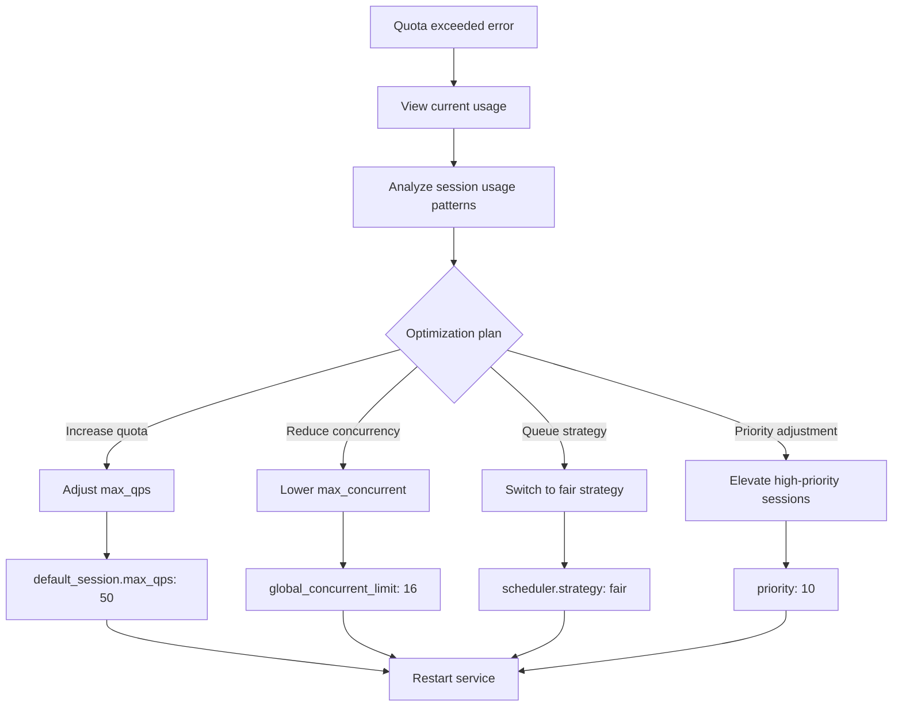
```mermaid
flowchart TD
    A["Quota exceeded error"] --> B["View current usage"]
    B --> C["Analyze session usage patterns"]
    C --> D{"Optimization plan"}

    D -->|"Increase quota"| E["Adjust max_qps"]
    D -->|"Reduce concurrency"| F["Lower max_concurrent"]
    D -->|"Queue strategy"| G["Switch to fair strategy"]
    D -->|"Priority adjustment"| H["Elevate high-priority sessions"]

    E --> I["default_session.max_qps: 50"]
    F --> J["global_concurrent_limit: 16"]
    G --> K["scheduler.strategy: fair"]
    H --> L["priority: 10"]

    I --> M["Restart service"]
    J --> M
    K --> M
    L --> M
```

**Diagnostic commands:**

```bash
# View all sessions
grpcurl -plaintext -d '{}' unix:///run/aipc/ai-runtime.sock aipc.platform.inference.v1.InferenceService/ListModels

# View quota statistics
grpcurl -plaintext -d '{}' unix:///run/aipc/ai-runtime.sock aipc.platform.inference.v1.InferenceService/GetStats

# View session creation logs
journalctl -u ai-runtime | grep -i "session"
```

## 5 Video Streaming Troubleshooting

### 5.1 RTSP Connection Failure

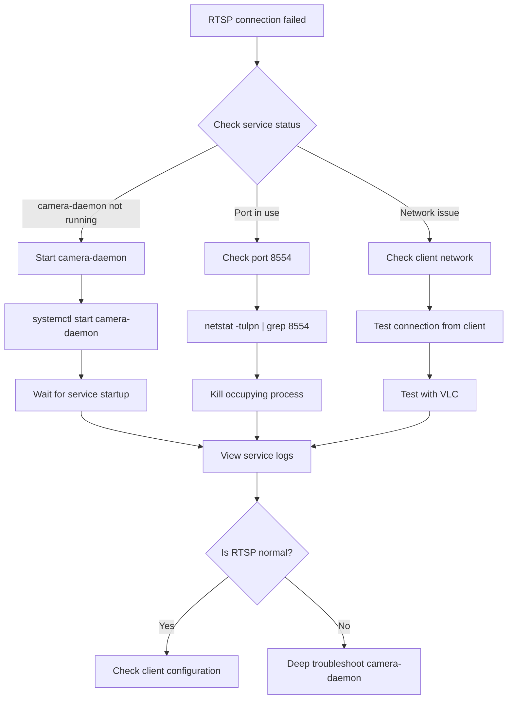
```mermaid
flowchart TD
    A["RTSP connection failed"] --> B{"Check service status"}
    B -->|"camera-daemon not running"| C["Start camera-daemon"]
    B -->|"Port in use"| D["Check port 8554"]
    B -->|"Network issue"| E["Check client network"]

    C --> F["systemctl start camera-daemon"]
    D --> G["netstat -tulpn | grep 8554"]
    E --> H["Test connection from client"]

    F --> I["Wait for service startup"]
    G --> J["Kill occupying process"]
    H --> K["Test with VLC"]

    I --> L["View service logs"]
    J --> L
    K --> L

    L --> M{"Is RTSP normal?"}
    M -->|Yes| N["Check client configuration"]
    M -->|No| O["Deep troubleshoot camera-daemon"]
```

**Diagnostic commands:**

```bash
# Check RTSP service status
systemctl status camera-daemon

# View RTSP logs
journalctl -u camera-daemon -f

# Test RTSP connection
ffmpeg -rtsp_transport tcp -i rtsp://localhost:8554/stream -t 10 -f null -

# Check port usage
netstat -tulpn | grep 8554
```

### 5.2 WebSocket Disconnection

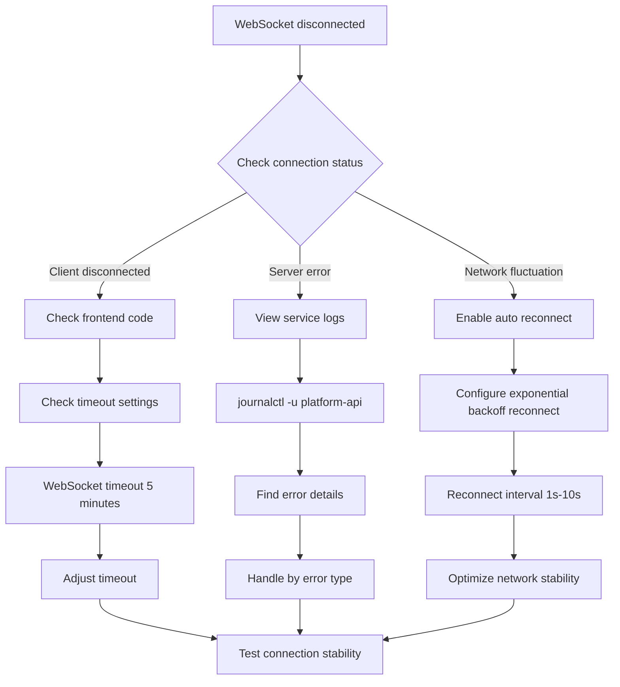
```mermaid
flowchart TD
    A["WebSocket disconnected"] --> B{"Check connection status"}
    B -->|"Client disconnected"| C["Check frontend code"]
    B -->|"Server error"| D["View service logs"]
    B -->|"Network fluctuation"| E["Enable auto reconnect"]

    C --> F["Check timeout settings"]
    D --> G["journalctl -u platform-api"]
    E --> H["Configure exponential backoff reconnect"]

    F --> I["WebSocket timeout 5 minutes"]
    G --> J["Find error details"]
    H --> K["Reconnect interval 1s-10s"]

    I --> L["Adjust timeout"]
    J --> M["Handle by error type"]
    K --> N["Optimize network stability"]

    L --> O["Test connection stability"]
    M --> O
    N --> O
```

**Diagnostic commands:**

```bash
# View WebSocket connection logs
journalctl -u platform-api | grep -i "websocket\|h264"

# Test WebSocket connection
wscat -c ws://localhost:8080/api/v1/h264/cam1

# Check frontend connection status in browser DevTools Network panel
```

### 5.3 Video Artifacts/Black Screen

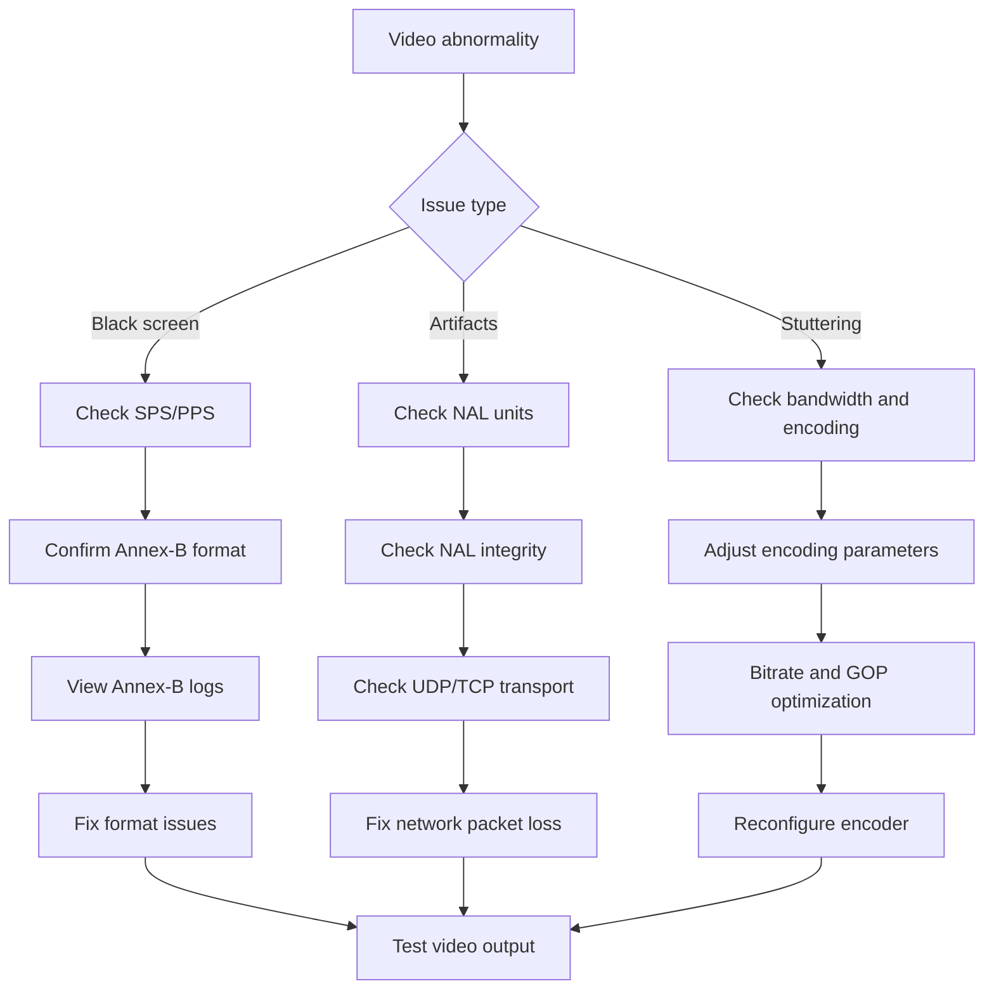
```mermaid
flowchart TD
    A["Video abnormality"] --> B{"Issue type"}
    B -->|"Black screen"| C["Check SPS/PPS"]
    B -->|"Artifacts"| D["Check NAL units"]
    B -->|"Stuttering"| E["Check bandwidth and encoding"]

    C --> F["Confirm Annex-B format"]
    D --> G["Check NAL integrity"]
    E --> H["Adjust encoding parameters"]

    F --> I["View Annex-B logs"]
    G --> J["Check UDP/TCP transport"]
    H --> K["Bitrate and GOP optimization"]

    I --> L["Fix format issues"]
    J --> M["Fix network packet loss"]
    K --> N["Reconfigure encoder"]

    L --> O["Test video output"]
    M --> O
    N --> O
```

**Diagnostic commands:**

```bash
# View video stream status
curl http://localhost:8080/api/v1/media/status

# View H.264 stream logs
journalctl -u platform-api | grep -i "h264\|nal"

# Analyze video packets
tcpdump -i lo -s 0 -w rtsp.pcap port 8554
```

## 6 Container Application Troubleshooting

### 6.1 Application Installation Failure

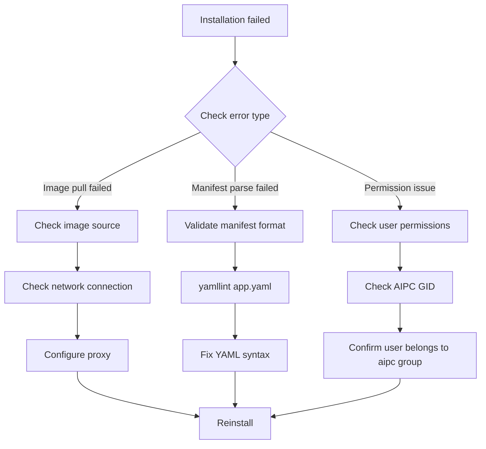
```mermaid
flowchart TD
    A["Installation failed"] --> B{"Check error type"}
    B -->|"Image pull failed"| C["Check image source"]
    B -->|"Manifest parse failed"| D["Validate manifest format"]
    B -->|"Permission issue"| E["Check user permissions"]

    C --> F["Check network connection"]
    D --> G["yamllint app.yaml"]
    E --> H["Check AIPC GID"]

    F --> I["Configure proxy"]
    G --> J["Fix YAML syntax"]
    H --> K["Confirm user belongs to aipc group"]

    I --> L["Reinstall"]
    J --> L
    K --> L
```

**Diagnostic commands:**

```bash
# View installation logs
journalctl -u app-manager -f

# Check manifest format
aipc-cli app inspect /path/to/app.yaml

# Verify image
docker pull registry.example.com/app:latest
```

### 6.2 Container Startup Failure

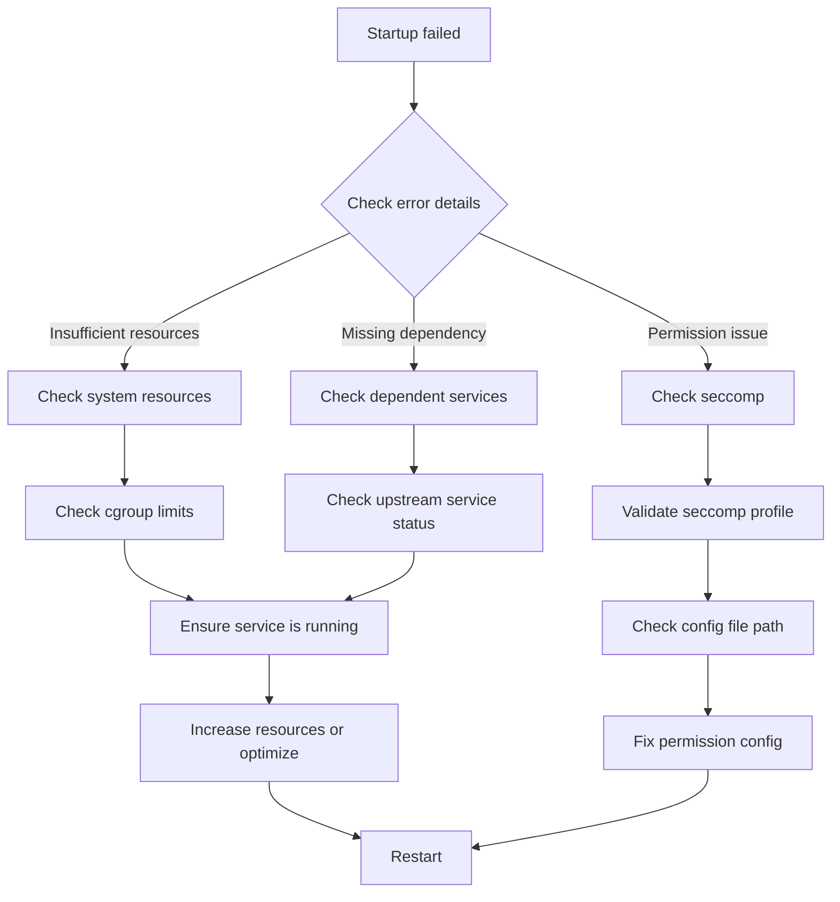
```mermaid
flowchart TD
    A["Startup failed"] --> B{"Check error details"}
    B -->|"Insufficient resources"| C["Check system resources"]
    B -->|"Permission issue"| D["Check seccomp"]
    B -->|"Missing dependency"| E["Check dependent services"]

    C --> F["Check cgroup limits"]
    D --> G["Validate seccomp profile"]
    E --> H["Check upstream service status"]

    F --> I["Adjust resource quotas"]
    G --> J["Check config file path"]
    H --> I["Ensure service is running"]

    I --> K["Increase resources or optimize"]
    J --> L["Fix permission config"]
    K --> M["Restart"]
    L --> M
```

**Diagnostic commands:**

```bash
# View container logs
journalctl -u app-manager | grep -i "container"

# Check system resources
free -h
df -h
# Note: Use systemd-cgtop instead of cgrouptop for cgroup resource monitoring
systemd-cgtop

# Check containerd status
systemctl status containerd
```

### 6.3 Health Check Failure

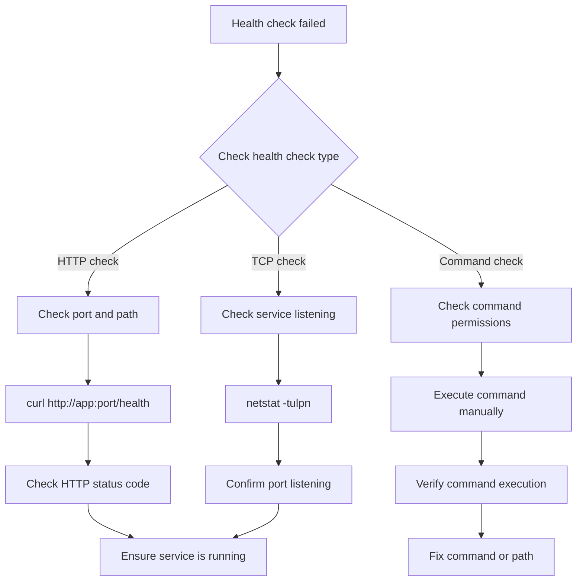
```mermaid
flowchart TD
    A["Health check failed"] --> B{"Check health check type"}
    B -->|"HTTP check"| C["Check port and path"]
    B -->|"Command check"| D["Check command permissions"]
    B -->|"TCP check"| E["Check service listening"]

    C --> F["curl http://app:port/health"]
    D --> G["Execute command manually"]
    E --> H["netstat -tulpn"]

    F --> I["Check HTTP status code"]
    G --> J["Verify command execution"]
    H --> K["Confirm port listening"]

    I --> L["Fix app health endpoint"]
    J --> M["Fix command or path"]
    K --> L["Ensure service is running"]
```

**Diagnostic commands:**

```bash
# View health check logs
journalctl -u app-manager | grep -i "healthcheck"

# Execute health check command manually
docker exec -it container-id /path/to/healthcheck.sh

# View container status
aipc-cli app info <app-id>
```

## 7 Device Control Troubleshooting

### 7.1 PTZ Control Not Responding

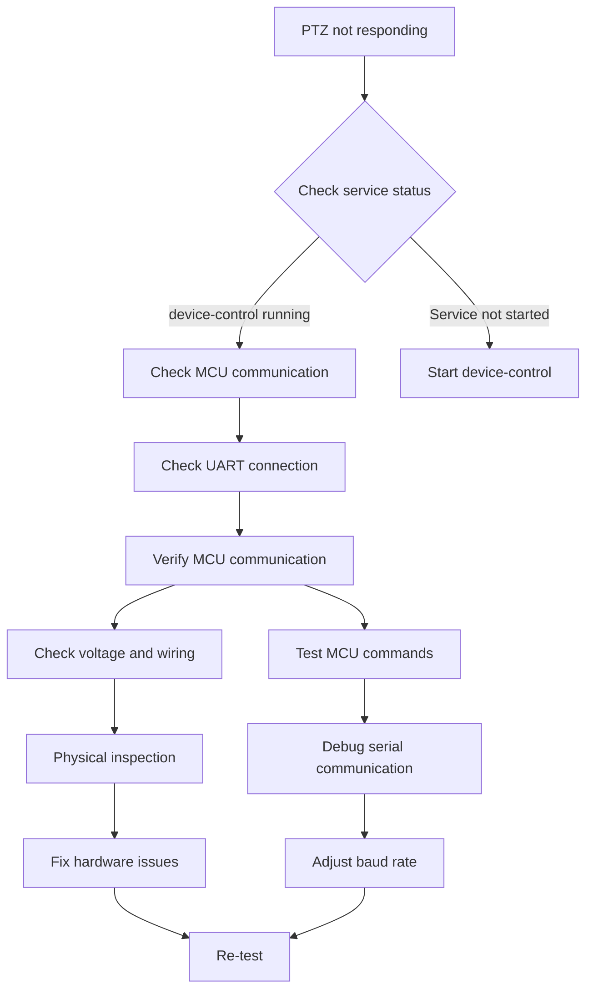
```mermaid
flowchart TD
    A["PTZ not responding"] --> B{"Check service status"}
    B -->|"device-control running"| C["Check MCU communication"]
    B -->|"Service not started"| D["Start device-control"]

    C --> E["Check UART connection"]
    E --> F["Verify MCU communication"]

    F --> G["Check voltage and wiring"]
    F --> H["Test MCU commands"]

    G --> I["Physical inspection"]
    H --> J["Debug serial communication"]

    I --> K["Fix hardware issues"]
    J --> L["Adjust baud rate"]

    K --> M["Re-test"]
    L --> M
```

**Diagnostic commands:**

```bash
# Check device-control status
systemctl status device-control

# View PTZ logs
journalctl -u device-control -f

# Test UART communication
ls -la /dev/ttyS*
stty -F /dev/ttyS0 921600

# Test PTZ control command
grpcurl -plaintext -d '{"direction": "PAN_LEFT", "speed": 50}' unix:///run/aipc/device-control.sock aipc.platform.device.v1.DeviceControl/Pan
```

### 7.2 Lens Control Abnormality

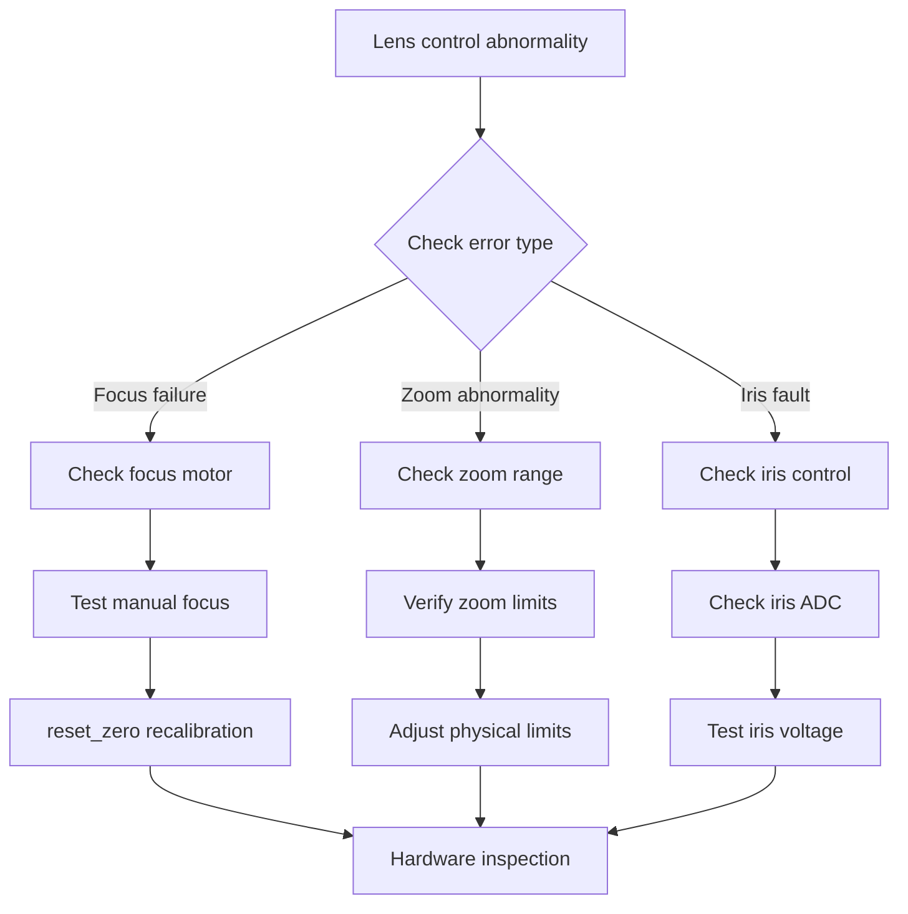
```mermaid
flowchart TD
    A["Lens control abnormality"] --> B{"Check error type"}
    B -->|"Focus failure"| C["Check focus motor"]
    B -->|"Zoom abnormality"| D["Check zoom range"]
    B -->|"Iris fault"| E["Check iris control"]

    C --> F["Test manual focus"]
    D --> G["Verify zoom limits"]
    E --> H["Check iris ADC"]

    F --> I["reset_zero recalibration"]
    G --> J["Adjust physical limits"]
    H --> K["Test iris voltage"]

    I --> L["Re-test focus"]
    J --> L["Physical adjustment"]
    K --> L["Hardware inspection"]
```

**Diagnostic commands:**

```bash
# View lens control logs
journalctl -u device-control | grep -i "lens\|focus\|zoom"

# View lens status
grpcurl -plaintext -d '{}' unix:///run/aipc/device-control.sock aipc.platform.device.v1.DeviceControl/GetLensStatus

# Test lens reset
grpcurl -plaintext -d '{}' unix:///run/aipc/device-control.sock aipc.platform.device.v1.DeviceControl/LensResetZero
```

## 8 Event Bus Troubleshooting

### 8.1 Event Publishing Failure

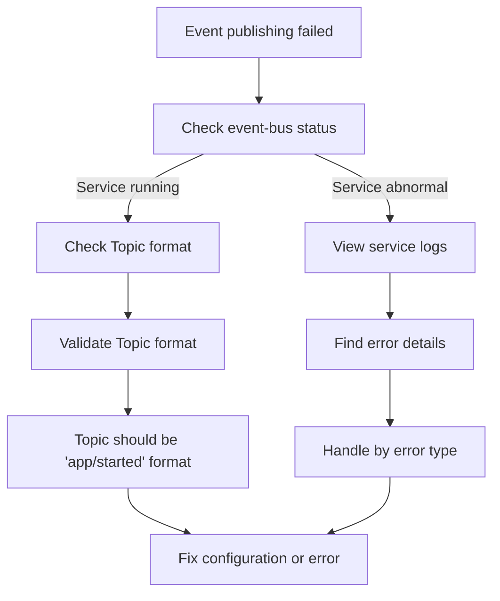
```mermaid
flowchart TD
    A["Event publishing failed"] --> B["Check event-bus status"]
    B -->|"Service running"| C["Check Topic format"]
    B -->|"Service abnormal"| D["View service logs"]

    C --> E["Validate Topic format"]
    D --> F["Find error details"]

    E --> G["Topic should be 'app/started' format"]
    F --> H["Handle by error type"]

    G --> I["Fix Topic format"]
    H --> I["Fix configuration or error"]
```

**Diagnostic commands:**

```bash
# Check event-bus status
systemctl status event-bus

# View event logs
journalctl -u event-bus -f

# Test event publishing
aipc-cli event-bus publish test/topic '{"message": "test"}'
```

### 8.2 Subscription Failure

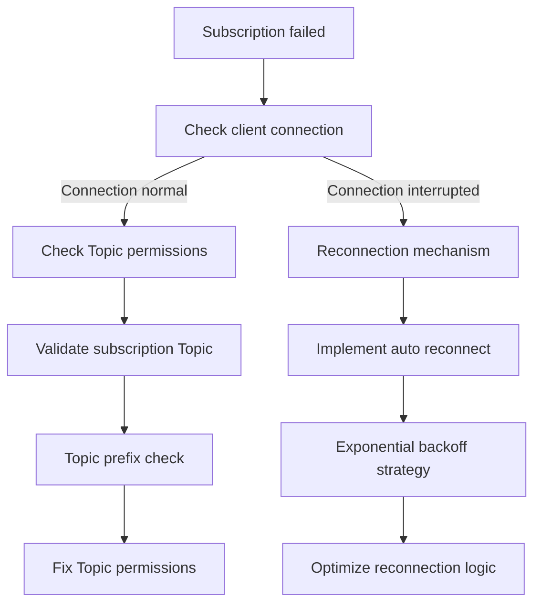
```mermaid
flowchart TD
    A["Subscription failed"] --> B["Check client connection"]
    B -->|"Connection normal"| C["Check Topic permissions"]
    B -->|"Connection interrupted"| D["Reconnection mechanism"]

    C --> E["Validate subscription Topic"]
    D --> F["Implement auto reconnect"]

    E --> G["Topic prefix check"]
    F --> H["Exponential backoff strategy"]

    G --> I["Fix Topic permissions"]
    H --> J["Optimize reconnection logic"]
```

## 9 Log Level Adjustment

### 9.1 Temporarily Adjust Log Level

```bash
# Temporarily set to debug level
# Note: journalctl does not support --log-level; set debug level in the service configuration file instead
sudo journalctl -u ai-runtime -f

# View error level and above logs
sudo journalctl -u camera-daemon -p err
```

### 9.2 Modify Configuration File

```yaml
# Adjust log_level in service configuration
service:
  name: ai-runtime
  listen: unix:///run/aipc/ai-runtime.sock
  log_level: debug  # debug, info, warn, error

# Or use environment variable
# export LOG_LEVEL=debug
```

### 9.3 Log Level Reference

| Level | Description |
|-------|-------------|
| `debug` | Detailed debugging information |
| `info` | Key runtime status |
| `warn` | Non-fatal warnings |
| `error` | Critical errors |

### 9.4 Log Analysis Tips

```bash
# View error rate
journalctl -u ai-runtime --since "1 hour ago" | grep -c "error"

# View most frequent errors
journalctl -u ai-runtime | grep "error" | sort | uniq -c | sort -nr

# Filter specific errors
journalctl -u ai-runtime | grep -E "(timeout|connection refused|permission denied)"
```

## 10 Performance Monitoring

### 10.1 System Resource Monitoring

```bash
# Monitor CPU usage
top -p $(pgrep -f ai-runtime)

# Monitor memory usage
free -h && ps aux | grep ai-runtime

# Monitor disk I/O
iostat -x 1 5

# Monitor network
iftop -i eth0
```

### 10.2 Service Performance Metrics

```bash
# AI Runtime statistics
grpcurl -plaintext -d '{}' unix:///run/aipc/ai-runtime.sock aipc.platform.inference.v1.InferenceService/GetStats

# Container statistics
aipc-cli app stats <app-id>

# Device status
grpcurl -plaintext -d '{}' unix:///run/aipc/device-control.sock aipc.platform.device.v1.DeviceControl/GetDeviceStatus
```

### 10.3 Real-time Monitoring Script

```bash
#!/bin/bash
# Monitoring script example

while true; do
    echo "=== $(date) ==="
    echo "CPU Usage:"
    top -bn1 | grep "Cpu(s)" | sed "s/.*, *\([0-9.]*\)%* id.*/\1/" | awk '{print 100 - $1}'
    echo "Memory Usage:"
    free | grep Mem | awk '{printf "%.2f%%\n", $3/$2 * 100.0}'
    echo "Disk Usage:"
    df /opt/aipc | tail -1 | awk '{print $5}'
    echo "NPU Temperature:"
    hailortcli scan | grep Temperature | awk '{print $2}'
    sleep 5
done
```

## 11 Web Console Troubleshooting

### 11.1 Browser Compatibility Issues

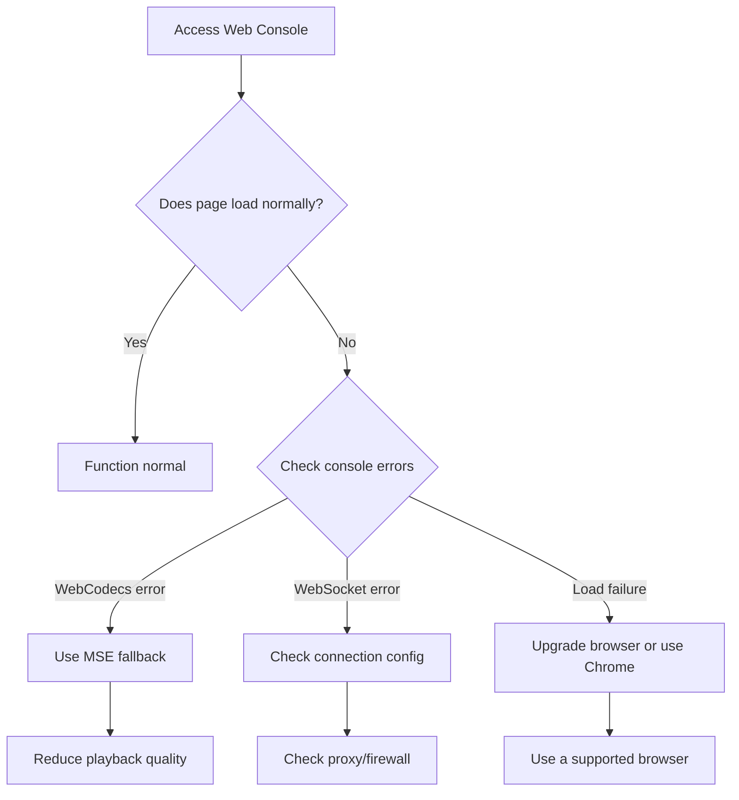
```mermaid
graph TD
    A["Access Web Console"] --> B{"Does page load normally?"}
    B -->|Yes| C["Function normal"]
    B -->|No| D{"Check console errors"}
    D -->|"WebCodecs error"| E["Use MSE fallback"]
    D -->|"WebSocket error"| F["Check connection config"]
    D -->|"Load failure"| G["Upgrade browser or use Chrome"]

    E --> H["Reduce playback quality"]
    F --> I["Check proxy/firewall"]
    G --> J["Use a supported browser"]
```

**Browser compatibility matrix:**

| Browser | Minimum Version | Support Level | Known Issues | Solution |
|---------|----------------|---------------|-------------|----------|
| Chrome | 88+ | Full support | -- | -- |
| Firefox | 78+ | Basic support | No WebCodecs support | Use MSE playback |
| Safari | 14+ | Partial support | No WebCodecs support | Fallback to MSE |
| Edge | 88+ | Full support | -- | -- |
| Mobile browsers | -- | Limited support | Performance issues | Use desktop |

**WebCodecs support detection:**

```javascript
// Run the following code in the browser console to check WebCodecs support
if ('WebCodecs' in window) {
    console.log('WebCodecs supported - using hardware decoding');
} else {
    console.log('WebCodecs not supported - fallback to MSE');
    // Auto-switch to MSE player
    window.location.reload();
}
```

### 11.2 WebSocket Connection Troubleshooting

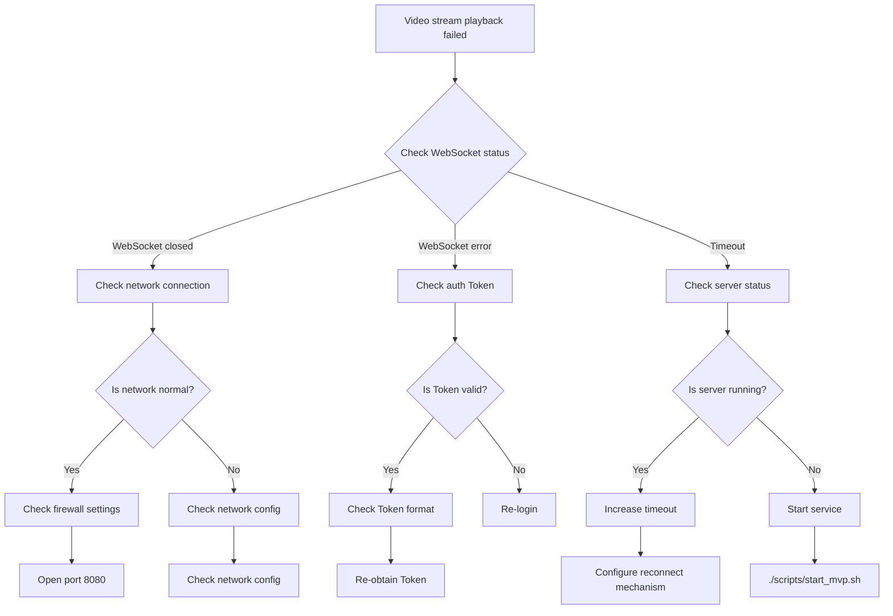
```mermaid
graph TD
    A["Video stream playback failed"] --> B{"Check WebSocket status"}
    B -->|"WebSocket closed"| C["Check network connection"]
    B -->|"WebSocket error"| D["Check auth Token"]
    B -->|"Timeout"| E["Check server status"]

    C --> C1{"Is network normal?"}
    C1 -->|Yes| F["Check firewall settings"]
    C1 -->|No| G["Check network config"]

    D --> D1{"Is Token valid?"}
    D1 -->|Yes| H["Check Token format"]
    D1 -->|No| I["Re-login"]

    E --> E1{"Is server running?"}
    E1 -->|Yes| J["Increase timeout"]
    E1 -->|No| K["Start service"]

    F --> L["Open port 8080"]
    G --> M["Check network config"]
    H --> N["Re-obtain Token"]
    J --> O["Configure reconnect mechanism"]
    K --> P["./scripts/start_mvp.sh"]
```

**Common WebSocket errors and solutions:**

| Error Code | Error Message | Possible Cause | Solution |
|------------|--------------|----------------|----------|
| 1006 | Abnormal closure (no close frame received) | Connection actively closed | Check if server is running normally |
| 1005 | No status code | Connection interrupted abnormally | Check network stability |
| 401/403 | Unauthorized | Token invalid or expired | Re-login to obtain new Token |
| 500 | Server error | Internal server error | Check server logs |

**WebSocket connection test:**

```javascript
// Run in browser console
const ws = new WebSocket('ws://localhost:8080/api/v1/h264/main');

ws.onopen = function() {
    console.log('WebSocket connected');
    // Send authentication message
    const token = localStorage.getItem('token');
    if (token) {
        ws.send(JSON.stringify({
            type: 'auth',
            token: token
        }));
    }
};

ws.onmessage = function(event) {
    console.log('Message received:', event.data);
};

ws.onclose = function(event) {
    console.log('WebSocket closed:', event.code, event.reason);
};

ws.onerror = function(error) {
    console.error('WebSocket error:', error);
};
```

### 11.3 Video Playback Troubleshooting

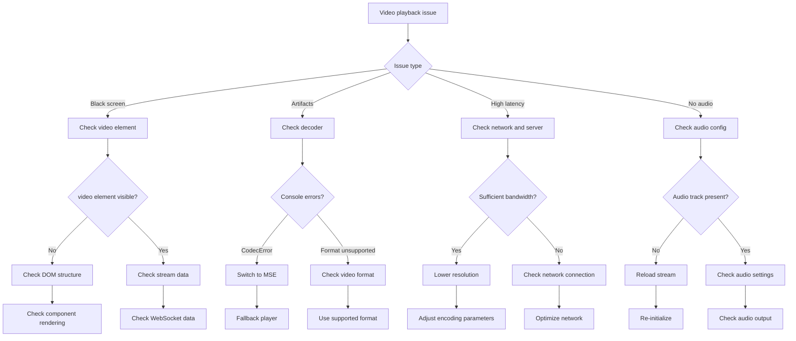
```mermaid
graph TD
    A["Video playback issue"] --> B{"Issue type"}
    B -->|"Black screen"| C["Check video element"]
    B -->|"Artifacts"| D["Check decoder"]
    B -->|"High latency"| E["Check network and server"]
    B -->|"No audio"| F["Check audio config"]

    C --> C1{"video element visible?"}
    C1 -->|No| G["Check DOM structure"]
    C1 -->|Yes| H["Check stream data"]

    D --> D1{"Console errors?"}
    D1 -->|"CodecError"| I["Switch to MSE"]
    D1 -->|"Format unsupported"| J["Check video format"]

    E --> E1{"Sufficient bandwidth?"}
    E1 -->|Yes| K["Lower resolution"]
    E1 -->|No| L["Check network connection"]

    F --> F1{"Audio track present?"}
    F1 -->|No| M["Reload stream"]
    F1 -->|Yes| N["Check audio settings"]

    G --> O["Check component rendering"]
    H --> P["Check WebSocket data"]
    I --> Q["Fallback player"]
    J --> R["Use supported format"]
    K --> S["Adjust encoding parameters"]
    L --> T["Optimize network"]
    M --> U["Re-initialize"]
    N --> V["Check audio output"]
```

#### Black Screen Issue

**Symptom:** Video player displays a black screen with no visual content.

**Possible causes:**

- WebSocket connection not established
- SPS/PPS not correctly received
- video element not properly mounted

**Solution:**

```javascript
// Check video element
document.querySelector('video')?.controls = true;
document.querySelector('video')?.play();

// Reload video stream
const player = window.videoRendererInstance;
if (player) {
    player.restart();
}
```

#### Artifacts/Mosaic Issue

**Symptom:** Video shows mosaics, color blocks, or other visual anomalies.

**Possible causes:**

- Network packet loss
- Decoder does not support current format
- Frame synchronization issue

**Solution:**

```javascript
// Enable fallback mode
if (window.navigator.userAgent.indexOf('Safari') > -1) {
    // Safari uses MSE player
    const player = new H264Player();
    player.initPlayer(videoElement);
    player.start(videoUrl);
}

// Reduce playback quality
const videoElement = document.querySelector('video');
if (videoElement) {
    videoElement.playbackRate = 1.0;
}
```

#### High Latency Issue

**Symptom:** Video playback lags significantly behind the live feed.

**Possible causes:**

- High network latency
- Slow server processing
- Improper buffer settings

**Solution:**

```javascript
// Adjust player parameters
const player = window.videoRendererInstance;
if (player) {
    player.setLatencyTarget(200); // 200ms
    player.setBufferLength(0.5);  // 0.5 seconds
}

// Check network quality
navigator.connection.addEventListener('change', () => {
    console.log('Connection type:', navigator.connection.effectiveType);
    console.log('Downlink speed:', navigator.connection.downlink);
});
```

### 11.4 API Request Failure Troubleshooting

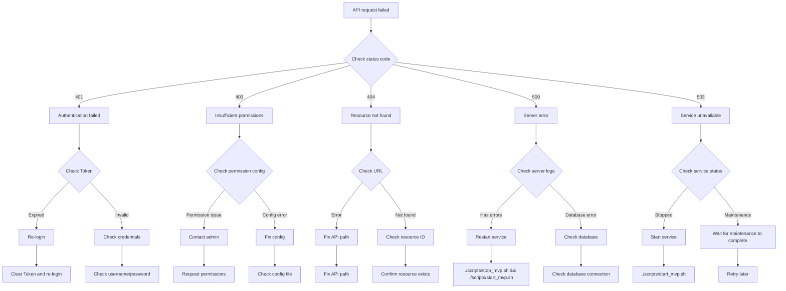
```mermaid
graph TD
    A["API request failed"] --> B{"Check status code"}
    B -->|401| C["Authentication failed"]
    B -->|403| D["Insufficient permissions"]
    B -->|404| E["Resource not found"]
    B -->|500| F["Server error"]
    B -->|503| G["Service unavailable"]

    C --> C1{"Check Token"}
    C1 -->|"Expired"| H["Re-login"]
    C1 -->|"Invalid"| I["Check credentials"]

    D --> D1{"Check permission config"}
    D1 -->|"Permission issue"| J["Contact admin"]
    D1 -->|"Config error"| K["Fix config"]

    E --> E1{"Check URL"}
    E1 -->|"Error"| L["Fix API path"]
    E1 -->|"Not found"| M["Check resource ID"]

    F --> F1{"Check server logs"}
    F1 -->|"Has errors"| N["Restart service"]
    F1 -->|"Database error"| O["Check database"]

    G --> G1{"Check service status"}
    G1 -->|"Stopped"| P["Start service"]
    G1 -->|"Maintenance"| Q["Wait for maintenance to complete"]

    H --> R["Clear Token and re-login"]
    I --> S["Check username/password"]
    J --> T["Request permissions"]
    K --> U["Check config file"]
    L --> V["Fix API path"]
    M --> W["Confirm resource exists"]
    N --> X["./scripts/stop_mvp.sh && ./scripts/start_mvp.sh"]
    O --> Y["Check database connection"]
    P --> Z["./scripts/start_mvp.sh"]
    Q --> RETRY["Retry later"]
```

**Common API error handling:**

**401 Unauthorized:**

```javascript
// Error response example
{
    "success": false,
    "error": "Invalid token",
    "code": 401
}

// Solution: Clear local Token and re-login
localStorage.removeItem('token');
localStorage.removeItem('user');
window.location.href = '/login';
```

**403 Forbidden:**

```javascript
// Error response example
{
    "success": false,
    "error": "Permission denied",
    "code": 403
}

// Solution: Check user permissions, confirm if operation requires special permissions, contact admin
```

**500 Server Error:**

```javascript
// Error response example
{
    "success": false,
    "error": "Internal server error",
    "code": 500
}

// Solution:
// 1. Check server logs: tail -f /var/log/aipc/platform-api.log
// 2. Restart service: ./scripts/stop_mvp.sh && ./scripts/start_mvp.sh
// 3. Check system resources: top && df -h
```

### 11.5 Frontend Performance Troubleshooting

```mermaid
graph TD
    A["Performance issue"] --> B{"Symptom"}
    B -->|"Memory leak"| C["Check component unmount"]
    B -->|"High CPU usage"| D["Check rendering performance"]
    B -->|"UI jank"| E["Check compute-intensive tasks"]

    C --> C1{"Component properly unmounted?"}
    C1 -->|No| F["Fix component lifecycle"]
    C1 -->|Yes| G["Check event listeners"]

    D --> D1{"Render frame rate"}
    D1 -->|"Below 30fps"| H["Optimize component rendering"]
    D1 -->|"Above 60fps"| I["Performance normal"]

    E --> E1{"Task type"}
    E1 -->|"List rendering"| J["Use virtual scrolling"]
    E1 -->|"Data processing"| K["Use Web Worker"]

    F --> L["Improve useEffect cleanup function"]
    G --> M["Remove uncleaned events"]
    H --> N["Use React.memo"]
    J --> O["Use react-window"]
    K --> P["Migrate to Worker thread"]
```

**Memory leak troubleshooting:**

```javascript
// Run memory test in browser console
// 1. Force garbage collection
if (window.gc) {
    window.gc();
}

// 2. Monitor memory usage
const memoryUsed = performance.memory?.usedJSHeapSize;
console.log('Memory usage:', memoryUsed / 1024 / 1024, 'MB');

// 3. Check component unmount - investigate uncleaned subscriptions
const subscriptions = [];
const originalAdd = subscriptions.push;
subscriptions.push = function(...args) {
    console.log('Adding subscription:', args);
    return originalAdd.apply(this, args);
};
```

**CPU usage optimization:**

```javascript
// Check rendering performance
const observer = new PerformanceObserver((list) => {
    for (const entry of list.getEntries()) {
        if (entry.name.includes('Paint')) {
            console.log('Paint time:', entry.duration);
        }
    }
});
observer.observe({ entryTypes: ['paint'] });

// Use React DevTools Profiler to analyze component render duration and identify re-render causes
```

### 11.6 Development Environment Troubleshooting

#### Dependency Installation Failure

```bash
# Clean cache and reinstall
rm -rf node_modules
rm -rf .pnpm-store
pnpm install --force

# Check Node.js version (requires 18+ or 20+)
node --version
npm --version
```

#### TypeScript Compilation Errors

```bash
# Force type checking
pnpm exec tsc --noEmit --strict

# Check type definitions
pnpm exec tsc --noEmit --skipLibCheck

# Clean cache
rm -rf .vite
```

#### Hot Reload Not Working

```bash
# Check Vite config
cat vite.config.ts

# Clean cache
rm -rf .vite
rm -rf node_modules/.vite

# Check port usage
netstat -tulpn | grep :5174
```

**Development environment configuration check workflow:**

```mermaid
graph TD
    A["Dev environment issue"] --> B{"Check environment variables"}
    B -->|"Missing"| C["Set environment variables"]
    B -->|"Error"| D["Fix config"]

    C --> C1["Check .env file"]
    C1 -->|"Not exists"| E["Create .env file"]
    C1 -->|"Exists"| F["Check variable values"]

    D --> D1["Check variable types"]
    D1 -->|"Error"| G["Fix type"]
    D1 -->|"Correct"| H["Check proxy config"]

    E --> I["Add required variables"]
    F --> J["Confirm VITE_API_TARGET"]
    G --> K["Change variable format"]
    H --> L["Check vite.config.ts"]

    I --> M["Refer to .env.example"]
    J --> N["Set to http://127.0.0.1:8080"]
    K --> O["Ensure string type"]
    L --> P["Check proxy config"]
```

### 11.7 Web Console Log Viewing

**Browser-side logs:**

1. Open browser Developer Tools (F12)
2. Switch to the Console tab
3. View error messages

**Server-side logs:**

```bash
# View Platform API service logs
tail -f /var/log/aipc/platform-api.log

# View App Manager logs
tail -f /var/log/aipc/app-manager.log

# View Device Control service logs
tail -f /var/log/aipc/device-control.log

# View Camera Daemon logs
tail -f /var/log/aipc/camera-daemon.log
```

## 12 Common Diagnostic Commands Quick Reference

| Scenario | Command | Description |
|----------|---------|-------------|
| View service status | `systemctl status ai-runtime camera-daemon app-manager` | Check core platform services |
| View service logs | `journalctl -u <service-name> -f` | View service logs in real time |
| Test gRPC connection | `grpcurl -plaintext unix:///run/aipc/service.sock list` | Test gRPC service availability |
| Check Socket | `ls -la /run/aipc/` | View Unix Socket files |
| Check port usage | `netstat -tulpn \| grep 8554` | Check RTSP port usage |
| Check system resources | `top -p $(pidof service)` | Monitor service resource usage |
| View container status | `aipc-cli app list` | List all container applications |
| Test network connection | `curl http://localhost:8080/api/v1/media/status` | Test API endpoint |
| View model status | `grpcurl -plaintext -d '{}' unix:///run/aipc/ai-runtime.sock aipc.platform.inference.v1.InferenceService/ListModels` | List registered models |
| Check NPU status | `hailortcli scan` | View Hailo device status |
| Test PTZ control | `grpcurl -plaintext -d '{"direction": "PAN_LEFT", "speed": 50}' unix:///run/aipc/device-control.sock aipc.platform.device.v1.DeviceControl/Pan` | Test PTZ control |
| View event logs | `aipc-cli event-bus logs` | View event bus logs |
| Check disk usage | `df -h /opt/aipc` | Check disk space |
| Check memory usage | `free -h` | Check system memory |

## 13 Error Code Reference

| Error Code | Error Name | Description | Solution |
|-----------|-----------|-------------|----------|
| 10001 | E_AUTH_FAILED | Authentication failed | Check username/password |
| 10002 | E_TOKEN_EXPIRED | Token expired | Re-login |
| 20001 | E_DEVICE_NOT_FOUND | Device not found | Check device connection |
| 20002 | E_STREAM_TIMEOUT | Stream timeout | Check network connection |
| 30001 | E_APP_NOT_INSTALLED | App not installed | Install app first |
| 30002 | E_APP_RUNNING | App is running | Stop app first |
| 40001 | E_MODEL_NOT_FOUND | Model not found | Scan model directory |
| 40002 | E_MODEL_LOAD_FAILED | Model loading failed | Check model format |
| 50001 | E_SYSTEM_ERROR | System error | Check system logs |
| 50002 | E_RESOURCE_BUSY | Resource busy | Wait for resource release |

## 14 Troubleshooting Summary

1. **Check service status first** -- Use `systemctl status` to confirm if services are running
2. **View error logs** -- Use `journalctl` to view detailed error information
3. **Verify network connections** -- Check if Sockets and ports are normal
4. **Check resource usage** -- Ensure system resources are sufficient
5. **Troubleshoot module by module** -- Verify progressively from low-level hardware to upper-level applications
6. **Preserve complete logs** -- Save sufficient log information before and after failures

## 15 Web Console Troubleshooting Checklist

### Basic Checks

- [ ] Network connection is normal (can ping device IP)
- [ ] Browser version is supported (Chrome recommended)
- [ ] Login session is valid
- [ ] Token has not expired
- [ ] All server services are running normally

### Advanced Checks

- [ ] Firewall allows port 8080
- [ ] System resource usage is normal
- [ ] Sufficient disk space
- [ ] Hardware devices are properly connected
- [ ] Configuration files are correct

### Performance Optimization Checks

- [ ] No memory leaks in components
- [ ] Good rendering performance
- [ ] API request caching is effective
- [ ] Video stream parameters are optimized
- [ ] Sufficient network bandwidth

### Contact Technical Support

If the above methods cannot resolve the issue, please provide the following information:

1. Issue description
2. Browser version and operating system
3. Console error screenshots
4. Related log files
5. Steps to reproduce the issue

Technical support email: support@aipc.tech

## Related Documentation

- [Platform Architecture](../3-software-platform/0-platform-architecture.md)
- [FAQ](./3-faq.md)
- [Configuration Reference](./1-config-reference.md)
- [AI Runtime Service](../4-service-reference/0-ai-runtime.md)
- [App Manager Service](../4-service-reference/1-app-manager.md)
