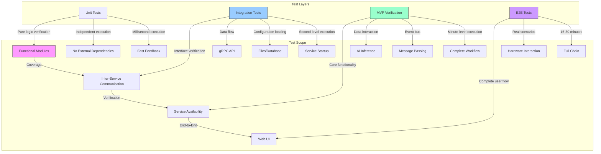
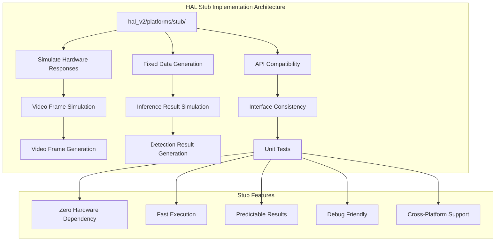
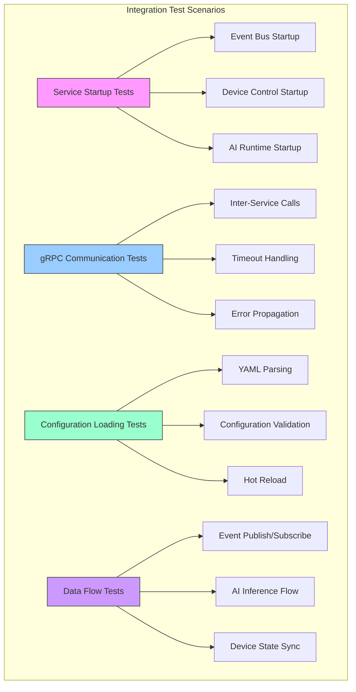
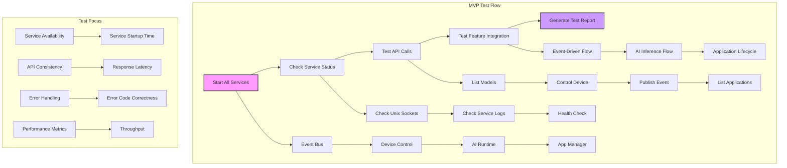
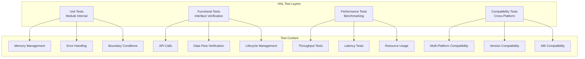
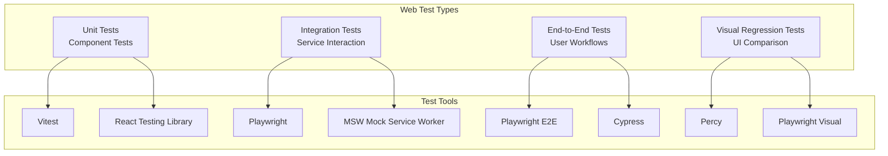
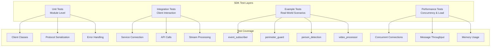
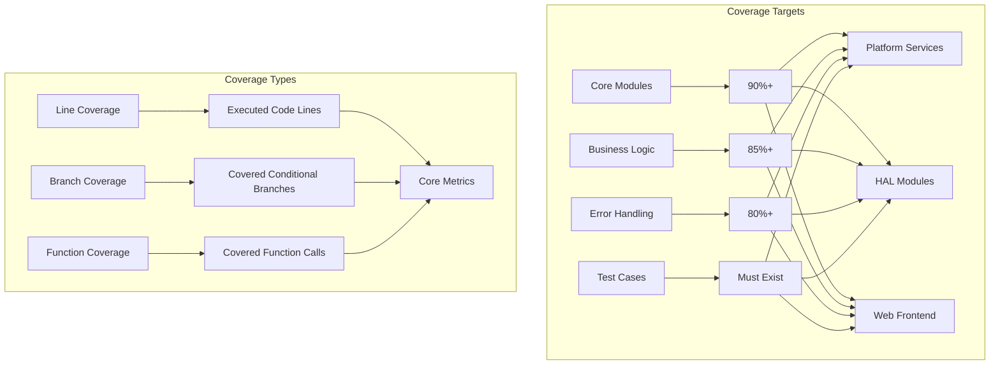

# Test Environment Setup

The AIPC platform adopts a four-layer test architecture, progressing from millisecond-level unit tests to end-to-end full-chain verification. This document describes the objectives, execution methods, and environment configuration for each test layer.

## 1 Test Layer Architecture



### 1.1 Layer Descriptions

| Layer | Objective | Dependencies | Execution Time | Coverage Requirement |
|-------|-----------|--------------|----------------|---------------------|
| Unit Tests | Test individual functions and modules, using Mocks to isolate external dependencies | None | Milliseconds | 80%+ |
| Integration Tests | Verify inter-module interfaces and data flow, including service startup and communication | Services running | Seconds to minutes | -- |
| MVP Verification | Use HAL Stub to simulate hardware, verify core functionality and service availability | Stub HAL | Minutes | -- |
| E2E Tests | Complete user workflows, including Web UI and real hardware interaction | Full stack + hardware | 15-30 minutes | -- |

## 2 Environment Preparation

### 2.1 Ubuntu 22.04

```bash
# Basic dependencies
sudo apt update
sudo apt install -y \
    build-essential \
    cmake \
    golang-go \
    nodejs \
    npm \
    protobuf-compiler \
    protobuf-compiler-grpc \
    libgrpc++-dev \
    libprotobuf-dev \
    python3-pip \
    python3-venv \
    git

# Go dependencies
go install google.golang.org/protobuf/cmd/protoc-gen-go@latest
go install google.golang.org/grpc/cmd/protoc-gen-go-grpc@latest

# Python dependencies
python3 -m pip install --user -r sdk/python/requirements.txt

# Node.js dependencies
cd web/console && npm install
```

### 2.2 macOS

```bash
# Install dependencies using Homebrew
brew install go node protobuf cmake grpc

# Go dependencies
go install google.golang.org/protobuf/cmd/protoc-gen-go@latest
go install google.golang.org/grpc/cmd/protoc-gen-go-grpc@latest

# Python dependencies
python3 -m venv venv
source venv/bin/activate
pip install -r sdk/python/requirements.txt
```

### 2.3 Hailo-15 Cross-Compilation Toolchain

```bash
# Download Hailo SDK 4.0.23
wget -O hailo-sdk.tar.gz <SDK_DOWNLOAD_URL>
sudo mkdir -p /opt/poky
sudo tar -xzf hailo-sdk.tar.gz -C /opt/poky/

# Load environment
source /opt/poky/4.0.23/environment-setup-aarch64-poky-linux

# Verify
echo $CC  # Should output: aarch64-poky-linux-gcc
```

### 2.4 Environment Check

```bash
# Check build environment
./scripts/check_build.sh

# Verify dependency versions
go version          # Go 1.25+
node --version      # v20+
protoc --version    # 3.12+
cmake --version     # 3.16+
```

## 3 Stub Mode Testing

### 3.1 Stub Mode Overview

HAL Stub is a pure software implementation of the HAL that provides simulated hardware functionality, allowing tests to run without depending on real hardware:



### 3.2 Stub Build

```bash
# Build HAL Stub
make hal-v2 PLATFORM=stub

# Verify build artifacts
ls -la build/output/hal/stub/libhal*

# Run MVP test using Stub
./scripts/test_mvp.sh
```

### 3.3 Stub Configuration Example

```yaml
# configs/hal/stub_config.yaml
stub_config:
  video:
    resolution: [1920, 1080]
    fps: 30
    format: "NV12"
    pattern: "test_pattern"  # test_pattern | noise | static

  inference:
    models:
      - name: "person_detection"
        input_size: [640, 640]
        output_count: 100
        confidence: 0.8

    delay_ms: 10  # Simulate inference delay

  codec:
    bitrate: 2000000
    gop_size: 30

  device:
    gpio_state: [false, false, false]  # GPIO simulated state
    uart_response: "OK"  # UART simulated response
```

## 4 Unit Tests

### 4.1 Running Unit Tests

```bash
# All unit tests
make test-unit

# Specific service
make test-unit-device-control
make test-unit-event-bus
make test-unit-app-manager

# Use Go test directly
go test -v ./platform/device-control/...
go test -v ./platform/event-bus/...
go test -v ./platform/app-manager/...
```

### 4.2 Test Directory Structure

```
platform/
├── device-control/
│   ├── device-control_test.go    # Main service tests
│   ├── handlers/
│   │   └── device_test.go       # Handler tests
│   └── grpc/
│       └── device_test.go       # gRPC service tests
├── event-bus/
│   ├── event-bus_test.go        # Event bus tests
│   └── handlers/
│       └── event_test.go         # Event handler tests
└── app-manager/
    ├── app-manager_test.go      # Application management tests
    └── handlers/
        └── app_test.go          # Application handler tests
```

### 4.3 Unit Test Example

```go
// platform/device-control/device-control_test.go
package devicecontrol

import (
    "testing"
    "context"

    "github.com/stretchr/testify/assert"
    "github.com/stretchr/testify/mock"

    "github.com/aipc/platform/device-control/pb"
)

func TestDeviceControl_GetStatus(t *testing.T) {
    srv := setupTestServer()
    client := pb.NewDeviceControlClient(srv.conn)

    resp, err := client.GetStatus(context.Background(), &pb.GetStatusRequest{})

    assert.NoError(t, err)
    assert.NotNil(t, resp)
    assert.Equal(t, pb.DeviceStatus_DEVICE_STATUS_RUNNING, resp.Status)
}

func TestDeviceControl_ControlLight(t *testing.T) {
    tests := []struct {
        name    string
        request *pb.ControlLightRequest
        want    *pb.ControlLightResponse
        wantErr bool
    }{
        {
            name: "valid control",
            request: &pb.ControlLightRequest{
                Light: pb.Light_LIGHT_WHITE,
                Value: 80,
            },
            want:    &pb.ControlLightResponse{Success: true},
            wantErr: false,
        },
        {
            name: "invalid value",
            request: &pb.ControlLightRequest{
                Light: pb.Light_LIGHT_WHITE,
                Value: 256, // Out of range
            },
            want:    nil,
            wantErr: true,
        },
    }

    for _, tt := range tests {
        t.Run(tt.name, func(t *testing.T) {
            srv := setupTestServer()
            client := pb.NewDeviceControlClient(srv.conn)

            resp, err := client.ControlLight(context.Background(), tt.request)

            if tt.wantErr {
                assert.Error(t, err)
                return
            }

            assert.NoError(t, err)
            assert.Equal(t, tt.want.Success, resp.Success)
        })
    }
}
```

## 5 Integration Tests

### 5.1 Running Integration Tests

```bash
# All integration tests
make test-integration

# Specific service integration tests
make test-integration-device-control
make test-integration-ai-runtime

# Using test script
./scripts/test_all.sh
```

### 5.2 Integration Test Scenarios



### 5.3 Integration Test Example

```go
// integration_test.go
package integration

import (
    "context"
    "testing"
    "time"

    "github.com/stretchr/testify/assert"
    "github.com/stretchr/testify/require"

    "github.com/aipc/platform/device-control/pb"
    aipb "github.com/aipc/platform/ai-runtime/pb"
)

func TestDeviceControlAndAIRuntimeIntegration(t *testing.T) {
    // 1. Start services
    deviceCtrl := startDeviceControlService()
    aiRuntime := startAIRuntimeService()

    // 2. Test device control
    client := pb.NewDeviceControlClient(deviceCtrl.conn)
    status, err := client.GetStatus(context.Background(), &pb.GetStatusRequest{})
    require.NoError(t, err)
    assert.Equal(t, pb.DeviceStatus_DEVICE_STATUS_RUNNING, status.Status)

    // 3. Test AI Runtime
    aiClient := aipb.NewAIRuntimeClient(aiRuntime.conn)
    models, err := aiClient.ListModels(context.Background(), &aipb.ListModelsRequest{})
    require.NoError(t, err)
    assert.Greater(t, len(models.Models), 0)

    // 4. Test interaction: device state affects AI inference
    lightResp, err := client.ControlLight(context.Background(), &pb.ControlLightRequest{
        Light: pb.Light_LIGHT_WHITE,
        Value: 100,
    })
    require.NoError(t, err)
    assert.True(t, lightResp.Success)

    // 5. Verify AI inference can access device state
    inferenceReq := &aipb.InferenceRequest{
        ModelName: "environment_monitoring",
        InputData: []byte("test_data"),
    }

    infResp, err := aiClient.Infer(context.Background(), inferenceReq)
    require.NoError(t, err)
    assert.Contains(t, infResp.Metadata, "device_status")
}

func TestEventBusIntegration(t *testing.T) {
    eb := startEventBusService()
    pub := pb.NewEventBusClient(eb.conn)
    sub := pb.NewEventBusClient(eb.conn)

    // Publish event
    event := &pb.PublishEventRequest{
        Topic: "device/light/control",
        Event: &pb.Event{
            Timestamp: time.Now().UnixNano(),
            Source:    "integration_test",
            Payload:   []byte(`{"light": "white", "value": 80}`),
        },
    }

    _, err := pub.PublishEvent(context.Background(), event)
    require.NoError(t, err)

    // Subscribe to event
    stream, err := sub.SubscribeEvent(context.Background(), &pb.SubscribeEventRequest{
        Topic: "device/light/control",
    })
    require.NoError(t, err)

    // Receive event
    received, err := stream.Recv()
    require.NoError(t, err)
    assert.Equal(t, event.Event.Timestamp, received.Event.Timestamp)
}
```

## 6 MVP Verification Testing

### 6.1 MVP Test Flow

MVP (Minimum Viable Product) testing verifies core functionality and service availability:



### 6.2 Running MVP Tests

```bash
# Start MVP services
./scripts/start_mvp.sh

# Run verification script
./scripts/test_mvp.sh

# Stop services
./scripts/stop_mvp.sh
```

### 6.3 MVP Test Script Walkthrough

The following script follows a four-step process: check services, test event bus, test device control, and test AI Runtime.

```bash
#!/bin/bash
# scripts/test_mvp.sh

set -e

PROJECT_ROOT="$(cd "$(dirname "${BASH_SOURCE[0]}")/.." && pwd)"
cd "$PROJECT_ROOT"

# Color definitions
GREEN='\033[0;32m'
YELLOW='\033[1;33m'
BLUE='\033[0;34m'
RED='\033[0;31m'
NC='\033[0m'

RUN_DIR="/run/aipc"

echo "=========================================="
echo "AIPC Platform - MVP Test"
echo "=========================================="

# Check service status
check_service() {
    local name=$1
    local sock=$2

    if [ -S "$sock" ]; then
        echo -e "${GREEN}OK${NC} $name is running"
        return 0
    else
        echo -e "${RED}FAIL${NC} $name is not running (socket: $sock)"
        return 1
    fi
}

# Test event bus
test_event_bus() {
    echo -e "\n${BLUE}[2/4] Testing Event Bus...${NC}"

    check_service "Event Bus" "$RUN_DIR/event-bus.sock"

    python3 -c "
from hailo_ipc_sdk import EventClient

try:
    eb = EventClient()
    test_topic = 'test/topic'
    test_data = {'message': 'Hello from MVP test'}
    eb.publish(test_topic, test_data)
    print('Event published successfully')
    print('Event bus test passed')
except Exception as e:
    print(f'Event bus test failed: {e}')
    exit(1)
"
}

# Test device control
test_device_control() {
    echo -e "\n${BLUE}[3/4] Testing Device Control...${NC}"

    check_service "Device Control" "$RUN_DIR/device-control.sock"

    python3 -c "
from hailo_ipc_sdk import DeviceClient

try:
    dc = DeviceClient()
    status = dc.get_device_status()
    print(f'Device status: {status}')
    devices = dc.list_devices()
    print(f'Device count: {len(devices)}')
    print('Device control test passed')
except Exception as e:
    print(f'Device control test failed: {e}')
    exit(1)
"
}

# Test AI Runtime
test_ai_runtime() {
    echo -e "\n${BLUE}[4/4] Testing AI Runtime...${NC}"

    check_service "AI Runtime" "$RUN_DIR/ai-runtime.sock"

    python3 -c "
from hailo_ipc_sdk import InferenceClient

try:
    ai = InferenceClient()
    models = ai.list_models()
    print(f'Available models: {len(models)}')
    for model in models:
        info = ai.get_model_info(model)
        print(f'Model: {model}, Input: {info.input_shape}')
    print('AI Runtime test passed')
except Exception as e:
    print(f'AI Runtime test failed: {e}')
    exit(1)
"
}

# Main flow
echo -e "${BLUE}[1/4] Checking services...${NC}"

SERVICES_OK=0
SERVICES=(
    "Event Bus|/run/aipc/event-bus.sock"
    "Device Control|/run/aipc/device-control.sock"
    "AI Runtime|/run/aipc/ai-runtime.sock"
    "App Manager|/run/aipc/app-manager.sock"
)

for service in "${SERVICES[@]}"; do
    IFS='|' read -r name sock <<< "$service"
    check_service "$name" "$sock" && SERVICES_OK=$((SERVICES_OK + 1))
done

if [ $SERVICES_OK -lt 2 ]; then
    echo -e "\n${RED}Error: Not enough services running${NC}"
    echo "Start services with: ./scripts/start_mvp.sh"
    exit 1
fi

# Execute functional tests
test_event_bus
test_device_control
test_ai_runtime

# Summary
echo -e "\n=========================================="
echo -e "${GREEN}MVP Test Complete!${NC}"
echo "=========================================="

# Log locations
echo "Logs:"
echo "  - Event Bus: /tmp/event-bus.log"
echo "  - Device Control: /tmp/device-control.log"
echo "  - AI Runtime: /tmp/ai-runtime.log"
echo "  - App Manager: /tmp/app-manager.log"
```

## 7 HAL Testing

### 7.1 HAL Test Layers



### 7.2 Running HAL Tests

```bash
# Build HAL tests
make hal-test

# Run HAL unit tests
cd hal/build-stub && make test

# Run HAL example programs
cd hal/build-stub && ./hello_world
cd hal/build-stub && ./video_test

# Performance tests
./scripts/test_hal_performance.sh
```

### 7.3 HAL Test Example

```cpp
// hal/test/test_buffer.cpp
#include <gtest/gtest.h>
#include "hal_buffer.h"

class HalBufferTest : public ::testing::Test {
protected:
    void SetUp() override {
        // Test initialization
    }

    void TearDown() override {
        // Test cleanup
    }
};

TEST_F(HalBufferTest, CreateFrameBuffer) {
    HalFrameBufferRequest req = {
        .width = 1920,
        .height = 1080,
        .format = HAL_PIX_FMT_NV12,
        .pool_max_buffers = 4,
        .mem_type = HAL_MEM_DMABUF,
        .zero_initialize = false,
        .priv = nullptr
    };

    HalFrameBuffer *frame = nullptr;
    int ret = HAL_FRAME_BUFFER_OPS.request_frame_buffer(&req, &frame);

    EXPECT_EQ(ret, HAL_OK);
    ASSERT_NE(frame, nullptr);
    EXPECT_EQ(frame->width, 1920);
    EXPECT_EQ(frame->height, 1080);
    EXPECT_EQ(frame->format, HAL_PIX_FMT_NV12);

    HAL_FRAME_BUFFER_OPS.release_frame_buffer(frame);
}

TEST_F(HalBufferTest, PixelFormatConversion) {
    EXPECT_EQ(hal_pixel_format_plane_count(HAL_PIX_FMT_NV12), 2);
    EXPECT_EQ(hal_pixel_format_plane_count(HAL_PIX_FMT_YUV420P), 3);
    EXPECT_EQ(hal_pixel_format_plane_count(HAL_PIX_FMT_RGB24), 1);

    EXPECT_STREQ(hal_pixel_format_to_string(HAL_PIX_FMT_NV12), "NV12");
    EXPECT_STREQ(hal_pixel_format_to_string(HAL_PIX_FMT_YUV420P), "YUV420P");
    EXPECT_STREQ(hal_pixel_format_to_string(HAL_PIX_FMT_RGB24), "RGB24");
}

TEST_F(HalBufferTest, BufferPool) {
    const int pool_size = 4;
    HalFrameBuffer *frames[pool_size];

    HalFrameBufferRequest req = {
        .width = 640,
        .height = 480,
        .format = HAL_PIX_FMT_GRAY8,
        .pool_max_buffers = pool_size,
        .mem_type = HAL_MEM_MALLOC,
        .zero_initialize = true,
        .priv = nullptr
    };

    // Allocate multiple buffers
    for (int i = 0; i < pool_size; i++) {
        int ret = HAL_FRAME_BUFFER_OPS.request_frame_buffer(&req, &frames[i]);
        EXPECT_EQ(ret, HAL_OK);
        ASSERT_NE(frames[i], nullptr);
    }

    // Release all buffers
    for (int i = 0; i < pool_size; i++) {
        HAL_FRAME_BUFFER_OPS.release_frame_buffer(frames[i]);
    }
}

TEST_F(HalBufferTest, ErrorHandling) {
    // Invalid format
    HalFrameBufferRequest req_invalid = {
        .width = 1920,
        .height = 1080,
        .format = (HalPixelFormat)999,
        .pool_max_buffers = 4,
        .mem_type = HAL_MEM_DMABUF,
        .zero_initialize = false,
        .priv = nullptr
    };

    HalFrameBuffer *frame = nullptr;
    int ret = HAL_FRAME_BUFFER_OPS.request_frame_buffer(&req_invalid, &frame);
    EXPECT_EQ(ret, HAL_ERR_INVALID_FMT);
    EXPECT_EQ(frame, nullptr);

    // Zero size
    HalFrameBufferRequest req_zero = {
        .width = 0,
        .height = 1080,
        .format = HAL_PIX_FMT_NV12,
        .pool_max_buffers = 4,
        .mem_type = HAL_MEM_DMABUF,
        .zero_initialize = false,
        .priv = nullptr
    };

    ret = HAL_FRAME_BUFFER_OPS.request_frame_buffer(&req_zero, &frame);
    EXPECT_EQ(ret, HAL_ERR_INVALID_SIZE);
    EXPECT_EQ(frame, nullptr);
}
```

## 8 Web Frontend Testing

### 8.1 Web Test Architecture



### 8.2 Running Web Tests

```bash
cd web/console

# Install dependencies
npm install

# Unit tests
npm run test:unit

# Integration tests
npm run test:integration

# End-to-end tests
npm run test:e2e

# All tests
npm run test
```

### 8.3 Web Test Example

```typescript
// web/console/src/__tests__/device-control.test.ts
import { render, screen, fireEvent, waitFor } from '@testing-library/react'
import { DeviceControl } from '../components/DeviceControl'
import { rest } from 'msw'
import { setupServer } from 'msw/node'

// Mock server
const server = setupServer(
  rest.get('/api/devices', (req, res, ctx) => {
    return res(
      ctx.status(200),
      ctx.json([
        { id: '1', name: 'Camera 1', status: 'online' },
        { id: '2', name: 'Camera 2', status: 'offline' }
      ])
    )
  }),

  rest.post('/api/devices/control', (req, res, ctx) => {
    return res(ctx.status(200))
  })
)

beforeAll(() => server.listen())
afterEach(() => server.resetHandlers())
afterAll(() => server.close())

describe('DeviceControl Component', () => {
  it('renders device list', async () => {
    render(<DeviceControl />)

    await waitFor(() => {
      expect(screen.getByText('Camera 1')).toBeInTheDocument()
      expect(screen.getByText('Camera 2')).toBeInTheDocument()
    })
  })

  it('controls device light', async () => {
    render(<DeviceControl />)

    await waitFor(() => {
      expect(screen.getByText('Camera 1')).toBeInTheDocument()
    })

    const lightControl = screen.getByText('Control Light')
    fireEvent.click(lightControl)

    await waitFor(() => {
      expect(screen.getByText('Light controlled')).toBeInTheDocument()
    })
  })
})
```

E2E test example:

```typescript
// web/console/tests/e2e/device-flow.spec.ts
import { test, expect } from '@playwright/test'

test.describe('Device Control Flow', () => {
  test('user can control device lights', async ({ page }) => {
    // Login
    await page.goto('/')
    await page.fill('#username', 'admin')
    await page.fill('#password', 'password')
    await page.click('button[type="submit"]')

    // Navigate to device control
    await page.click('text=Devices')

    // Wait for devices to load
    await page.waitForSelector('text=Camera 1')

    // Control light
    await page.click('text=Camera 1')
    await page.click('text=Control Light')

    // Set brightness
    await page.fill('input[type="range"]', '80')
    await page.click('button=Apply')

    // Verify success message
    await expect(page.locator('text=Light controlled')).toBeVisible()
  })
})
```

## 9 Python SDK Testing

### 9.1 SDK Test Layers



### 9.2 Running SDK Tests

```bash
cd sdk/python

# Install test dependencies
pip install -r requirements-test.txt

# Run tests
python -m pytest tests/ -v

# With coverage
python -m pytest tests/ --cov=src --cov-report=html

# Specific test file
python -m pytest tests/test_event_client.py -v

# Run example tests
python examples/event_subscriber.py &
python examples/perimeter_guard.py &

# Clean up background processes
trap "kill %1 %2 2>/dev/null" EXIT
```

### 9.3 SDK Test Example

```python
# sdk/python/tests/test_event_client.py
import pytest
from unittest.mock import Mock, patch
from hailo_ipc_sdk import EventClient

@pytest.fixture
def event_client():
    with patch('socket.socket') as mock_socket:
        mock_socket.return_value.connect.return_value = None
        mock_socket.return_value.recv.return_value = b'\x00\x00\x00\x00'

        client = EventClient()
        yield client

def test_event_client_connect(event_client):
    """Test event client connection"""
    with patch.object(event_client, '_connect') as mock_connect:
        mock_connect.return_value = True

        result = event_client.connect()

        assert result is True
        mock_connect.assert_called_once()

def test_event_client_subscribe(event_client):
    """Test event subscription"""
    with patch.object(event_client, 'subscribe') as mock_subscribe:
        mock_subscribe.return_value = Mock()

        thread = event_client.subscribe('test/topic', lambda e: None)

        assert thread is not None
        mock_subscribe.assert_called_once_with('test/topic', Mock())

def test_event_client_publish(event_client):
    """Test event publishing"""
    with patch.object(event_client, 'publish') as mock_publish:
        mock_publish.return_value = True

        result = event_client.publish('test/topic', {'message': 'hello'})

        assert result is True
        mock_publish.assert_called_once_with('test/topic', {'message': 'hello'})

def test_event_client_error_handling(event_client):
    """Test error handling"""
    with patch.object(event_client, 'publish') as mock_publish:
        mock_publish.side_effect = Exception("Connection failed")

        with pytest.raises(Exception) as exc_info:
            event_client.publish('test/topic', {'message': 'hello'})

        assert str(exc_info.value) == "Connection failed"

def test_perimeter_guard_integration():
    """Test perimeter guard example integration"""
    with patch('hailo_ipc_sdk.InferenceClient') as mock_inference, \
         patch('hailo_ipc_sdk.EventClient') as mock_events, \
         patch('hailo_ipc_sdk.DeviceClient') as mock_device:

        mock_inference.return_value.subscribe.return_value = iter([(1, Mock())])
        mock_events.return_value.publish.return_value = True
        mock_device.return_value.set_white_light.return_value = None

        from examples.perimeter_guard import PerimeterGuardApp

        app = PerimeterGuardApp()
        app.running = False
        app._process_frame(1, Mock())

        mock_device.return_value.set_white_light.assert_called_with(100)

def test_event_subscriber_scenario():
    """Test event subscriber scenario"""
    with patch('hailo_ipc_sdk.EventClient') as mock_events, \
         patch('hailo_ipc_sdk.DeviceClient') as mock_device:

        mock_event = Mock()
        mock_event.topic = 'model/cam0/detections'
        mock_event.payload = '{"objects": [{"label": "person", "score": 0.9}]}'
        mock_event.event_id = '123'

        mock_events.return_value.on_event.return_value = Mock()
        mock_device.return_value.set_white_light.return_value = None

        from examples.event_subscriber import EventSubscriberApp

        app = EventSubscriberApp()
        app.running = False
        app._on_detection(mock_event)

        mock_device.return_value.set_white_light.assert_called_with(80)
```

## 10 CI/CD Integration

### 10.1 GitHub Actions Workflow

```yaml
# .github/workflows/test.yml
name: Tests

on:
  push:
    branches: [ main, develop ]
  pull_request:
    branches: [ main ]

jobs:
  unit-tests:
    runs-on: ubuntu-latest

    steps:
    - uses: actions/checkout@v3

    - name: Set up Go
      uses: actions/setup-go@v3
      with:
        go-version: '1.21'

    - name: Set up Node.js
      uses: actions/setup-node@v3
      with:
        node-version: '20'

    - name: Set up Python
      uses: actions/setup-python@v4
      with:
        python-version: '3.9'

    - name: Install dependencies
      run: |
        make env-check

    - name: Run unit tests
      run: |
        make test-unit
        cd web/console && npm run test:unit
        cd sdk/python && python -m pytest tests/unit/ -v

    - name: Upload coverage to Codecov
      uses: codecov/codecov-action@v3
      with:
        file: ./coverage.xml
        flags: unit-tests
        name: codecov-unit

  integration-tests:
    runs-on: ubuntu-latest

    needs: unit-tests

    steps:
    - uses: actions/checkout@v3

    - name: Setup environment
      run: |
        sudo mkdir -p /run/aipc
        sudo chmod 777 /run/aipc

    - name: Build services
      run: |
        make layer1
        make hal-v2 PLATFORM=stub

    - name: Start services
      run: |
        ./scripts/start_mvp.sh
        sleep 5

    - name: Run integration tests
      run: |
        ./scripts/test_mvp.sh
        ./scripts/test_all.sh
        cd web/console && npm run test:integration

    - name: Stop services
      run: |
        ./scripts/stop_mvp.sh

  e2e-tests:
    runs-on: ubuntu-latest

    needs: integration-tests

    steps:
    - uses: actions/checkout@v3

    - name: Setup Node.js
      uses: actions/setup-node@v3
      with:
        node-version: '20'

    - name: Install dependencies
      run: |
        cd web/console && npm install

    - name: Run E2E tests
      run: |
        cd web/console && npm run test:e2e

    - name: Upload screenshots
      if: failure()
      uses: actions/upload-artifact@v3
      with:
        name: e2e-screenshots
        path: web/console/test-results/screenshots/

  performance-tests:
    runs-on: ubuntu-latest

    steps:
    - uses: actions/checkout@v3

    - name: Setup
      run: |
        make layer2
        make hal-v2 PLATFORM=stub

    - name: Run performance tests
      run: |
        ./scripts/test_hal_performance.sh
        ./scripts/test_service_benchmarks.sh

    - name: Upload results
      uses: actions/upload-artifact@v3
      with:
        name: performance-results
        path: test-results/performance/
```

### 10.2 Multi-Stage Build Strategy

The CI/CD pipeline executes in the following sequential stages:

| Stage | Contents | Dependencies |
|-------|----------|--------------|
| test:unit | Go unit tests + Web unit tests + Python unit tests | None |
| test:integration | Build Stub HAL, start services, run integration tests | unit passed |
| test:e2e | Playwright E2E tests | integration passed |
| test:performance | HAL performance benchmarks + service performance benchmarks | None |

Corresponding multi-stage configuration:

```yaml
stages:
  - test:unit
  - test:integration
  - test:e2e
  - test:performance

variables:
  GO_VERSION: "1.21"
  NODE_VERSION: "20"
  PYTHON_VERSION: "3.9"

# Unit test stage
unit:
  stage: test:unit
  script:
    - make env-check
    - make test-unit
    - cd web/console && npm run test:unit
    - cd sdk/python && python -m pytest tests/ -v --cov=src

# Integration test stage
integration:
  stage: test:integration
  dependencies:
    - unit
  before_script:
    - sudo mkdir -p /run/aipc /tmp
    - sudo chmod 777 /run/aipc /tmp
  script:
    - make layer1
    - make hal-v2 PLATFORM=stub
    - ./scripts/start_mvp.sh
    - sleep 10
    - ./scripts/test_mvp.sh
    - ./scripts/test_all.sh
  after_script:
    - ./scripts/stop_mvp.sh

# Performance test stage
performance:
  stage: test:performance
  dependencies:
    - integration
  script:
    - ./scripts/test_hal_performance.sh
    - ./scripts/test_service_benchmarks.sh
    - ./scripts/test_memory_usage.sh
  artifacts:
    reports:
      performance: performance/*.json
```

## 11 Test Reports and Coverage

### 11.1 Coverage Targets



### 11.2 Generating Coverage Reports

```bash
# Go coverage
go test -v -coverprofile=coverage.out ./...
go tool cover -html=coverage.out -o coverage.html

# Python coverage
cd sdk/python
python -m pytest tests/ --cov=src --cov-report=html --cov-report=xml

# Frontend coverage
cd web/console
npm run test -- --coverage --coverage-reporters=html
```

### 11.3 Coverage Report Example

```json
{
  "total_coverage": {
    "overall": 87.5,
    "by_module": {
      "platform/device-control": 92.3,
      "platform/event-bus": 89.1,
      "platform/app-manager": 85.7,
      "platform/ai-runtime": 83.2,
      "hal/stub": 90.5,
      "sdk/python": 86.8,
      "web/console": 88.9
    },
    "by_type": {
      "unit_tests": 89.2,
      "integration_tests": 78.5,
      "e2e_tests": 65.3
    }
  },
  "critical_functions": {
    "device_control/DeviceControl.GetStatus": {
      "coverage": 95.0,
      "branches": {
        "success": true,
        "error_handling": true
      }
    },
    "ai_runtime/AIRuntime.Infer": {
      "coverage": 88.0,
      "branches": {
        "model_loading": true,
        "inference_flow": true,
        "error_handling": false
      },
      "recommendations": [
        "Add test for model not found case",
        "Add test for timeout scenario"
      ]
    }
  },
  "areas_needing_attention": [
    {
      "module": "platform/device-control/handlers/lens.go",
      "coverage": 65.2,
      "functions": ["LensControl.Zoom", "LensControl.Focus"],
      "issue": "Missing error handling tests"
    },
    {
      "module": "web/console/src/components/DeviceList.tsx",
      "coverage": 72.8,
      "functions": ["DeviceList.render", "DeviceList.handleRefresh"],
      "issue": "Missing edge case tests"
    }
  ]
}
```

### 11.4 Test Report Template

| Test Type | Pass Rate | Execution Time | Major Issues |
|-----------|-----------|----------------|-------------|
| Unit Tests | 98.5% | 3m 45s | None |
| Integration Tests | 95.2% | 12m 30s | 1 timeout |
| MVP Verification | 100% | 5m 20s | None |
| E2E Tests | 92.8% | 25m 10s | 1 UI failure |
| Performance Tests | Passed | 10m 00s | None |

**Overall Assessment**: Core functionality is stable, main test pass rate >95%. E2E tests have UI stability issues that need optimization.

**Full report template:**

```markdown
# AIPC Platform Test Report

**Test Date**: 2024-01-15
**Test Version**: v1.11.0
**Test Environment**: Ubuntu 22.04, Go 1.21, Node 20, Python 3.9

## Detailed Results

### Unit Tests

    PASS: platform/device-control (45/46 tests, 97.8%)
    PASS: platform/event-bus (32/32 tests, 100%)
    PASS: platform/app-manager (28/29 tests, 96.6%)
    PASS: platform/ai-runtime (41/43 tests, 95.3%)

### Performance Tests

    HAL throughput: 30 FPS (target met)
    Service latency: <50ms (target met)
    Memory usage: Peak 256MB (target met)
    CPU usage: Average 45% (target met)

## Issue Tracking

| ID | Issue Description | Status | Priority | Assignee | Expected Fix |
|----|----------|------|--------|--------|----------|
| T-123 | E2E test: Login page occasional timeout | Fixed | High | Zhang | 2024-01-16 |
| T-124 | AI inference occasional timeout | Analyzing | Medium | Li | 2024-01-18 |
| T-125 | Python SDK connection timeout | Fixed | High | Wang | 2024-01-16 |

## Recommendations

1. **Increase stability testing**: Especially performance under concurrent scenarios
2. **Optimize UI tests**: Add retry mechanisms and wait strategies
3. **Performance monitoring**: Add continuous performance monitoring
4. **Documentation updates**: Update test instructions and best practices

## Next Steps

1. Fix discovered issues
2. Increase test coverage to 90%+
3. Establish automated testing workflow
4. Regular performance regression testing
```

### 11.5 Testing Best Practices

1. **Automation First**: All tests should be runnable automatically without manual intervention
2. **Fast Feedback**: Unit tests should complete within minutes
3. **Test Isolation**: Tests should be independent of each other, not sharing state
4. **Clear Assertions**: Each test case should have clear pass/fail criteria
5. **Performance Baselines**: Establish performance baselines to prevent performance regression
6. **Coverage Tracking**: Continuously track test coverage to ensure critical code is tested
7. **Documentation Sync**: Write clear documentation for test cases

## Related Documentation

- [Development Guide](../3-platform-development/1-development-environment.md)
- [Contributing Guide](./1-platform-contributing.md)
- [Troubleshooting](./2-troubleshooting.md)
