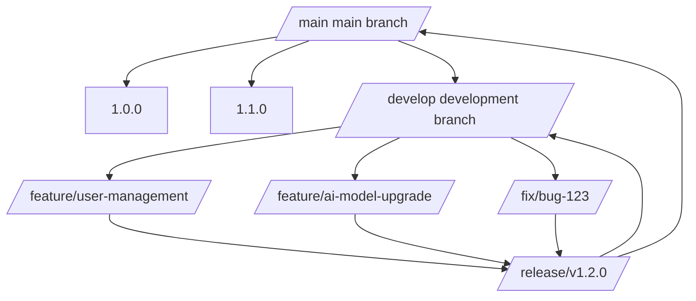
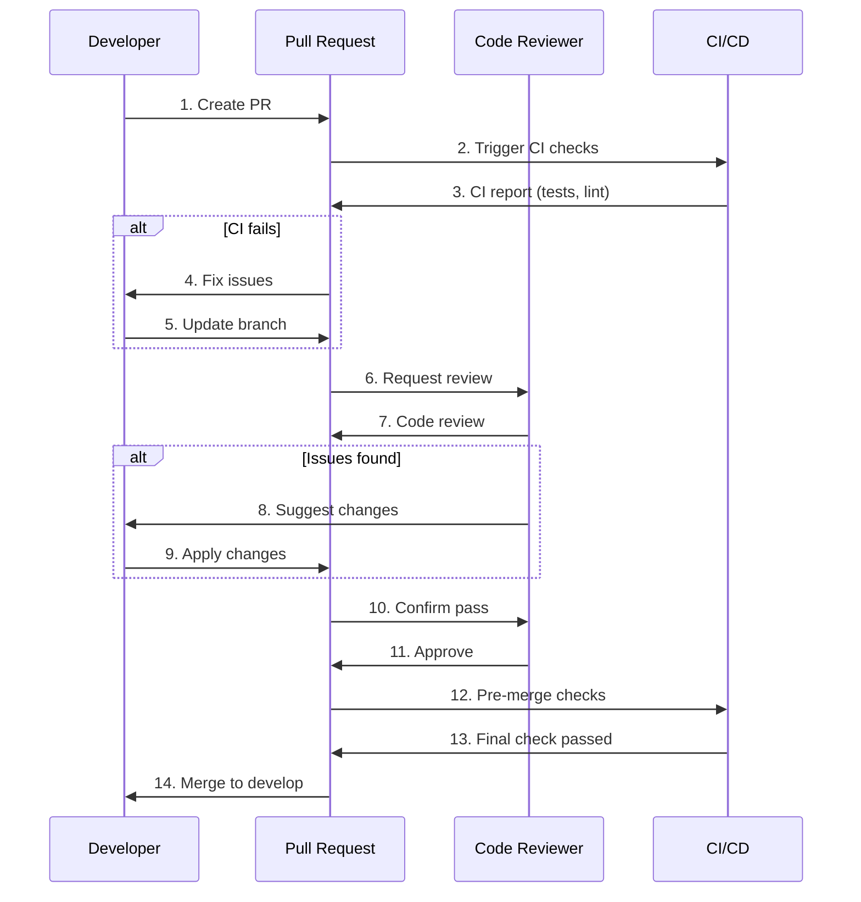

# Platform Contributing Guide

This document is the complete contributing guide for the NE503 AIPC platform, covering the full workflow from development environment setup to version release. Whether you are a first-time contributor or a core maintainer, you should follow the code style, Git workflow, testing requirements, and review standards described in this guide.

## 1 Project Overview and Tech Stack

### 1.1 Project Introduction

The NE503 AIPC platform is a general-purpose edge AI computing platform that provides a unified AI-driven device foundation for smart IPCs, industrial cameras, and edge computing boxes. The platform supports multiple SoCs (Hailo-15, RK3588, Jetson) and enables hardware-independent AI application deployment through a hardware abstraction layer.

### 1.2 Architecture Overview

```
┌─────────────────────────────────────────────┐
│    Application Container Layer               │
│  - Business services (Python/Go/C++)         │
│  - Model services (inference pipelines)      │
└────────────┬────────────────────────────────┘
             │ SDK (gRPC + SHM IPC)
┌────────────┴────────────────────────────────┐
│    Platform Services Layer (Go + C++)        │
│  - camera-daemon   - ai-runtime             │
│  - event-bus       - app-manager            │
│  - device-control  - platform-api           │
└────────────┬────────────────────────────────┘
             │ HAL C API
┌────────────┴────────────────────────────────┐
│    Hardware Abstraction Layer (C/C++)        │
│  - hal_video  - hal_ml  - hal_codec  - hal_io│
└─────────────────────────────────────────────┘
```

### 1.3 Tech Stack

| Layer | Technology | Description |
|-------|-----------|-------------|
| **Application Layer** | Python/Go/C++ | Business services and model inference services |
| **Platform Services** | Go 1.25+ | Microservice architecture, gRPC communication |
| **Hardware Abstraction** | C/C++ | Cross-platform hardware interfaces |
| **Container Runtime** | containerd | Application isolation and runtime environment |
| **Web Console** | React + TypeScript | Management interface |
| **Communication Protocol** | gRPC + Unix Socket | High-performance IPC |
| **Event System** | Custom Pub/Sub | Supports wildcard topics |

### 1.4 Core Features

- **Container Isolation**: Based on containerd + seccomp + capabilities + namespace
- **Zero-Copy Optimization**: Video-to-AI pipeline uses DMA-BUF, inter-process communication uses SHM
- **Multi-SoC Support**: Hailo-15, RK3588, Jetson, etc.
- **Plugin System**: Supports both gRPC and event-driven communication
- **Fine-Grained Permissions**: Independent access control for video, inference, device, and network
- **Real-Time Monitoring**: Application status, resource usage, log collection

## 2 Development Environment Setup

### 2.1 Quick Start

```bash
# 1. Clone the repository
git clone <repo-url>
cd platform

# 2. Install basic dependencies
sudo apt update
sudo apt install -y build-essential git cmake \
    protobuf-compiler python3 python3-pip \
    libgstreamer1.0-dev libgstreamer-plugins-base1.0-dev

# 3. Install Go (use latest stable version from https://go.dev/dl/)
# See https://go.dev/dl/ for the latest version
export PATH=$PATH:/usr/local/go/bin

# 4. Initialize Go modules
go mod download

# 5. Build the project
make all

# 6. Run tests
make test

# 7. Start services
./scripts/start_mvp.sh
```

### 2.2 Docker Development Environment (Recommended)

Use a pre-configured Docker container for development to avoid local environment differences:

```bash
# 1. Build the development image (admin operation)
docker/dev/build.sh /opt/poky/4.0.23 <registry>/ne503-dev-env:v1.0
docker push <registry>/ne503-dev-env:v1.0

# 2. Regular user workflow
docker pull <registry>/ne503-dev-env:v1.0
make docker-dev                    # Start persistent development container
make docker-dev-shell              # Enter the container

# 3. Mount source code for development
make docker-dev-mount              # Mount host source directory
docker exec -it ne503-dev-mount bash
```

> The Docker-related Makefile targets above require the project to have a Docker development environment configured. For available targets, refer to the project's Makefile.

### 2.3 Toolchain Installation

```bash
# Go toolchain
go install google.golang.org/protobuf/cmd/protoc-gen-go@latest
go install google.golang.org/grpc/cmd/protoc-gen-go-grpc@latest
go install golang.org/x/tools/cmd/goimports@latest
go install github.com/golangci/golangci-lint/cmd/golangci-lint@latest

# Python toolchain
pip3 install grpcio grpcio-tools pytest pytest-cov black flake8 isort

# C/C++ toolchain
sudo apt install -y clang-format clang-tidy cmake

# TypeScript toolchain
npm install -g typescript eslint prettier @typescript-eslint/parser
```

### 2.4 IDE Configuration

#### VS Code

```json
{
  "go.lintTool": "golangci-lint",
  "go.lintOnSave": "workspace",
  "go.lintOnFormat": true,
  "go.useLanguageServer": true,
  "gopls.env": {
    "GOFLAGS": "-mod=mod"
  },
  "[go]": {
    "editor.formatOnSave": true,
    "editor.codeActionsOnSave": {
      "source.organizeImports": true
    }
  },
  "[python]": {
    "editor.formatOnSave": true,
    "editor.codeActionsOnSave": {
      "source.organizeImports": true
    }
  },
  "editor.formatOnSave": true
}
```

#### GoLand / IntelliJ IDEA

1. Install the Go plugin
2. Configure Go SDK to 1.25+
3. Set golangci-lint as the linter
4. Configure File Watchers for automatic formatting

## 3 Code Style Guidelines

### 3.1 Go Code Standards

#### Formatting Tools

```bash
# Auto-format Go code
make fmt

# Or use gofmt
gofmt -w .

# Use goimports (also handles import sorting)
goimports -w .
```

#### Code Principles

```go
// Small interface principle
type Logger interface {
    Log(msg string)
}

// Error wrapping
func CreateUser(user User) (*User, error) {
    if user.Email == "" {
        return nil, fmt.Errorf("invalid user: %w", ErrInvalidEmail)
    }
    // ...
}

// Dependency injection
func NewUserService(repo UserRepository, logger Logger) *UserService {
    return &UserService{repo: repo, logger: logger}
}
```

#### Function Design

```go
// Single responsibility
func (s *UserService) Validate(user *User) error {
    // Only validate
}

// Error handling
func (s *UserService) Create(user *User) error {
    if err := s.Validate(user); err != nil {
        return fmt.Errorf("validate failed: %w", err)
    }

    // Create logic
    if err := s.repo.Create(user); err != nil {
        return fmt.Errorf("create failed: %w", err)
    }

    return nil
}

// Options pattern
type ServerOption func(*Server)

func WithPort(port int) ServerOption {
    return func(s *Server) { s.port = port }
}

func NewServer(opts ...ServerOption) *Server {
    s := &Server{port: 8080}
    for _, opt := range opts {
        opt(s)
    }
    return s
}
```

### 3.2 C/C++ Code Standards

#### Formatting Tools

```bash
# Install clang-format
sudo apt install clang-format

# Format C/C++ code
find . -name "*.h" -o -name "*.cpp" -o -name "*.c" | xargs clang-format -i
```

#### Code Format

```cpp
// Header include order
#include <vector>    // Standard library
#include <memory>    // C++ standard library
#include "hal_video.h"  // Project headers

// Class definition
class VideoHandler {
public:
    VideoHandler();
    ~VideoHandler();

    int Init(const Config& config);
    void ProcessFrame(const Frame& frame);

private:
    std::unique_ptr<Impl> impl_;
    std::vector<Frame> buffer_;
};

// Function implementation
int VideoHandler::Init(const Config& config) {
    if (!config.IsValid()) {
        return -EINVAL;
    }

    try {
        impl_ = std::make_unique<Impl>(config);
        return 0;
    } catch (const std::exception& e) {
        LOG_ERROR("Init failed: %s", e.what());
        return -1;
    }
}
```

### 3.3 Python Code Standards

#### Formatting Tools

```bash
# Install black and isort
pip install black isort

# Format Python code
black .
isort .
```

#### Code Style

```python
# Type annotations
from typing import List, Optional
import hailo_ipc_sdk as sdk

class App:
    def __init__(self, config: Config) -> None:
        self.inference_client: Optional[sdk.InferenceClient] = None
        self.config = config

    def process_frame(self, frame: sdk.Frame) -> List[sdk.Detection]:
        """Process a single frame"""
        if not self.inference_client:
            raise RuntimeError("Client not initialized")

        results = self.inference_client.infer("yolov8n", frame)
        return results.objects

    def run(self) -> None:
        """Main loop"""
        try:
            while True:
                frame = self.get_frame()
                detections = self.process_frame(frame)
                self.handle_detections(detections)
        except KeyboardInterrupt:
            logger.info("Shutting down...")
```

### 3.4 TypeScript/React Code Standards

#### Formatting Tools

```bash
# In the web/console directory
npm run format  # Run prettier
npm run lint    # Run ESLint
```

#### Component Design

```tsx
// Component naming: PascalCase
export function ApplicationList() {
  // State management with useState
  const [applications, setApplications] = useState<Application[]>([]);

  // Side effects with useEffect
  useEffect(() => {
    fetchApplications();
  }, []);

  // Event handling with useCallback
  const handleInstall = useCallback((manifest: Manifest) => {
    // Implement install logic
  }, []);

  return (
    <div className="application-list">
      {/* Use semantic tags */}
      <header className="list-header">
        <h2>Application List</h2>
      </header>

      {/* Accessibility */}
      <button
        onClick={handleInstall}
        aria-label="Install application"
      >
        Install
      </button>
    </div>
  );
}
```

### 3.5 Cross-Language Common Standards

#### File Naming

| Language | Naming Style | Example |
|----------|-------------|---------|
| Go | `snake_case.go` | `user_service.go` |
| C/C++ | `snake_case.h`/`.cpp` | `video_handler.h` |
| Python | `snake_case.py` | `app_main.py` |
| TypeScript | `PascalCase.tsx` | `AppList.tsx` |
| Configuration files | `snake_case.yaml` | `app_manager.yaml` |

#### Comment Standards

```go
// Package-level comment
// Package appmanager provides application lifecycle management for AIPC platform containers.
package appmanager

// Interface comment
// InferenceClient handles model inference requests
type InferenceClient interface {
    // Subscribe to model inference results
    Subscribe(stream string, model string, fps int) <-chan Result

    // Execute a single inference
    Infer(model string, data []byte) (*Result, error)
}
```

## 4 Git Workflow

### 4.1 Branch Strategy



### 4.2 Branch Types

| Branch Type | Naming Rule | Description |
|------------|------------|-------------|
| Main branch | `main` | Production code, always stable |
| Development branch | `develop` | Integration branch for all feature branches |
| Feature branch | `feature/*` | New feature development |
| Fix branch | `fix/*` | Bug fixes |
| Release branch | `release/*` | Release preparation |
| Hotfix branch | `hotfix/*` | Emergency fixes |

### 4.3 Commit Message Convention

Follow the Conventional Commits format:

```bash
# Format: <type>: <description>
#
# Types:
# feat:     New feature
# fix:      Bug fix
# docs:     Documentation update
# style:    Code formatting
# refactor: Refactoring
# perf:     Performance optimization
# test:     Testing related
# chore:    Build or auxiliary tool changes

# Examples
feat: add user authentication
fix: resolve memory leak in video handler
docs: update API documentation
style: format Go code with gofmt
refactor: extract common interface for inference
perf: optimize database query
test: add unit tests for app manager
chore: update Makefile dependencies
```

### 4.4 Branch Operations

#### Creating Branches

```bash
# Create a feature branch
git checkout -b feature/user-management develop

# Create a fix branch
git checkout -b fix/bug-123 develop

# Create a release branch
git checkout -b release/v1.2.0 develop
```

#### Merging Branches

```bash
# 1. Ensure branch is up to date
git fetch origin
git rebase origin/develop

# 2. Check code quality
make fmt
make lint
make test

# 3. Push branch
git push origin feature/user-management

# 4. Create Pull Request
gh pr create --title "feat: add user management" --body "$(cat <<'EOF'
## Summary
Implement user management functionality, including:
- User registration and login
- Permission management
- Session management

## Test Plan
- [x] Unit tests
- [x] Integration tests
- [x] Manual testing

## Related Issues
Closes #123
EOF
)"
```

### 4.5 Pull Request Process



### 4.6 Merge Request Template

```markdown
## Summary
Briefly describe the purpose and main content of this PR

## Changes
- [ ] Feature A
- [ ] Feature B
- [ ] Bug fix C
- [ ] Documentation update

## Test Results
- [x] Unit tests passed
- [x] Integration tests passed
- [ ] End-to-end tests passed
- [ ] Performance tests passed

## Breaking Changes
If there are breaking changes, describe them here

## Related Issues
Closes #123
Related to #456
```

## 5 Code Review Standards

### 5.1 Review Process

**Pre-submission self-check:**

```bash
# Format code
make fmt

# Run lint
make lint

# Run tests
make test

# Check commit message
git log --oneline -1
```

**Review coverage:**
- Code style and naming conventions
- Correctness of feature implementation
- Completeness of error handling
- Performance impact assessment
- Security considerations
- Test coverage

### 5.2 Review Checklist

#### Code Quality

- Functions no longer than 50 lines
- Files no larger than 800 lines
- Nesting depth no more than 4 levels
- Meaningful variable names
- Necessary comments added

#### Security

- No hardcoded keys/passwords
- Input validated
- Error messages do not leak sensitive data
- Secure library functions used

#### Performance

- Avoid N+1 queries
- Use appropriate data structures
- Consider memory usage

#### Testing

- New features have corresponding tests
- Test coverage not less than 80%
- Includes boundary condition tests

### 5.3 Review Tools

```bash
# Run code review
make lint

# Go code review
golangci-lint run --enable=unused

# Security review
gosec ./...

# Python code review
flake8 .
black --check .
isort --check-only .

# TypeScript code review
cd web/console && npm run lint
```

### 5.4 Review Feedback Format

It is recommended to use the following structured format for feedback:

```
### Overall Assessment
(Overall assessment of code quality)

### Major Issues
1. **Issue Type** (Critical/High/Medium/Low)
   - Specific description
   - Suggested fix

2. **Issue Type**
   - Specific description
   - Suggested fix

### Highlights
1. (Parts of the code worth acknowledging)
```

### 5.5 Review Severity Levels

| Level | Meaning | Action |
|-------|---------|--------|
| **Critical** | Security vulnerability or data loss risk | **Must fix**, otherwise will not be merged |
| **High** | Functional defect or significant quality issue | **Should fix**, merge with caution |
| **Medium** | Maintainability issue | **Suggested fix**, may merge optionally |
| **Low** | Optimization suggestions or style issues | **Optional fix** |

## 6 Testing Requirements

### 6.1 Test Types

| Test Type | Coverage Requirement | Tools | Description |
|-----------|---------------------|-------|-------------|
| **Unit Tests** | 80%+ | Go: `go test` | Test individual functions and components |
| **Integration Tests** | Required | `test/integration/` | Test interactions between components |
| **End-to-End Tests** | Critical flows | Playwright | Complete business flow verification |

### 6.2 Go Testing Standards

#### Test File Organization

```
platform/
├── user_service.go
├── user_service_test.go      # Unit tests
└── integration/
    ├── user_service_test.go   # Integration tests
    └── mocks/                 # Mock objects
```

#### Test Example

```go
// user_service_test.go
package appmanager

import (
    "testing"
    "github.com/stretchr/testify/assert"
)

func TestUserService_CreateUser(t *testing.T) {
    tests := []struct {
        name    string
        user    User
        wantErr bool
    }{
        {
            name: "valid user",
            user: User{
                Email: "test@example.com",
                Name:  "Test User",
            },
            wantErr: false,
        },
        {
            name: "empty email",
            user: User{
                Email: "",
                Name:  "Test User",
            },
            wantErr: true,
        },
    }

    for _, tt := range tests {
        t.Run(tt.name, func(t *testing.T) {
            service := NewUserService(mockRepo)

            err := service.CreateUser(tt.user)

            if tt.wantErr {
                assert.Error(t, err)
                return
            }

            assert.NoError(t, err)
            assert.NotEmpty(t, tt.user.ID)
        })
    }
}
```

#### Performance Benchmarks

```go
func BenchmarkUserService_CreateUser(b *testing.B) {
    service := NewUserService(mockRepo)
    user := User{
        Email: "test@example.com",
        Name:  "Test User",
    }

    b.ResetTimer()
    for i := 0; i < b.N; i++ {
        _, _ = service.CreateUser(user)
    }
}
```

### 6.3 Python Testing Standards

```python
# tests/test_app.py
import unittest
from unittest.mock import Mock, patch
import sys
import os

# Add application path
sys.path.append(os.path.join(os.path.dirname(__file__), '..'))

class TestApp(unittest.TestCase):
    def setUp(self):
        self.app = App()

    def test_init(self):
        """Test application initialization"""
        self.assertEqual(self.app.config.mode, "production")
        self.assertTrue(self.app.running)

    @patch('app.InferenceClient')
    def test_inference_client(self, mock_client):
        """Test inference client"""
        mock_client.return_value.subscribe.return_value = iter([])
        result = self.app.inference_client()
        self.assertIsNotNone(result)

    def test_memory_usage(self):
        """Test memory usage"""
        import psutil
        process = psutil.Process()

        initial_mem = process.memory_info().rss / 1024 / 1024  # MB

        for i in range(1000):
            self.app.process_frame(f"frame_{i}")

        final_mem = process.memory_info().rss / 1024 / 1024  # MB
        mem_growth = final_mem - initial_mem

        self.assertLess(mem_growth, 100, "Excessive memory growth")

if __name__ == '__main__':
    unittest.main()
```

### 6.4 C/C++ Testing Standards

```cpp
// user_service_test.cpp
#include <gtest/gtest.h>
#include "user_service.h"

class UserServiceTest : public ::testing::Test {
protected:
    void SetUp() override {
        service_ = std::make_unique<UserService>();
    }

    void TearDown() override {
        service_.reset();
    }

    std::unique_ptr<UserService> service_;
};

TEST_F(UserServiceTest, CreateUserSuccess) {
    User user;
    user.email = "test@example.com";
    user.name = "Test User";

    auto result = service_->CreateUser(user);

    EXPECT_TRUE(result.success);
    EXPECT_FALSE(result.id.empty());
}

TEST_F(UserServiceTest, CreateUserInvalidEmail) {
    User user;
    user.email = "";
    user.name = "Test User";

    auto result = service_->CreateUser(user);

    EXPECT_FALSE(result.success);
    EXPECT_EQ(result.error_code, ErrorCode::InvalidEmail);
}
```

### 6.5 End-to-End Testing (Playwright)

```typescript
// tests/e2e/app-install.spec.ts
import { test, expect } from '@playwright/test';

test.describe('Application Installation', () => {
  test('install application via Web console', async ({ page }) => {
    // Login
    await page.goto('/login');
    await page.fill('input[name="username"]', 'admin');
    await page.fill('input[name="password"]', 'password');
    await page.click('button[type="submit"]');

    // Navigate to applications page
    await page.goto('/applications');

    // Click install button
    await page.click('button:has-text("Install App")');

    // Upload file
    const fileInput = page.locator('input[type="file"]');
    await fileInput.setInputFiles('/tmp/app.yaml');

    // Fill in paths
    await page.fill('input[name="manifestPath"]', '/tmp/app.yaml');
    await page.fill('input[name="imagePath"]', '/tmp/my-app.tar');

    // Click install
    await page.click('button:has-text("Install")');

    // Wait for installation to complete
    await expect(page.locator('.status')).toContainText('Installed');
  });
});
```

### 6.6 Test Coverage

```bash
# Go test coverage
go test -cover ./...
go test -coverprofile=coverage.out ./...
go tool cover -html=coverage.out -o coverage.html

# Python test coverage
pytest --cov=app tests/
pytest --cov-report=html tests/

# Check coverage threshold
COVERAGE=$(go test -cover ./... | grep -v "no test files" | awk '{print $4}' | sed 's/%//' | awk '{sum+=$1; count++} END {print sum/count}')
echo "Average coverage: ${COVERAGE}%"
if awk "BEGIN {exit !($COVERAGE < 80)}"; then
    echo "Coverage below 80%"
    exit 1
fi
```

## 7 Documentation Update Requirements

### 7.1 Documentation Types

| Documentation Type | Location | When to Update |
|-------------------|----------|---------------|
| **API Documentation** | `docs/api/` | New API, API changes |
| **User Manual** | `docs/user/` | New features, UI changes |
| **Development Docs** | `docs/development/` | Development workflow changes |
| **Deployment Docs** | `docs/deployment/` | Deployment method changes |
| **Code Comments** | Source directories | New features, complex logic |

### 7.2 Documentation Update Standards

#### API Documentation Format

```markdown
# Inference Service API

## Overview
The inference service provides model registration and inference capabilities

## RegisterModel
Register a new AI model with the platform

### Request
\`\`\`protobuf
message RegisterModelRequest {
  string model_id = 1;
  string model_path = 2;
  repeated string input_streams = 3;
  repeated string output_topics = 4;
}
\`\`\`

### Response
\`\`\`protobuf
message RegisterModelResponse {
  bool success = 1;
  string error_message = 2;
}
\`\`\`

### Example
\`\`\`go
client := NewInferenceClient()
req := &pb.RegisterModelRequest{
    ModelId: "yolov8n",
    ModelPath: "/models/yolov8n.hef",
    InputStreams: []string{"cam0_main"},
}
resp, err := client.RegisterModel(ctx, req)
\`\`\`
```

#### Code Comment Standards

```go
// Package appmanager manages application lifecycles,
// including installation, starting, stopping, and monitoring.
package appmanager

// AppManager is the application manager,
// responsible for lifecycle management of all applications.
type AppManager struct {
    container containerd.Container
    manifest  *manifest.AppManifest
    // Other fields...
}

// InstallApp installs an application
//
// Parameters:
//   - manifestPath: path to the application manifest file
//   - imagePath: path to the application image file
//
// Returns:
//   - *App: the installed application instance
//   - error: error information
func (m *AppManager) InstallApp(manifestPath, imagePath string) (*App, error) {
    // Implementation logic...
}
```

#### Changelog Format

```markdown
# Changelog

## [1.2.0] - 2024-03-01

### Added
- Added multi-container application support
- Added plugin system
- GPU acceleration support

### Fixed
- Fixed memory leak issue (#123)
- Fixed health check timeout (#125)

### Changed
- Upgraded Go version to 1.21
- Optimized network performance

## [1.1.0] - 2024-02-01

### Added
- Added REST API endpoints
- Support for model hot-loading
```

### 7.3 Documentation Checklist

#### Pre-submission Check

- New features have corresponding documentation
- API changes have updated interface documentation
- Configuration changes have updated configuration descriptions
- Deployment documentation is kept up to date
- Code comments are complete

#### Documentation Quality Check

- Documentation content is accurate
- Example code is runnable
- Documentation structure is clear
- Appropriate table of contents and navigation
- Documentation format is consistent

## 8 Issue Report Templates

### 8.1 Bug Report Template

```markdown
## Bug Description
Briefly describe the issue found

## Reproduction Steps
1. Action A
2. Action B
3. Issue occurs

## Expected Behavior
Describe the correct expected behavior

## Actual Behavior
Describe what actually happened

## Environment Information
- Platform version: [fill in]
- Operating system: [fill in]
- Hardware model: [fill in]
- Log files: [attach relevant logs]

## Error Information
\`\`\`
Error log content
\`\`\`

## Additional Information
- Supplementary screenshots (if any)
- Related configuration files
- Network capture (if network-related)
```

### 8.2 Feature Request Template

```markdown
## Feature Overview
Briefly describe the requested feature

## Use Case
Describe the use case and need for this feature

## Feature Requirements
- Feature A
- Feature B
- Feature C

## Expected API/Interface
Describe the desired API design or interface design

## Alternative Solutions
If this feature cannot be implemented, are there alternative solutions

## Priority
- [ ] Critical
- [ ] High
- [ ] Medium
- [ ] Low

## References
Related issues, discussions, or documentation links
```

### 8.3 Issue Report Example

```markdown
## Bug Description
Application fails to load configuration file at startup, causing process crash

## Reproduction Steps
1. Build application image
2. Export as tar file
3. Install application using aipc-cli
4. Start application
5. Application crashes immediately

## Expected Behavior
Application should start normally and load configuration file

## Actual Behavior
Application cannot start, process exits

## Environment Information
- Platform version: 1.1.0
- Operating system: Ubuntu 22.04
- Hardware model: Hailo-15
- Log files: [aipc-cli-app.log](https://example.com/log)

## Error Information
\`\`\`
2024-03-01 10:00:00 ERROR Failed to load config: /etc/aipc/app.yaml
2024-03-01 10:00:00 ERROR Config validation failed: invalid format
2024-03-01 10:00:00 FATAL Application exited with code 1
\`\`\`

## Additional Information
- Configuration file permissions: -rw-r--r--
- Configuration file content: [app.yaml](https://example.com/app.yaml)
- Tried using default configuration, still cannot start
```

## 9 Version Release Process

### 9.1 Release Preparation

#### Pre-release Check

```bash
# Code quality check
make fmt
make lint
make test

# Documentation update
git status docs/

# Version number check
grep -r "version" */go.mod
grep -r "VERSION" */Makefile

# Changelog preview
git log --oneline --since="2024-01-01" > changelog-preview.txt
```

#### Create Release Branch

```bash
# Switch to develop branch
git checkout develop

# Create release branch
git checkout -b release/v1.2.0

# Update version numbers
# 1. Update go.mod
sed -i 's/version = "1.1.0"/version = "1.2.0"/' */go.mod

# 2. Update Makefile
sed -i 's/VERSION := 1.1.0/VERSION := 1.2.0/' Makefile

# 3. Update version references in documentation
find docs/ -name "*.md" -exec sed -i 's/1\.1\.0/1.2.0/g' {} \;

# Commit changes
git add .
git commit -m "chore: bump version to 1.2.0"
```

#### Build Test

```bash
# Clean build directory
make clean

# Build all components
make all

# Run full test suite
make test

# Build release package
make pack-release VERSION=1.2.0
```

### 9.2 Release Execution

#### Merge to Main Branch

```bash
# Ensure all changes are committed
git status

# Switch to main branch
git checkout main

# Merge release branch
git merge --no-ff release/v1.2.0 -m "release: v1.2.0"

# Create tag
git tag -a v1.2.0 -m "Release version 1.2.0"

# Push to remote
git push origin main
git push origin v1.2.0
```

#### Documentation Release

```bash
# Generate API documentation
make docs-api

# Update documentation
git add docs/
git commit -m "docs: update API documentation for v1.2.0"
git push origin main

# Deploy documentation to GitHub Pages
./scripts/deploy-docs.sh
```

#### Update Development Branch

```bash
# Switch to develop branch
git checkout develop

# Merge release branch
git merge --no-ff release/v1.2.0 -m "merge release v1.2.0 into develop"

# Push
git push origin develop
```

### 9.3 Post-Release Work

#### Notify Stakeholders

```bash
# Create GitHub Release
gh release create v1.2.0 \
    --title "AIPC Platform v1.2.0" \
    --notes "$(cat CHANGELOG.md)"

# Send notification
echo "AIPC Platform v1.2.0 released" | mail -s "Release Notification" team@example.com
```

#### Monitor Release Status

```bash
# Check CI/CD status
gh run list --limit 10

# Monitor application status
./scripts/monitor-release.sh

# Collect user feedback
./scripts/collect-feedback.sh
```

#### Version Archival

```bash
# Archive release branch
git checkout release/v1.2.0
git branch -d release/v1.2.0

# Archive old tags
git tag -d v1.1.0
git push origin --delete v1.1.0

# Backup release package
mkdir -p releases/v1.2.0
cp build/output/* releases/v1.2.0/
```

### 9.4 Emergency Release Process

#### Create Hotfix Branch

```bash
# Create branch from release tag
git checkout v1.1.0
git checkout -b hotfix/bug-999

# Fix the issue
# ... fix code ...

# Commit changes
git add .
git commit -m "fix: resolve critical bug #999"

# Test the fix
make test
```

#### Release Hotfix

```bash
# Merge to main and develop
git checkout main
git merge --no-ff hotfix/bug-999 -m "hotfix: resolve bug #999"

git checkout develop
git merge --no-ff hotfix/bug-999 -m "merge hotfix bug-999"

# Create new version tag
git tag -a v1.1.1 -m "Hotfix release 1.1.1"

# Push all changes
git push origin main develop v1.1.1
```

## Related Documentation

- [Development Guide](../3-platform-development/1-development-environment.md) -- Environment setup, project structure, and development workflow
- [Test Environment Setup](./0-platform-testing.md) -- Test environment configuration and usage
- [Platform Architecture](../3-platform-development/0-platform-architecture.md) -- Four-layer architecture design and core service details

### Development Tools

- **Go Language**: [golang.org](https://golang.org)
- **gRPC**: [grpc.io](https://grpc.io)
- **Docker**: [docs.docker.com](https://docs.docker.com)
- **React**: [react.dev](https://react.dev)

### Community Resources

- **GitHub Issues**: [Submit an Issue](https://github.com/aipc/platform/issues)
- **Discussions**: [GitHub Discussions](https://github.com/aipc/platform/discussions)
- **Documentation**: [AIPC Platform Docs](https://docs.aipc.io)

### Contributor Notes

- [Code of Conduct](https://github.com/aipc/platform/blob/main/CODE_OF_CONDUCT.md)
- [License](https://github.com/aipc/platform/blob/main/LICENSE)
- [Privacy Policy](https://github.com/aipc/platform/blob/main/PRIVACY.md)

## Version History

| Version | Date | Changes |
|---------|------|---------|
| 1.0.0 | 2024-01-01 | Initial version |
| 1.1.0 | 2024-02-01 | Added plugin system |
| 1.2.0 | 2024-03-01 | Improved multi-container support |

## License

This document is based on the AIPC Platform documentation, licensed under the MIT License. See [LICENSE](https://github.com/aipc/platform/blob/main/LICENSE).
