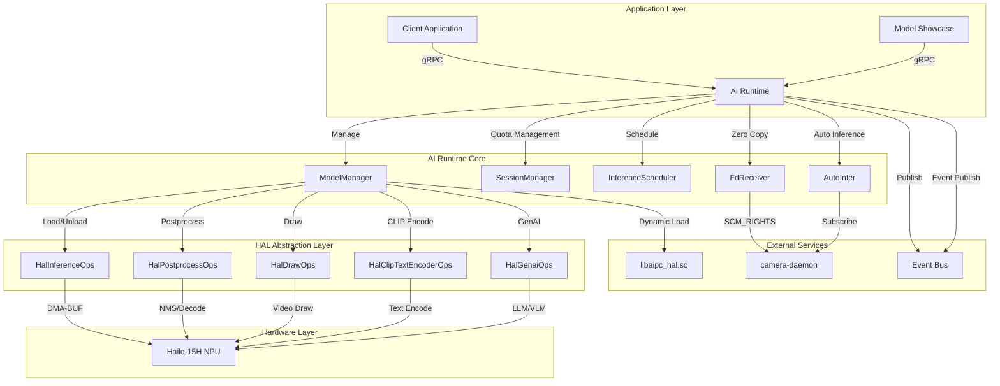
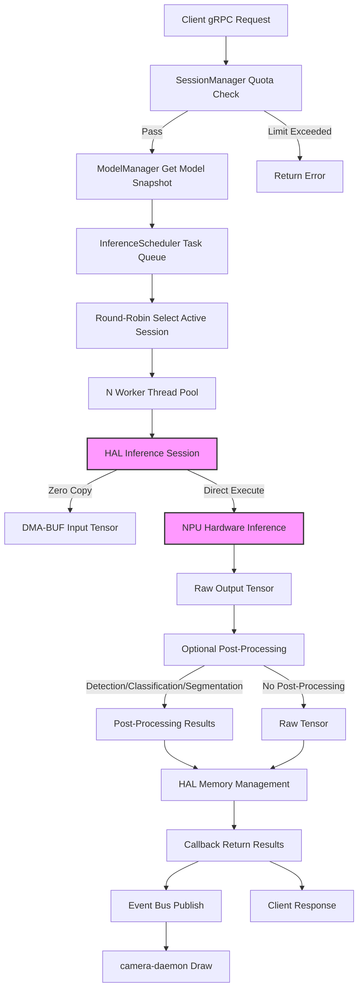
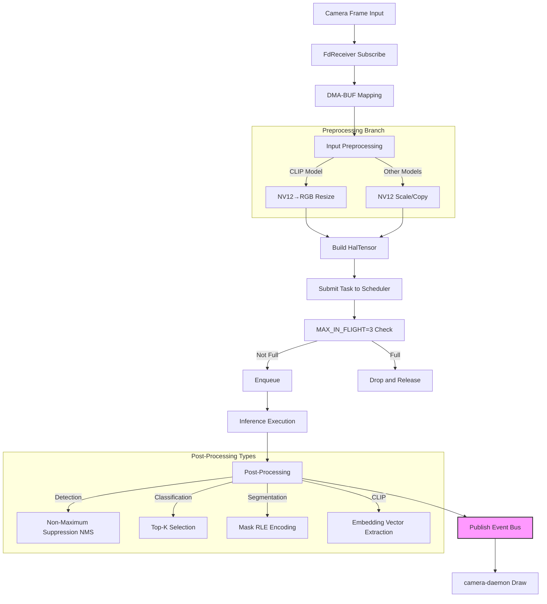
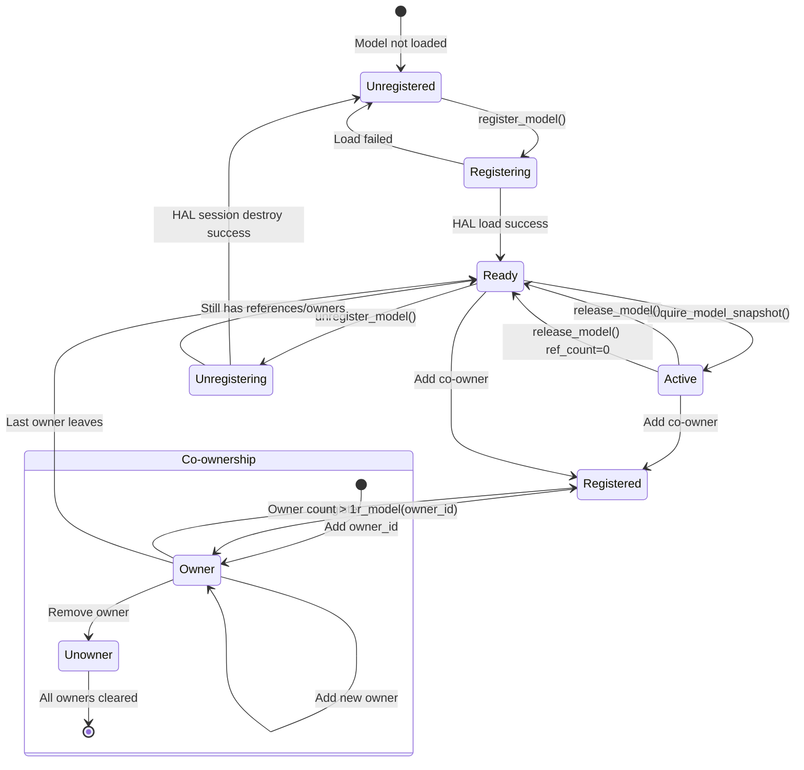
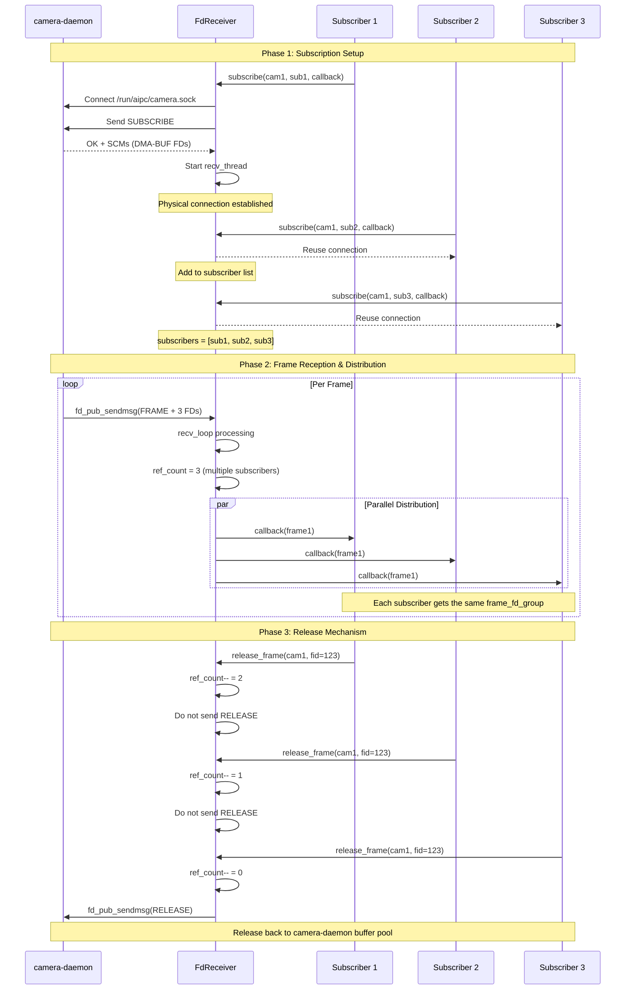

# AI Runtime Service

## 1 Overview

AI Runtime is the unified inference service on the NE503 platform, responsible for NPU compute scheduling, model lifecycle management, and inference execution. It supports traditional CV model inference as well as GenAI (LLM/VLM) streaming generation, serving as the core hub of the entire AI inference pipeline.

Technology stack: **C++17 + gRPC**, dynamically loading hardware acceleration libraries through HAL (Hardware Abstraction Layer) to achieve transparent invocation of the Hailo-15H NPU.

Core capabilities:

- **Model lifecycle management** — Supports multi-application model sharing, reference counting, and RAII automatic release
- **Fair scheduling** — Round-Robin algorithm ensures fair NPU resource usage across multiple sessions
- **Zero-copy data path** — DMA-BUF file descriptor passing, zero memory copies from camera to NPU
- **GenAI streaming generation** — Supports LLM/VLM text generation and image understanding

## 2 Architecture



The architecture is divided into four layers: the application layer connects through gRPC/Unix Socket; the AI Runtime core layer contains five major components that coordinate the entire inference workflow; the HAL abstraction layer hides hardware differences through dynamic loading of `libaipc_hal.so` for pluggable hardware acceleration; the hardware layer interacts directly with the Hailo-15H NPU.

## 3 Core Components

| Component | Responsibility | Key Features |
|-----------|---------------|--------------|
| **ModelManager** | Model loading/unloading, lifecycle management | Reference counting, co-ownership, atomic snapshots |
| **SessionManager** | Session quota management (QPS/concurrency/FPS) | Independent queues, sliding window statistics |
| **InferenceScheduler** | Inference task scheduling | Round-Robin fair scheduling, worker thread pool |
| **FdReceiver** | DMA-BUF zero-copy frame reception | Connection reuse, reference counting, multicast distribution |
| **AutoInfer** | Automatic inference pipeline | Frame subscription → inference → postprocess → event publish |

The HAL layer provides five sets of operation interfaces:

| HAL Interface | Function | Key Methods |
|---------------|----------|-------------|
| `HalInferenceOps` | Core inference | `create`, `run`, `destroy` |
| `HalPostprocessOps` | Post-processing (NMS, decoding, etc.) | `create`, `run`, `apply_config_json` |
| `HalDrawOps` | Visualization drawing | `overlay_detection`, etc. |
| `HalClipTextEncoderOps` | CLIP text encoding | `create`, `encode`, `destroy` |
| `HalGenaiOps` | GenAI LLM/VLM | `create`, `generate_stream`, `abort_generation` |

## 4 Inference Pipeline



Key inference pipeline flow:

1. **Quota validation** — SessionManager checks QPS, concurrency, and FPS limits
2. **Model snapshot** — Acquires ModelSnapshot through atomic reference, ensuring thread safety
3. **Scheduled execution** — Round-Robin algorithm fairly selects tasks from the active session queue
4. **Zero-copy input** — DMA-BUF file descriptors passed directly to NPU, no memory copying
5. **Post-processing (optional)** — Detection, classification, segmentation, etc. automatically execute corresponding post-processing
6. **Result distribution** — Simultaneously publishes via Event Bus to camera-daemon for video overlay drawing

## 5 Auto Inference Pipeline

The AutoInfer component implements a fully automated pipeline from camera frames to inference result publishing:



**AutoInfer Features**:
- **MAX_IN_FLIGHT=3** — Prevents camera buffer pool exhaustion
- **Adaptive Preprocessing** — Automatically converts input format based on model type
- **Flow Control** — FPS throttling and frame drop protection

**Event Bus Inference Result Topic**: Inference results are automatically published to topics in the format `inference/{model_id}/{stream_id}`. Developers can subscribe to this topic to receive real-time inference results.

## 6 Model Lifecycle



**Key model management features**:

- **Reference Counting** — `ref_count` tracks active model usage; model can only be unloaded when it reaches zero
- **Co-ownership** — Multiple applications can share the same model, with independent unloading per owner
- **Atomic Snapshots** — `ModelSnapshot` ensures safe model resource access across multiple threads
- **RAII Protection** — `ModelGuard` automatically releases model references when scope ends, preventing resource leaks

## 7 gRPC API

Service name: `InferenceService`, listen address `unix:///run/aipc/ai-runtime.sock`.

### Model Management

| RPC | Request | Response | Description |
|-----|---------|----------|-------------|
| `RegisterModel` | `ModelRegisterRequest` | `ModelRegisterResponse` | Register model to NPU |
| `UnregisterModel` | `ModelInfo` | `Status` | Unload model |
| `ListModels` | `Empty` | `ModelListResponse` | List registered models |
| `GetModelInfo` | `ModelInfo` | `ModelInfo` | Get model details |

### Inference

| RPC | Request | Response | Description |
|-----|---------|----------|-------------|
| `Infer` | `InferRequest` | `InferResponse` | Single inference |
| `StreamInfer` | `StreamInferRequest` | `stream StreamInferResponse` | Streaming inference (real-time video) |

### Session Management

| RPC | Request | Response | Description |
|-----|---------|----------|-------------|
| `CreateSession` | `SessionConfig` | `SessionCreateResponse` | Create quota session |
| `DestroySession` | `SessionConfig` | `Status` | Destroy session |

### Statistics & Configuration

| RPC | Request | Response | Description |
|-----|---------|----------|-------------|
| `GetStats` | `Empty` | `SystemStats` | Get system statistics |
| `UpdatePostprocessConfig` | `UpdatePostprocessConfigRequest` | `UpdatePostprocessConfigResponse` | Update post-processing config |
| `EncodeText` | `EncodeTextRequest` | `EncodeTextResponse` | CLIP text encoding |

### GenAI (LLM/VLM)

| RPC | Request | Response | Description |
|-----|---------|----------|-------------|
| `GenaiCreateSession` | `GenaiCreateSessionRequest` | `GenaiCreateSessionResponse` | Create GenAI session |
| `GenaiDestroySession` | `GenaiCreateSessionRequest` | `Status` | Destroy session (reuses GenaiCreateSessionRequest as only session_id is needed) |
| `GenaiGenerate` | `GenaiGenerateRequest` | `stream GenaiGenerateResponse` | Streaming generation |
| `GenaiAbort` | `GenaiAbortRequest` | `Status` | Abort generation |

### Key Message Structures

**Tensor data**:

```protobuf
message Tensor {
  repeated int32 shape = 1;
  DataType dtype = 2;     // UINT8/INT8/FLOAT16/FLOAT32, etc.
  bytes data = 3;
  int32 dma_fd = 4;       // DMA-BUF zero-copy file descriptor
}
```

**Structured post-processing results**:

```protobuf
message PostResult {
  repeated Detection detections = 1;          // Object detection
  repeated Classification classifications = 2; // Classification
  repeated LandmarkSet landmarks = 3;         // Keypoints
  repeated SegmentationMask masks = 4;        // Segmentation
  repeated OcrLine ocr_lines = 5;             // OCR
  repeated Embedding embeddings = 6;          // Embedding vectors
  repeated DepthMap depth_maps = 7;           // Depth estimation
}
```

**Model registration request**:

```protobuf
message ModelRegisterRequest {
  string model_path = 1;     // protobuf field number 1
  string model_id = 2;       // protobuf field number 2
  repeated TensorSpec inputs = 3;   // protobuf field number 3
  repeated TensorSpec outputs = 4;  // protobuf field number 4
  string model_type = 13;      // detection, landmarks, segmentation, classification
  string model_variant = 14;   // yolov8n, yolov8s, etc.
  string owner_id = 12;
}
```

## 8 DMA-BUF Zero-Copy



**FdReceiver key features**:

- **Connection reuse** — Multiple subscribers to the same camera-daemon stream share a physical connection
- **Reference counting** — Prevents DMA-BUF from being released prematurely; buffer is only returned to the pool after all subscribers release
- **Multicast distribution** — All subscribers receive the same frame data
- **RAII management** — `FdGroup` automatically closes file descriptors, preventing FD leaks

## 9 Post-Processing Types

| Post-Processing Type | HAL Enum | Model Type | Default Parameters |
|---------------------|----------|------------|-------------------|
| Object Detection | `HAL_POST_TYPE_DETECTION` | detection, yolo | Confidence 0.25, NMS 0.45 |
| Keypoints | `HAL_POST_TYPE_KEYPOINT` | landmarks, keypoint | Confidence 0.25 |
| Segmentation | `HAL_POST_TYPE_SEGMENTATION` | segmentation | Confidence 0.25 |
| Classification | `HAL_POST_TYPE_CLASSIFICATION` | classification | Confidence 0.25, Top-K 5 |
| CLIP | `HAL_POST_TYPE_CLIP` | clip, embedding | Default config |
| OCR Detection | `HAL_POST_TYPE_OCR_DETECTION` | ocr_detection | Confidence 0.25, NMS 0.45 |
| OCR Recognition | `HAL_POST_TYPE_OCR_RECOGNITION` | ocr_recognition | Default config |
| Depth Map | `HAL_POST_TYPE_DEPTH` | depth, monocular_depth | Default config |

## 10 GenAI Support

AI Runtime supports streaming generation for LLMs (Large Language Models) and VLMs (Vision Language Models). When creating a GenAI session, the system forcefully unloads all loaded CV models to free NPU resources, and waits for HAL to complete cleanup (approximately 6 seconds) before loading the GenAI model.

**Streaming generation flow**:

1. Client creates a session via `GenaiCreateSession`
2. Sends a `GenaiGenerate` request with prompt and generation parameters (Temperature, Top-P, etc.)
3. HAL generates tokens one by one through callback mechanism, each token is immediately returned to the client via gRPC Server Stream
4. Sends a completion signal when the end-of-sequence token is encountered

Supported capabilities: text generation, image understanding, multi-turn dialogue, LoRA fine-tuning.

## 11 Configuration

Configuration file: `configs/ai/ai-runtime.yaml`

| Config Section | Key Parameters | Description |
|---------------|----------------|-------------|
| **service** | `listen` | gRPC listen address, default `unix:///run/aipc/ai-runtime.sock` |
| **hal** | `library_path`, `device_path` | HAL dynamic library path, NPU device path (`/dev/hailo0`) |
| **models** | `repository_path`, `cache_path`, `preload` | Model repository path, cache path, preloaded model list |
| **scheduler** | `global_qps_limit`, `strategy`, `timeout_ms` | Global QPS limit, scheduling strategy (priority/fifo/fair), timeout |
| **performance** | `device_mode`, `batch_enabled`, `max_model_cache` | Device mode (high/normal/low), batch inference, max model cache count |
| **monitoring** | `enabled`, `stats_interval_sec`, `temperature_limit_c` | Monitoring switch, stats interval, thermal protection threshold (85°C shutdown protection, 80°C throttle) |
| **event_bus** | `enabled`, `endpoint`, `auto_publish_results` | Event Bus switch, connection address, auto-publish inference results |
| **auto_infer** | `enabled`, `pipelines` | Auto inference switch, pipeline config (model_id, stream_id, fps) |

**Scheduling strategy descriptions**:

- **fair** (default) — Round-Robin fair rotation, ensuring each session gets balanced inference opportunities
- **priority** — Schedules by session priority, higher priority sessions execute first
- **fifo** — First-in-first-out, executes in submission order

**Session quota configuration example**:

```yaml
scheduler:
  default_session:
    max_qps: 30          # Default max QPS
    max_concurrent: 2    # Default max concurrent inferences
    priority: 5          # Default priority (1-10)
```

## 12 Monitoring Statistics

### System Statistics Metrics

| Metric | Description |
|--------|-------------|
| **NPU Utilization** | Hardware accelerator usage rate |
| **CPU Utilization** | System CPU usage rate |
| **DSP Utilization** | Digital signal processor load |
| **Memory Usage** | Total and used memory |
| **Inference Latency** | Queue wait + inference execution time |
| **FPS Statistics** | Per-session actual inference frame rate |

## 13 Troubleshooting

| Issue | Possible Cause | Troubleshooting Method |
|-------|---------------|----------------------|
| Model registration failed | Incorrect model path, insufficient NPU device permissions | Check model file path, `/dev/hailo0` permissions |
| Inference timeout | Queue backlog, concurrency limit too low | Check `global_qps_limit` and `max_concurrent` config |
| Zero-copy failure | camera-daemon connection abnormal | Check `/run/aipc/camera.sock` connection status |
| Insufficient memory | Too many model caches, concurrency too high | Lower `max_model_cache` and concurrency limits |
| Device overheating | NPU load too high, insufficient cooling | Check `temperature_limit_c` config, reduce inference load |

Common debug commands:

```bash
# View service logs
journalctl -u ai-runtime

# View Hailo device status
hailortcli scan

# Performance analysis
perf stat
```

## 14 Related Documentation

- [Platform Architecture](../../3-platform-development/0-platform-architecture.md) — NE503 software platform overall architecture
- [App Development Guide](../../4-application-development/1-app-reference.md) — AI application development workflow
- [SDK Reference](../../4-application-development/2-sdk-reference.md) — Python/CLI SDK usage guide
- [CLI Tool Guide](../../5-system-integration/3-cli-guide.md) — Command-line tool `aipc-cli` usage
- [RESTful API](../../5-system-integration/1-restful-api.md) — RESTful API interface reference
