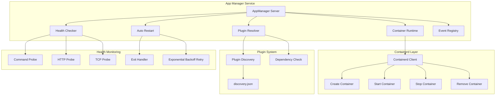
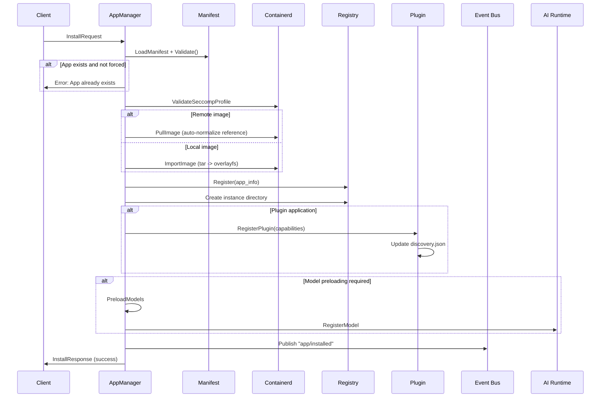
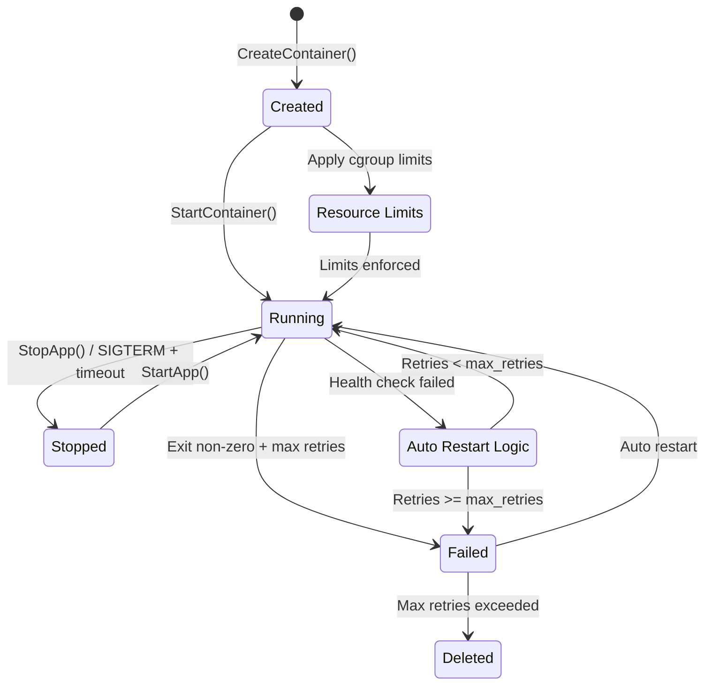
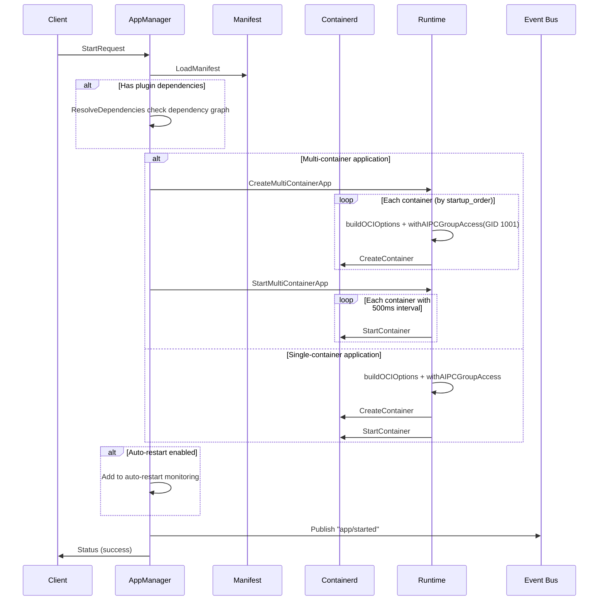
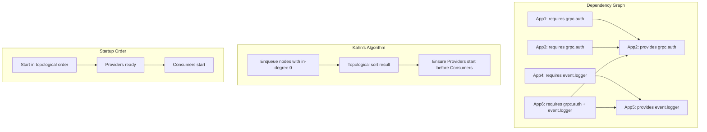
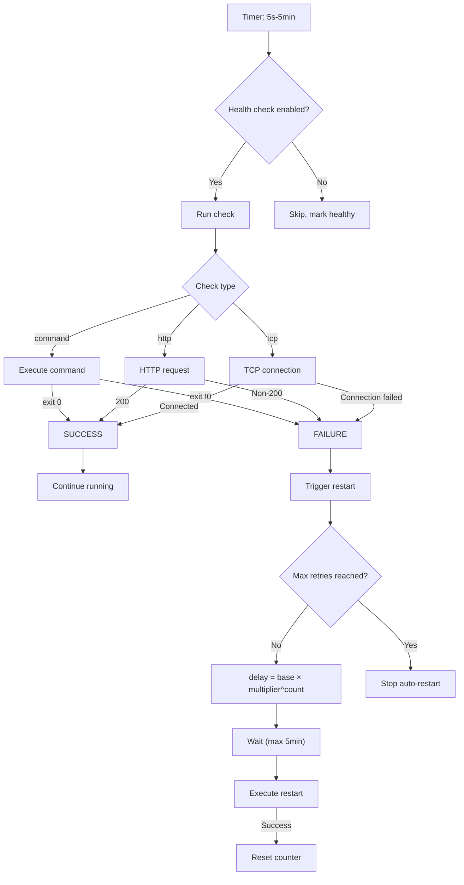

# App Manager Service

## 1 Overview

App Manager is the core container lifecycle management service of the AIPC platform, built on containerd. It provides a unified API for application installation, startup, stopping, uninstallation, and monitoring. It supports both single-container and multi-container (Main/Sub) architectures, with built-in plugin system, health monitoring, and security sandbox.

Core capabilities:

- **Container Lifecycle Management** — Full CRUD operations with support for async installation and batch operations
- **Multi-Container Architecture** — Main/Sub mode with ordered startup and shutdown for complex applications
- **Plugin System** — Capability-based plugin discovery with Kahn's algorithm dependency resolution
- **Health Monitoring** — Command/HTTP/TCP probes + exponential backoff auto-restart
- **Security Sandbox** — Three-layer isolation via Namespace, Capability, and Seccomp

## 2 Architecture



The service listens on `unix:///run/aipc/app-manager.sock`, manages the container runtime through containerd, and integrates with services such as Event Bus and AI Runtime.

## 3 gRPC API

Service name: `AppManager`, listen address `unix:///run/aipc/app-manager.sock`.

### Application Lifecycle Management

| RPC | Request | Response | Description |
|-----|---------|----------|-------------|
| `InstallApp` | `InstallRequest` | `InstallResponse` | Install application |
| `AsyncInstallApp` | `AsyncInstallRequest` | `AsyncInstallResponse` | Install asynchronously |
| `GetInstallProgress` | `InstallProgressRequest` | `InstallProgressResponse` | Query install progress |
| `StartApp` | `StartRequest` | `Status` | Start application |
| `StopApp` | `StopRequest` | `Status` | Stop application |
| `UninstallApp` | `UninstallRequest` | `Status` | Uninstall application |
| `ListApps` | `Empty` | `AppList` | List applications |
| `GetApp` | `GetAppRequest` | `AppInfo` | Get application details |
| `GetAppStats` | `GetAppRequest` | `AppStats` | Get resource statistics |
| `GetAppLogs` | `GetLogsRequest` | `stream LogLine` | Stream logs |
| `BatchOperation` | `BatchRequest` | `BatchResponse` | Batch operation |

### Container Management

| RPC | Request | Response | Description |
|-----|---------|----------|-------------|
| `ListContainers` | `ListContainersRequest` | `ContainerList` | List containers |
| `GetContainer` | `GetContainerRequest` | `ContainerDetail` | Container details |
| `GetContainerStats` | `GetContainerRequest` | `ContainerStats` | Container statistics |
| `GetContainerLogs` | `GetContainerLogsRequest` | `stream LogLine` | Container logs |
| `StartContainer` | `ContainerRequest` | `Status` | Start container |
| `StopContainer` | `ContainerRequest` | `Status` | Stop container |
| `RestartContainer` | `ContainerRequest` | `Status` | Restart container |
| `RemoveContainer` | `RemoveContainerRequest` | `Status` | Remove container |

### Image and Resource Management

| RPC | Request | Response | Description |
|-----|---------|----------|-------------|
| `ListImages` | `Empty` | `ImageList` | List images |
| `RemoveImage` | `RemoveImageRequest` | `Status` | Remove image |
| `GetDiskUsage` | `Empty` | `DiskUsageResponse` | Disk usage |
| `PruneResources` | `PruneRequest` | `PruneResponse` | Prune resources |

### Advanced Operations

| RPC | Request | Response | Description |
|-----|---------|----------|-------------|
| `InspectApp` | `GetAppRequest` | `InspectResponse` | Inspect application config |
| `ExecContainer` | `stream ExecInput` | `stream ExecOutput` | Execute command in container |

## 4 Application Installation Flow



**Key implementation details**:

- **Image handling** — Remote images automatically normalize references (e.g., `nginx:latest` -> `docker.io/library/nginx:latest`); local images are imported via Import + Unpack into overlayfs
- **Registry management** — Uses GORM + SQLite to store application metadata with atomic writes for consistency
- **Plugin registration** — Parses `plugin.capabilities` and atomically updates `/run/aipc/plugins/discovery.json`

## 5 Container Lifecycle



**Container ID format**:
- Main container: `aipc-{appID}`
- Sub container: `aipc-{appID}-{containerName}`

## 6 Multi-Container Architecture

Multi-container applications use a Main/Sub mode with ordered startup:

```yaml
# Multi-container application manifest example
spec:
  containers:
    api-gateway:
      role: main
      image: myapp/gateway:1.0
      healthcheck:
        type: http
        path: /health
        port: 8080
    worker-1:
      role: sub
      image: myapp/worker:1.0
    processor:
      role: sub
      image: myapp/processor:1.0

  lifecycle:
    startup_order: [worker-1, processor, api-gateway]
    shutdown_order: [api-gateway, processor, worker-1]
```

**Main/Sub permission differences**:

| Feature | Main Container | Sub Container |
|---------|---------------|---------------|
| `/run/aipc` | Mounted | Not mounted |
| Device access | Granted | No access |
| Network mode | host available | Isolated |
| Capabilities | Base capability set | Minimal set |
| Purpose | Platform service access | Business logic execution |

Startup order follows the `lifecycle.startup_order` configuration with a 500ms interval between each container. Default order: sub containers -> main container.

### Start Application Flow



## 7 Plugin Dependency Resolution

The plugin system uses Kahn's algorithm for topological sorting to resolve dependencies:



**Resolution process**:

1. **Build adjacency list** — consumer -> provider mapping
2. **Calculate in-degrees** — Number of dependencies for each node
3. **Initialize queue** — Enqueue nodes with in-degree 0
4. **Topological sort** — Dequeue, decrement neighbor in-degrees, enqueue new zero in-degree nodes
5. **Cycle detection** — If result length < total node count, a circular dependency exists

**Plugin discovery** — Maintains `/run/aipc/plugins/discovery.json`, recording capabilities, transport methods, and socket paths of all running plugins.

**discovery.json format example**:

```json
{
  "version": "1",
  "updated_at": "2024-01-01T00:00:00Z",
  "plugins": {
    "auth-service": {
      "app_id": "auth-service",
      "version": "1.0.0",
      "state": "running",
      "capabilities": [
        {
          "id": "grpc.auth",
          "version": "1.0",
          "transport": "grpc",
          "grpc": {
            "socket_path": "/run/aipc/plugins/auth-service.sock",
            "service": "AuthService"
          }
        }
      ],
      "updated_at": "2024-01-01T00:00:00Z"
    }
  }
}
```

### Plugin Capability Declaration

Declare plugin capabilities in the application Manifest:

```yaml
plugin:
  capabilities:
    - id: grpc.auth
      version: "1.0"
      transport: grpc
      proto: AuthService
      description: "Authentication service"
    - id: event.logger
      version: "1.0"
      transport: event
      topics:
        publish: [app/logs/error, app/logs/info]
        subscribe: [app/events/user]
```

## 8 Health Checks and Auto-Restart

Supports three probe types and exponential backoff restart strategy:



**Restart strategy parameters**:

| Parameter | Default | Description |
|-----------|---------|-------------|
| Base delay | 5s | Wait time before first retry |
| Backoff multiplier | 1.5x | Delay multiplier for each retry |
| Max retries | 0 (unlimited) | 0 means unlimited |
| Delay cap | 5min | Maximum wait time |
| Check interval | 30s | Health probe execution interval |

> **NOTE**: `restart_policy` (in the manifest `spec` section) controls the container-level restart policy (e.g., `always`, `on-failure`), while `auto_restart` (in the manifest `auto_restart` section) controls the health-check-driven automatic restart with exponential backoff. These are two independent mechanisms — `restart_policy` applies at the container runtime level, whereas `auto_restart` is managed by App Manager's health checker.

## 9 Security Sandbox

### Namespace Isolation

| Namespace | Default State | Description |
|-----------|--------------|-------------|
| PID | Enabled | Process isolation |
| NET | Enabled | Network isolation |
| IPC | Enabled | System V IPC and POSIX message queue isolation |
| UTS | Enabled | Hostname isolation |
| MOUNT | Enabled | Filesystem mount point isolation |
| USER | Disabled | Requires privilege |

### Capability Control

Dangerous capabilities dropped by default: `CAP_SYS_ADMIN`, `CAP_NET_ADMIN`, `CAP_SYS_MODULE`, `CAP_SYS_TIME`, `CAP_SYS_RAWIO`, `CAP_SYS_PTRACE`, `CAP_SYS_CHROOT`, `CAP_SYS_BOOT`, `CAP_MKNOD`.

### Resource Limits (cgroup v2)

Resource control via cgroup v2:

| Resource | Default Limit | cgroup Path |
|----------|--------------|-------------|
| CPU | 50% single core | `/sys/fs/cgroup/.../group-aipc-{id}.scope/cpu.max` |
| Memory | 256Mi | `memory.max` |
| PID | 128 | `pids.max` |

## 10 Configuration

Configuration file path: `configs/platform/app-manager.yaml`

| Section | Key Parameters | Description |
|---------|---------------|-------------|
| **service** | `listen`, `log_level` | gRPC listen address (`unix:///run/aipc/app-manager.sock`), log level |
| **containerd** | `address`, `namespace`, `runtime`, `snapshotter` | containerd connection config (`/run/containerd/containerd.sock`, `aipc` namespace) |
| **apps** | `registry_path`, `instances_path`, `logs_path` | Application registry, instance, and log directories |
| **security** | `seccomp_profile`, `readonly_rootfs`, `capabilities_drop` | Security sandbox configuration (see [Config Reference](../3-config-reference.md#4-app-manageryaml)) |
| **resources** | `default_cpu_quota`, `default_memory_mb`, `max_total_*` | Default resource limits and total capacity caps |
| **airuntime** | `enabled`, `endpoint` | AI Runtime integration configuration |
| **eventbus** | `enabled`, `endpoint`, `publish_events` | Event Bus event publishing configuration |

**Event publishing topics**: `app/installed`, `app/started`, `app/stopped`, `app/uninstalled`, `plugin/status`.

## 11 Troubleshooting

| Issue | Possible Cause | Troubleshooting Method |
|-------|---------------|----------------------|
| Container start failure | Corrupted image, insufficient permissions | Check application logs via `GetAppLogs`, verify seccomp config |
| Image pull failure | Network issue, invalid reference format | Check image reference format, try local import |
| Insufficient resources | cgroup limits too high, OOM | Adjust `resources` config, check `GetAppStats` |
| Plugin dependency conflict | Circular dependency, capability not provided | Check `discovery.json`, verify dependency graph |
| Health check timeout | Internal application error, misconfigured probe | Check probe type and parameters, review application logs |

Common debug commands:

```bash
# Install application
grpcurl -plaintext -d '{
  "manifest_path": "/etc/aipc/apps/my-app.yaml",
  "image_path": "docker.io/myapp/myapp:latest",
  "force": false
}' unix:///run/aipc/app-manager.sock \
  aipc.platform.app.v1.AppManager/InstallApp

# Start application
grpcurl -plaintext -d '{"app_id":"my-app"}' \
  unix:///run/aipc/app-manager.sock \
  aipc.platform.app.v1.AppManager/StartApp

# View resource statistics
grpcurl -plaintext -d '{"app_id":"my-app"}' \
  unix:///run/aipc/app-manager.sock \
  aipc.platform.app.v1.AppManager/GetAppStats

# Batch operation
grpcurl -plaintext -d '{
  "app_ids": ["app1", "app2", "app3"],
  "operation": "start",
  "timeout_seconds": 30
}' unix:///run/aipc/app-manager.sock \
  aipc.platform.app.v1.AppManager/BatchOperation
```

### Single-Container Manifest Complete Example

```yaml
apiVersion: v1
kind: Application
metadata:
  id: my-app
  name: My Application
  version: 1.0.0
  description: A sample application
spec:
  image: nginx:latest
  permissions:
    inference:
      models:
        - yolov8n
      max_qps: 100
    events:
      publish:
        - app/events/data
    device:
      light: true
  resources:
    cpu: "50%"
    memory: "256Mi"
  env:
    - name: ENV
      value: production
  volumes:
    - host: /opt/aipc/configs/nginx.conf
      container: /etc/nginx/nginx.conf
      readonly: true
  autostart: true
  restart_policy: always
  restart_max_retries: 3
  healthcheck:
    enabled: true
    type: http
    path: /health
    port: 8080
    interval: 30s
    timeout_seconds: 5
    retries: 3
  auto_restart:
    enabled: true
    max_retries: 5
    retry_delay_seconds: 5
    backoff_multiplier: 1.5
    health_check_interval_seconds: 30
  security:
    no_new_privileges: true
    readonly_rootfs: true
```

## 12 Related Documentation

- [Platform Architecture](../../3-platform-development/0-platform-architecture.md) — NE503 software platform overall architecture
- [Application Development Guide](../../4-application-development/1-app-reference.md) — Complete application development workflow
- [AI Runtime Service](./0-ai-runtime.md) — AI inference service reference
- [Event Bus Service](./2-event-bus.md) — Event bus service reference
- [CLI Tool Guide](../../5-system-integration/3-cli-guide.md) — aipc-cli command-line tool
