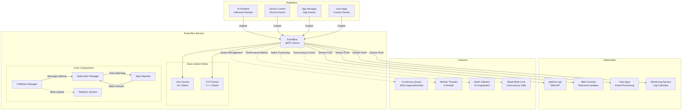
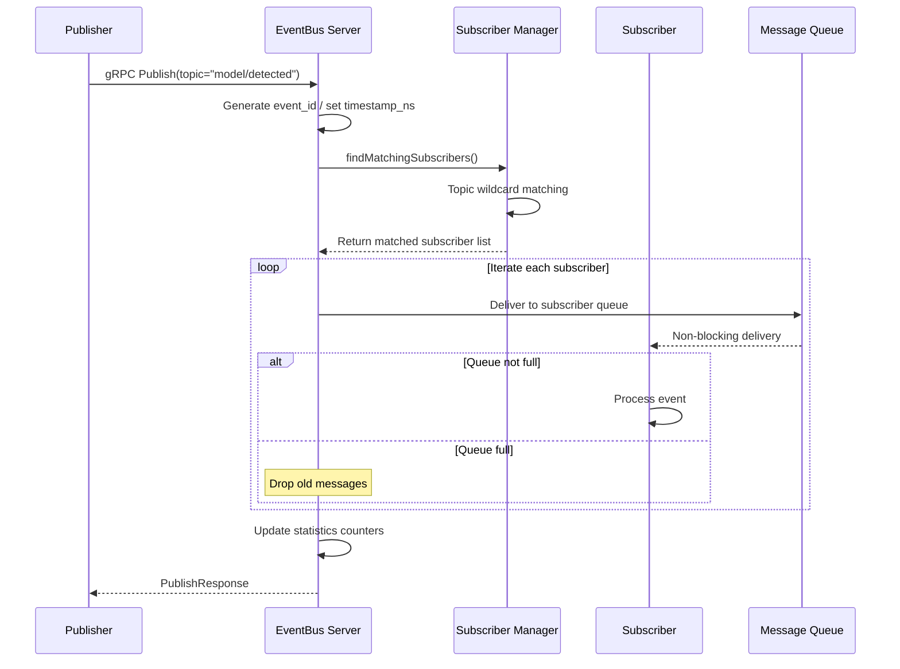
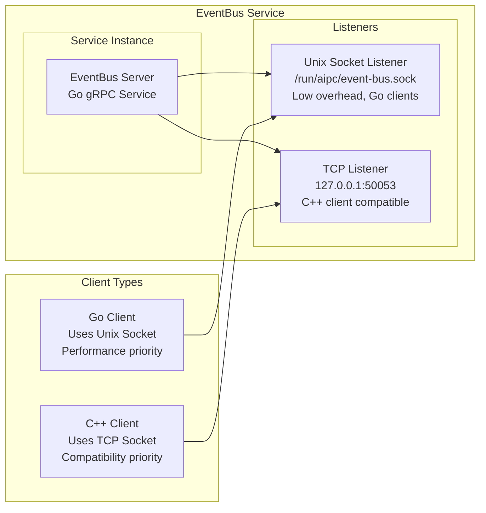
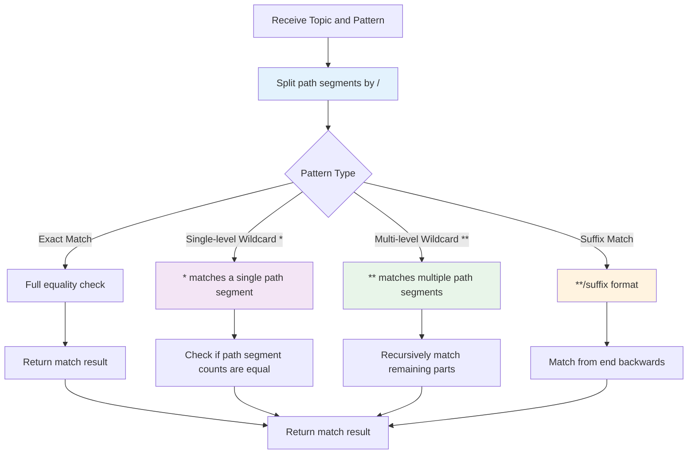
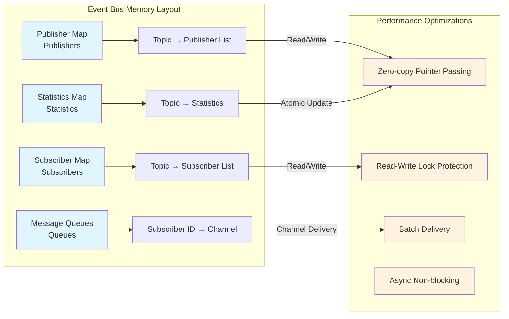

# Event Bus Service

## Overview

`event-bus` is the local Pub/Sub message bus for the NE503 platform, responsible for AI inference result distribution, application event reporting, and system event notification. It supports MQTT-style wildcard Topic matching, uses a pure in-memory implementation, and requires no external dependencies.

**Tech Stack**: Go + gRPC, zero disk I/O, pure in-memory architecture.

**Core Capabilities**:

- **MQTT-style Wildcards**: Supports three matching modes — `*` (single-level), `**` (multi-level), and `**/suffix` (suffix)
- **Dual Listener Mode**: Provides both Unix Socket (Go clients) and TCP Socket (C++ clients) access methods simultaneously
- **Pure In-memory Queue**: 1000-message buffer per subscriber, asynchronous non-blocking delivery
- **Batch Processing Optimization**: Worker threads + batch delivery, single message publish latency < 0.1 ms

## Architecture

Event Bus serves as the platform-level messaging hub, connecting multiple event sources and subscribers including AI Runtime, device control, and application management.



## Publish/Subscribe Flow



Key flow points: auto-generated event_id → wildcard matching to find subscribers → buffered channel non-blocking delivery → drop old messages when queue is full to protect throughput.

## Dual Listener Mode

Event Bus starts both Unix Socket and TCP Socket gRPC listeners simultaneously, optimizing the access experience for Go clients and C++ clients respectively.



**Design Rationale**: Unix Socket has zero network overhead for local communication, making it ideal for high-performance inter-service calls between Go services; TCP Socket addresses the limited Unix Socket support in C++ gRPC libraries. Both listeners share the same core logic.

## gRPC API

Service name: `EventBus`

- Unix Socket: `unix:///run/aipc/event-bus.sock`
- TCP Socket: `127.0.0.1:50053`

### RPC Methods

| RPC | Request Type | Response Type | Description |
|-----|---------|----------|------|
| `Publish` | `PublishRequest` | `PublishResponse` | Publish a single event |
| `PublishBatch` | `stream PublishRequest` | `Status` | Batch publish (client streaming) |
| `Subscribe` | `SubscribeRequest` | `stream Event` | Subscribe to Topic (supports wildcards, server streaming) |
| `Unsubscribe` | `SubscribeRequest` | `Status` | Unsubscribe |
| `ListTopics` | `Empty` | `TopicListResponse` | List active Topics |
| `GetTopicInfo` | `TopicInfo` | `TopicInfo` | Get Topic details |
| `GetStats` | `Empty` | `SystemStats` | Get system statistics |
| `GetTopicStats` | `TopicInfo` | `EventStats` | Get Topic statistics |

### Core Message Structures

**Event** (event message):

```protobuf
message Event {
  string topic = 1;           // Topic (e.g., "model/person_v1/detections")
  uint64 timestamp_ns = 2;    // Nanosecond timestamp
  string source = 3;          // Source (app_id / service name)
  string event_id = 4;        // Event ID (auto-generated)
  bytes payload = 10;         // Payload (JSON or protobuf)
  string payload_type = 11;   // "json" / "protobuf"
  map<string, string> metadata = 20;
}
```

**SubscribeRequest** (subscribe request):

```protobuf
message SubscribeRequest {
  string topic = 1;           // Supports wildcards
  string subscriber_id = 2;   // Subscriber ID
  map<string, string> filters = 10;  // Optional filters
  uint32 queue_size = 20;     // Queue size
  bool drop_old = 21;         // Drop old messages when queue is full
}
```

**Statistics** (statistics):

```protobuf
message EventStats {
  string topic = 1;
  uint64 published_count = 2;   // Published count
  uint64 delivered_count = 3;   // Delivered count
  uint64 dropped_count = 4;     // Dropped count
  float avg_latency_us = 5;     // Average latency (microseconds)
}

message SystemStats {
  repeated EventStats topic_stats = 1;
  uint32 total_subscribers = 2;  // Total subscribers
  uint32 total_topics = 3;       // Total topics
  uint64 uptime_ms = 4;          // Uptime (milliseconds)
}
```

## Topic Wildcard Matching

Event Bus supports MQTT-style wildcard matching based on `/`-delimited hierarchical Topic paths.

### Matching Patterns

| Pattern | Description | Example |
|------|------|------|
| Exact match | Topic is exactly equal | `app/test/alert` |
| `*` | Match a single level (does not cross `/`) | `app/*/alert` matches `app/test/alert` |
| `**` | Match zero or more levels | `app/**` matches `app/a/b/c` |
| `**/suffix` | Suffix matching | `app/**/events` matches `app/a/b/events` |

**Matching Rules**:

- `*` matches only a single path segment, does not cross `/` separators
- `**` matches zero to multiple path segments, supports recursive backtracking
- The matching algorithm uses segment-by-segment recursive comparison to correctly handle nested wildcards

### Matching Examples

| Subscription Pattern | Topic | Match Result | Description |
|----------|-------|---------|------|
| `model/person_v1/detections` | `model/person_v1/detections` | ✅ | Exact match |
| `model/person_v1/detections` | `model/yolov8/detections` | ❌ | No match |
| `model/*/detections` | `model/person_v1/detections` | ✅ | `*` matches `person_v1` |
| `model/*/detections` | `model/a/b/detections` | ❌ | `*` does not cross levels |
| `app/**` | `app/test/alert` | ✅ | `**` matches `test/alert` |
| `app/**` | `app/a/b/c` | ✅ | `**` matches `a/b/c` |
| `app/**` | `app` | ✅ | `**` matches zero segments |
| `model/**/detections` | `model/cam0_main/person_v1/detections` | ✅ | `**` matches `cam0_main/person_v1` |
| `**/alert` | `system/device/error/alert` | ✅ | Suffix match |

### Matching Algorithm Flow



## Pure In-Memory Architecture

Event Bus uses a pure in-memory design where all data structures reside in process memory with no external storage dependencies.



**Core Design**: Zero-copy pointer passing, read-write lock concurrency control, buffered channel isolation for slow consumers, async publish with immediate return, automatic inactive Topic reclamation (default 3600 seconds).

## Performance Characteristics

| Metric | Value | Description |
|------|------|------|
| Single message publish latency | < 0.1 ms | Including matching and delivery |
| Maximum throughput | 100,000 msg/s | Batch publish mode |
| Memory usage | < 50 MB | Including subscriptions and statistics |
| Maximum Topics | 1000 | Configurable |
| Queue per subscriber | 1000 messages | Configurable |

## Configuration

Configuration file path: `configs/platform/event-bus.yaml`

| Configuration Item | Default Value | Description |
|--------|--------|------|
| **service.name** | `event-bus` | Service name |
| **service.listen** | `unix:///run/aipc/event-bus.sock` | Unix Socket listen address (Go clients) |
| **service.tcp_listen** | `127.0.0.1:50053` | TCP listen address (C++ client compatible) |
| **service.log_level** | `info` | Log level |
| **bus.queue_size** | `1000` | Queue size per subscriber |
| **bus.max_topics** | `1000` | Maximum number of Topics |
| **bus.workers** | `4` | Number of worker threads |
| **bus.batch_size** | `10` | Batch delivery size |
| **bus.inactive_topic_ttl** | `3600` | Inactive Topic cleanup interval (seconds) |
| **routing.priorities** | — | Topic prefix priorities (`system/` → 10, `alert/` → 8, `model/` → 5, `app/` → 5) |
| **routing.rate_limits** | — | Topic rate limits (`model/*` → 1000 msg/s, `app/*` → 100 msg/s) |
| **monitoring.stats_enabled** | `true` | Enable statistics |
| **monitoring.stats_interval_sec** | `10` | Statistics collection interval (seconds) |
| **monitoring.metrics_port** | `9091` | Prometheus metrics port |

## Related Documentation

- [AI Inference Service](./0-ai-runtime.md) — One of the main event sources for Event Bus
- [Device Control Service](./3-device-control.md) — Device events distributed through Event Bus
- [App Manager Service](./1-app-manager.md) — Application lifecycle events published to Event Bus
- [CLI Tool Guide](../../5-system-integration/3-cli-guide.md) — Use `aipc-cli event` commands to operate Event Bus
